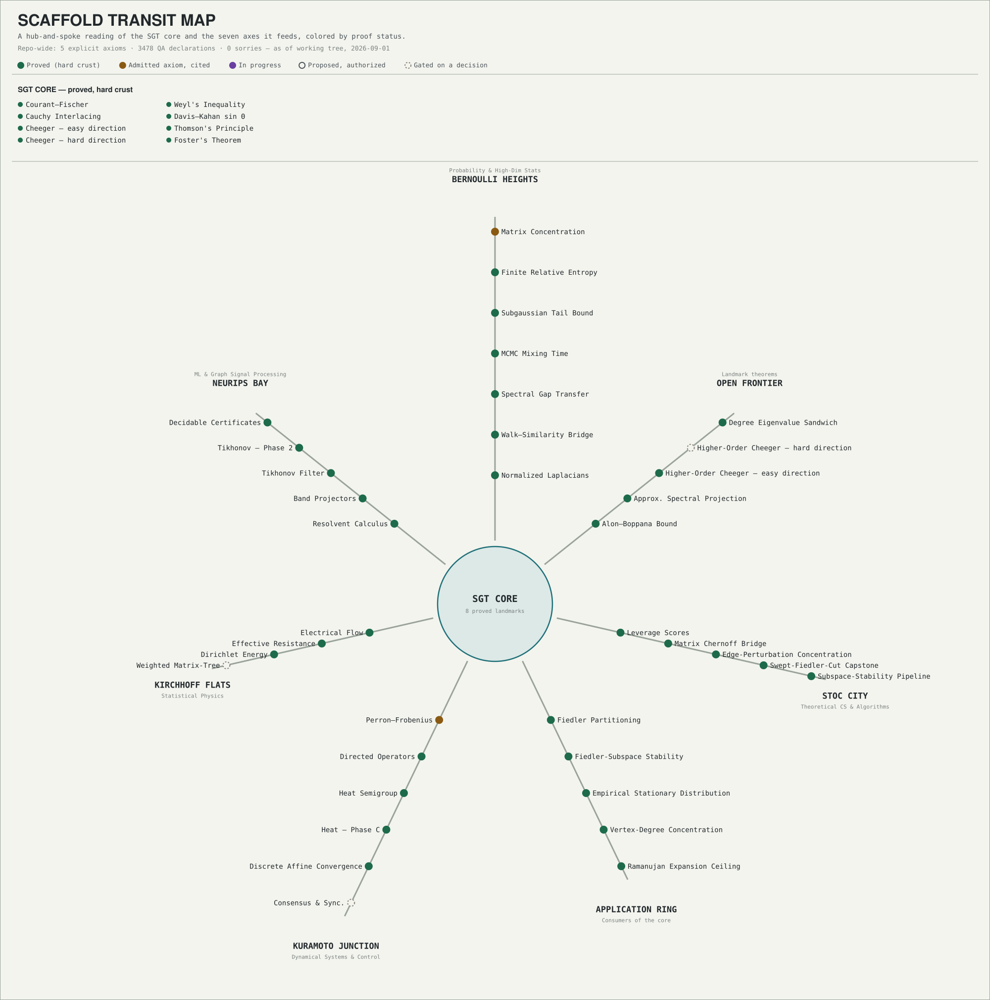
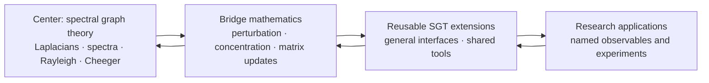

# Scaffold

Scaffold lets researchers formalize new applied mathematics today by treating
selected published results as explicit, cited assumptions. Lean checks every
downstream deduction, while those assumptions remain visible, reviewable, and
replaceable as formal proofs become available.

The project’s center is **spectral graph theory (SGT)**. Its goal is a broad,
reusable formal neighborhood around SGT: graph and Laplacian theory,
spectral and variational methods, matrix/operator tools, probability, and
bridges that future research can compose.

Scaffold is both a Lean library and a research substrate. It is **pre-release**:
the default `lake build` currently passes, but consumers should pin a [verified
revision](docs/5_QA_SCOREBOARD.md) rather than tracking `main`.

## Status

As of August 27, 2026:

| Check | Result |
| --- | --- |
| Default `lake build` | Passes; the umbrella reaches every public module |
| Explicit cited axioms | 10 |
| QA theorems/lemmas | 2800, with no `sorry` or `admit` under `Scaffold/` |

Recent highlights (full per-run history in
[`docs/AGENT_ACTIVITY.md`](docs/AGENT_ACTIVITY.md); per-result detail in each
linked proposal):

- **Alon–Boppana bound** delivered complete end-to-end (Nilli's variational
  route), with the **Ramanujan Expansion Ceiling** as its first theorem
  consumer ([proposal](proposals/alon-boppana-bound.md)).
- **Spectral sparsification via leverage-score sampling**, complete —
  `matrix_bernstein`'s first real theorem consumer
  ([proposal](proposals/spectral-sparsification-via-leverage-scores.md)).
- **Both Cheeger inequalities** on arbitrary weighted graphs, including the
  volume-weighted (irregular) pair and the higher-order (multiway) easy
  direction (`GraphTheory.Cheeger`, `GraphTheory.Multiway`).
- **The directed / Perron–Frobenius axis**: PageRank, irreducible stationary
  distributions, directed mixing, the magnetic Laplacian, and signed-graph
  balance theory.
- **Heat semigroup** and **Krylov / Kaniel–Paige**, both programs complete
  end-to-end with zero admitted axioms.
- **Hermitian functional-calculus bridge**, unifying Tikhonov filtering, the
  heat semigroup, and the magnetic propagator as one construction.
- **Fiedler-subspace stability** and **empirical stationary-distribution
  concentration** — first graph-theoretic consumers of `davis_kahan_sin_theta`
  and `hoeffding_empirical`, respectively.

The generated [QA Scoreboard](docs/5_QA_SCOREBOARD.md) is the authority for
current counts, verification commands, and limitations.

## Transit map

A hub-and-spoke reading of the SGT core and the seven research axes it
feeds, colored by proof status (proved · admitted axiom · in progress ·
proposed · gated). This is a snapshot, not live data — regenerate it with
`python3 scripts/generate_scaffold_map_svg.py` after a proposal's status
changes; the same underlying data drives a clickable, hoverable version at
[`docs/scaffold_map.html`](docs/scaffold_map.html) (open it locally — it's
plain self-contained HTML/JS, no build step).

<p align="center"></p>

## Why Scaffold exists

Modern applied work often depends on results that Mathlib does not yet expose
in a directly usable form. Waiting for every prerequisite to be formalized can
block experimentation at the frontier. Hiding those gaps behind `sorry`, on the
other hand, obscures what has actually been established.

Scaffold makes the tradeoff explicit:

- published background results may enter through a narrow, cited axiom boundary;
- real definitions and stable APIs make those results composable in Lean;
- small QA proofs test the interfaces and selected consequences;
- novel results remain conditional on their axioms until those axioms are
  proved or replaced upstream.

This is stronger than informal derivation because Lean checks the downstream
reasoning. It is weaker than foundational formalization because the admitted
mathematics remains part of the trust base.

### Why spectral graph theory

The center could have been a few other applied-math domains instead; SGT
was chosen over each for a specific tradeoff, not by default.

| Alternative | Its case | Why SGT won instead |
| --- | --- | --- |
| Matrix concentration (Bernstein, Azuma) | Highest immediate utility — nearly every randomized-algorithm and high-dimensional-statistics bound depends on it directly | Needs substantial measure-theoretic setup before any concrete consequence; used here as an admitted bridge (`Probability.Concentration.Matrix.*`), not a starting point |
| Optimization and convex analysis | Interfaces directly with control theory and machine learning | Branches quickly into special cases (convex cones, non-smooth subgradients, constraint qualifications) that resist a clean formalization boundary |
| Classical (unweighted) graph theory | Already well developed in Mathlib; little extra machinery needed | Stays discrete — does not naturally bridge into the continuous linear algebra (eigenvalues, quadratic forms) that connects graphs to the rest of formalized mathematics |

SGT sits at the intersection instead: finite matrices and graphs avoid most
infinite-dimensional measure-theoretic and topological overhead, while its
spectral machinery (eigenvalues, Rayleigh quotients, quadratic forms)
immediately exercises Mathlib's bridges across linear algebra, analysis,
and probability at once. Formalizing SGT is what forces this project to
build reusable interfaces spanning linear algebra (`Spectral`),
combinatorics and expansion (`Cheeger`, `Fiedler`, `Expander`), random
walks (`RandomWalk`, `Normalized`, `Stationary`, `Mixing`), and variational analysis
(Courant–Fischer, the Cheeger bounds) — see "What's here" below — rather
than one isolated result.

### The mushy center and hard crust

Scaffold deliberately keeps two kinds of work separate:

- The **mushy center** is the smallest possible set of research-frontier results
  that we need before their full proofs exist in Lean. Each such result must be
  a named, explicit axiom with a precise statement, a source citation, and a
  clear account of its intended upstream replacement. It is never concealed
  behind `sorry`.
- The **hard crust** is everything that follows mechanically from that center:
  definitions, interfaces, derived theorems, and QA lemmas proved by Lean. This
  work must contain no `sorry` or `admit`, and should make the assumptions on
  which it depends apparent.

Ongoing work should shrink and strengthen the mushy center while expanding the
hard crust. Prefer proving or upstreaming an existing axiom, tightening an
axiom's statement, or deriving a reusable checked consequence over adding a new
assumption. An axiom may be added only when it is cited, necessary for a
concrete SGT milestone, and surrounded by enough hard-crust checks to expose
its intended use.

## The center-out research policy

Ongoing work radiates outward from SGT. We strengthen the center first, add
adjacent mathematics only when it unlocks important SGT obligations, and
advance to applications only when the intervening interfaces are credible.



The reverse arrows matter: outer work that exposes a weak definition, missing
assumption, or unusable theorem shape sends us back inward to repair the nearest
dependency. We do not expand the library merely because a topic is adjacent or
interesting.

A proposed task receives priority when it:

1. unlocks a concrete SGT theorem, experiment, or downstream consumer;
2. repairs a load-bearing definition or closes a known proof dependency;
3. reduces the trust surface, removes a placeholder, or replaces an axiom upstream;
4. creates a reusable bridge between SGT and perturbation, probability, or dynamics;
5. can be validated by a focused Lean check, numerical experiment, or citation review;
6. delivers more of the above per unit of complexity and maintenance cost than
   competing work.

Build health, real definitions, and sound theorem shapes take precedence over
adding new surface area. The complete policy lives in
[Strategy](docs/1_STRATEGY.md). Active work is listed in
[proposals](proposals/README.md).

## What's here

The near-term center is general SGT. Public modules currently cover:

| Area | Modules |
| --- | --- |
| Graphs and Laplacians | `GraphTheory.Spectral`, `GraphTheory.SimpleGraphAdapter` |
| Variational spectra | Courant–Fischer, Rayleigh, Cauchy interlacing (in `Spectral`) |
| Cuts and expansion | `GraphTheory.Cheeger`, `GraphTheory.Fiedler`, `GraphTheory.Expander`, `GraphTheory.Multiway`, `GraphTheory.VariationalTransfer` — both Cheeger directions (regular and volume-weighted), the Expander Mixing Lemma and Hoffman bound, certified-conductance and swept-cut extraction, and the higher-order (multiway) easy direction |
| Decidable spectral certificates | `GraphTheory.SpectralCertificates` (ℚ and kernel-verifiable ℤ specification checkers, both soundness-proved) |
| Electrical structure | `GraphTheory.Electrical`, `GraphTheory.ElectricalFlow`, `GraphTheory.Foster` — effective resistance as a genuine metric, Foster's theorem, leverage scores |
| Heat semigroup | `GraphTheory.Heat` — the diffusion operator `e^{-tL}`: semigroup law, mass conservation, eigenmode decay, the connected-graph DC limit, and the derivative/remainder bounds at `t = 0`; program complete |
| Walks and mixing | `GraphTheory.RandomWalk`, `GraphTheory.Normalized`, `GraphTheory.Stationary`, `GraphTheory.Mixing` — the ℓ²-mixing proxy and the geometric-decay mixing bound |
| Directed operators | `GraphTheory.Directed` — out/in-degree, directed handshaking, the directed normalized Laplacian |
| Krylov methods and Chebyshev polynomials | `GraphTheory.Krylov` — the Lanczos/Kaniel–Paige program, complete end-to-end |
| Polynomial filters and band projection | `GraphTheory.PolyFilter` — filter-agnostic band-projector approximation, with power-method and Chebyshev instantiations |
| Nonnegative-matrix spectral theory | `LinearAlgebra.PerronFrobenius`, `LinearAlgebra.PrimitiveConvergence` — the admitted Perron–Frobenius and primitive-power-convergence axioms |
| Irreducible stationary distributions | `GraphTheory.IrreducibleStationary` — Perron–Frobenius's first theorem consumer |
| PageRank | `GraphTheory.PageRank` — the teleportation-regularized Google matrix, existence and uniqueness on reducible input |
| Directed mixing | `GraphTheory.DirectedMixing` — `primitive_power_tendsto`'s first consumer, the PageRank power-iteration theorem |
| Magnetic Laplacian | `GraphTheory.Magnetic` — the shelf's first complex Hermitian object; flux/gauge characterization |
| Signed graphs | `GraphTheory.Signed` — the signed Laplacian; Harary's balance theorem in kernel form |
| Alon–Boppana program | `GraphTheory.AlonBoppana` — complete end-to-end via Nilli's variational route; its first theorem consumer is the Ramanujan Expansion Ceiling |
| Hermitian functional calculus | `GraphTheory.FunctionalCalculus` — the Scaffold–Mathlib bridge; recovers Tikhonov filtering, the heat semigroup, and the magnetic propagator as one calculus |
| Cluster projector | `GraphTheory.ClusterProjector` — the spectral projector onto an arbitrary eigenvalue set |
| Perturbation | `Analysis.OperatorTheory.Perturbation.{Weyl,DavisKahan,BandDavisKahan,ProjectionGap,Duhamel}` — Weyl's inequality, Davis–Kahan sin Θ, and the band/cluster projector-stability family |
| Concentration | `Probability.Concentration.Scalar.*`, `Probability.Concentration.Matrix.*` |
| Spectral sparsification | `GraphTheory.Sparsification`, `Derived.SparsificationTail`, `Probability.BernoulliProduct` — leverage-score sampling; `matrix_bernstein`'s first real theorem consumer |
| Edge-perturbation concentration | `GraphTheory.EdgePerturbation`, `Derived.EdgePerturbationTail` — centered Bernoulli edge-Laplacian perturbations; `matrix_hoeffding`'s first theorem consumer |
| Concentration → subspace-stability pipeline | `Derived.EdgePerturbationDrift` — high-probability Fiedler-subspace and Fiedler-line rotation under random edge resampling (`edgePerturbation_fiedlerLine_drift`), composing `fiedlerLine_stability` with `edgePerturbation_norm_tail` through the packaging identity `laplacian (perturbWeight A p ω) = ∑ₑ perturbSummand` and the Laplacian linearity package (`laplacian_smul`/`laplacian_sum`) |
| Empirical stationary distribution | `Probability.IIDProduct`, `Derived.EmpiricalStationary` — `hoeffding_empirical`'s first theorem consumer |
| Finite-distribution entropy | `InformationTheory.Entropy` (relative entropy and Shannon entropy, Gibbs' inequality, the entropy maximum — all proved) |
| Discrete-affine dynamics | `Dynamics.DiscreteAffine` (finite-vector geometric decay and affine-iteration convergence, all proved) |
| Matrix updates | `Core.MatrixUpdates` (Woodbury, Sherman–Morrison) |

Outward work must improve one of those interfaces or make a concrete, broadly
reusable connection. The existing persistence modules
(`GraphTheory.Dynamics`, `Derived.EventStream`, `Derived.ProjectorDrift`) do
not set this agenda; they are a retained example whose tail and projector-drift
theorems remain conditional on Matrix Azuma alone (Davis–Kahan and Weyl
are proved since 2026-08-21/20).

See [Spectral Theory](docs/3_SPECTRAL_THEORY.md) for the status of that
example, and the [SGT Radar](docs/7_SGT_RADAR.md) for coverage scores.

### SGT coverage snapshot

Last assessed: August 27, 2026. Scores reflect usable, verified coverage on a
0–5 scale; see the [full radar and evidence](docs/7_SGT_RADAR.md).

| Area | Coverage |
| --- | ---: |
| Graph and Laplacian models | 4.0 / 5 |
| Spectral linear algebra | 4.5 / 5 |
| Variational and functional methods | 4.0 / 5 |
| Cuts, expansion, and clustering | 5.0 / 5 |
| Random walks and diffusion | 4.0 / 5 |
| Combinatorial and electrical structure | 4.5 / 5 |
| Perturbation, randomness, and algorithms | 4.5 / 5 |
| Adjacent systems interfaces | 1.0 / 5 |

Assurance quality is assessed separately in the full radar; subject coverage
and trust level are not combined into one score.

## Trust model

Citations and explicit axioms belong in the mushy center; checked Lean proofs
belong in the hard crust. Do not describe an axiom-backed result as fully
formalized, and do not use `sorry` to move a result across that boundary.

| Artifact | What it establishes | What it does not establish |
| --- | --- | --- |
| Real Lean definition | A precise, typechecked object | That it is the best model of the application |
| Explicit cited axiom | A visible assumption usable by Lean | A proof or machine-verified transcription of the source |
| QA lemma with a real proof | A checked consequence of its dependencies | The truth of any axioms it uses |
| Axiom-backed derived theorem | Correct deduction relative to the trust base | A foundationally proved theorem |
| Numerical or domain experiment | Evidence for specified behavior | A general mathematical proof |

Project documentation uses these labels distinctly. Citation review,
compilation, mathematical review, and empirical validation are separate gates.

## Repository map

```text
Scaffold/Mathlib/   public definitions and explicit axiom APIs
Scaffold/QA/        fully proved interface checks
Scaffold/Derived/   axiom-backed derived theorems (checked deductions)
Scaffold/Internal/  internal utilities
index/              source mappings and domain maps
docs/               canonical strategy, architecture, theory, partnerships, and QA
governance/         contribution, maintenance, conduct, and release process
research/papers/    reference papers and research artifacts
research/archive/   provenance and superseded reports—not current policy
scripts/            documentation and policy checks
proposals/          active priority list and delivered records
```

`Scaffold/Derived/` holds derived theorems: Lean-checked deductions whose
conclusions remain conditional on the axioms they consume. Its first two
modules are a retained persistence example: `EventStream.lean` derives an
Azuma tail bound on a random event-driven graph stream, and
`ProjectorDrift.lean` derives a high-probability endpoint projector-drift
bound. They are not a standing expansion target.

The remaining root files are repository entry points or tool configuration:
`Scaffold.lean` is the Lake library root; `lakefile.lean`,
`lake-manifest.json`, and `lean-toolchain` pin the build; and `opencode.json`
configures project-local agent tooling. Lean modules otherwise belong under
`Scaffold/`.

## Get started

Pinned toolchain: Lean 4.14.0 (see `lean-toolchain`; Mathlib is required at
the matching `v4.14.0` tag).

```sh
lake build
python3 scripts/generate_qa_scoreboard.py
python3 scripts/lint_axioms.py
python3 scripts/check_citations.py
python3 scripts/check_markdown_links.py
```

`lake build` builds the library root `Scaffold.lean`. Downstream consumers
should prefer a narrow import over that umbrella.

## Intended consumption

Once the scoreboard reports a clean build for the required modules, a Lake
project can pin Scaffold as follows:

```lean
require scaffold from git
  "https://github.com/marcospolanco/scaffold.git" @ "<verified-revision>"
```

Representative narrow imports:

```lean
import Scaffold.Mathlib.GraphTheory.Spectral
import Scaffold.Mathlib.Probability.Concentration.Matrix.Bernstein
import Scaffold.Mathlib.Analysis.OperatorTheory.Perturbation.DavisKahan
```

## Working on Scaffold

Before adding a new domain or theorem family:

1. identify the SGT obligation or downstream experiment it unlocks;
2. map the shortest dependency path back to the SGT center;
3. compare its leverage against repairing existing definitions, imports,
   citations, and axioms;
4. define the smallest composable interface;
5. record whether each dependency is proved, axiom-backed, experimental, or
   conjectural;
6. add proportionate QA and run the narrowest meaningful verification.

See [Contributing](governance/CONTRIBUTING.md) for the review workflow.

Non-interactive agent runs use `scripts/opencode-pursue`. The project agent
follows `AGENTS.md`, maintains the [execution plan](docs/EXECUTION_PLAN.md)
and [activity log](docs/AGENT_ACTIVITY.md), and is denied publishing or
destructive Git commands. See [`scripts/README.md`](scripts/README.md) for
the safety boundary and invocation.

## Canonical documentation

- [Strategy](docs/1_STRATEGY.md) — mission and center-out prioritization.
- [Architecture](docs/2_ARCHITECTURE.md) — axiom admission, QA, citations, and
  upstream replacement.
- [Spectral Theory](docs/3_SPECTRAL_THEORY.md) — retained persistence example.
- [Partnerships](docs/4_PARTNERSHIPS.md) — dated, time-sensitive research landscape.
- [QA Scoreboard](docs/5_QA_SCOREBOARD.md) — generated metrics and recorded verification.
- [SGT Backlog](docs/6_SGT_BACKLOG.md) — ranked, center-first work queue.
- [SGT Radar](docs/7_SGT_RADAR.md) — evidence-scored coverage of the SGT neighborhood.
- [Mathlib Coverage Map](docs/8_MATHLIB_COVERAGE_MAP.md) — dated survey of the
  pinned Mathlib itself, distinct from Scaffold's own coverage.
- [Proposals](proposals/README.md) — active priority list and delivered records.
- [Traction Plan](docs/traction-plan.md) — promotion plan for the future
  clean-room repository's release; applies only there, not to this repository.
- [Contributing](governance/CONTRIBUTING.md) — contribution and review workflow.

## License

Apache 2.0. See [LICENSE](LICENSE).
