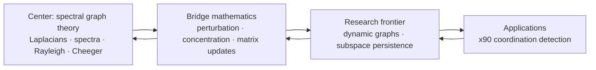

# Scaffold

Scaffold lets researchers formalize new applied mathematics today by treating selected published results as explicit, cited assumptions. Lean checks every downstream deduction, while those assumptions remain visible, reviewable, and replaceable as formal proofs become available.

The project’s center is **spectral graph theory (SGT)**. Its current research objective is spectral persistence in time-varying networks: combining graph Laplacians, variational methods, matrix perturbation, and concentration bounds to support rigorously specified coordination-detection algorithms.

Scaffold is both a Lean library and a research substrate. It is currently **pre-release and not yet build-clean**; see [Current maturity](#current-maturity) before trying to consume it as a dependency.

## Why Scaffold exists

Modern applied work often depends on results that Mathlib does not yet expose in a directly usable form. Waiting for every prerequisite to be formalized can block experimentation at the frontier. Hiding those gaps behind `sorry`, on the other hand, obscures what has actually been established.

Scaffold makes the tradeoff explicit:

- published background results may enter through a narrow, cited axiom boundary;
- real definitions and stable APIs make those results composable in Lean;
- small QA proofs test the interfaces and selected consequences;
- novel results remain conditional on their axioms until those axioms are proved or replaced upstream.

This is stronger than informal derivation because Lean checks the downstream reasoning. It is weaker than foundational formalization because the admitted mathematics remains part of the trust base.

## The center-out research policy

Ongoing work radiates outward from SGT. We strengthen the center first, add adjacent mathematics only when it unlocks important SGT obligations, and advance to applications only when the intervening interfaces are credible.



The reverse arrows matter: outer work that exposes a weak definition, missing assumption, or unusable theorem shape sends us back inward to repair the nearest dependency. We do not expand the library merely because a topic is adjacent or interesting.

A proposed task receives priority when it:

1. unlocks a concrete SGT theorem, experiment, or downstream consumer;
2. repairs a load-bearing definition or closes a known proof dependency;
3. reduces the trust surface, removes a placeholder, or replaces an axiom upstream;
4. creates a reusable bridge between SGT and perturbation, probability, or dynamics;
5. can be validated by a focused Lean check, numerical experiment, or citation review;
6. delivers more of the above per unit of complexity and maintenance cost than competing work.

Build health, real definitions, and sound theorem shapes take precedence over adding new surface area. The complete policy lives in [Strategy](docs/1_STRATEGY.md).

## What we are trying to prove

The motivating “oil and water” hypothesis asks when a coherent spectral subspace retains its identity under a stream of graph updates. Schematically:

```text
‖Σₖ Eₖ‖ / γ < C
```

Here `Eₖ` represents event-induced perturbations and `γ` is a relevant spectral gap. This is a research mnemonic, not yet a theorem: the norm, update model, invariant subspace, probability assumptions, and constant all need precise definitions.

The intended dependency chain is:

```text
spectral graph definitions
        ↓
Laplacian update identities
        ↓
Weyl / Davis–Kahan perturbation control
        ↓
matrix concentration for event streams
        ↓
dynamic subspace-persistence result
        ↓
calibrated x90 observable
```

See [Spectral Theory and Algorithmic Pipeline](docs/3_SPECTRAL_THEORY.md) for the formalization boundary and validation program.

## Trust model

| Artifact | What it establishes | What it does not establish |
| --- | --- | --- |
| Real Lean definition | A precise, typechecked object | That it is the best model of the application |
| Explicit cited axiom | A visible assumption usable by Lean | A proof or machine-verified transcription of the source |
| QA lemma with a real proof | A checked consequence of its dependencies | The truth of any axioms it uses |
| Axiom-backed derived theorem | Correct deduction relative to the trust base | A foundationally proved theorem |
| Numerical or domain experiment | Evidence for specified behavior | A general mathematical proof |

Project documentation uses these labels distinctly. Citation review, compilation, mathematical review, and empirical validation are separate gates.

## Repository map

```text
Scaffold/Mathlib/   public definitions and explicit axiom APIs
Scaffold/QA/        fully proved interface checks
Scaffold/Internal/  internal utilities
index/              source mappings and domain maps
docs/               canonical strategy, architecture, theory, partnerships, and QA
governance/         contribution, maintenance, conduct, and release process
research/papers/    reference papers and research artifacts
research/archive/   provenance and superseded reports—not current policy
scripts/            documentation and policy checks
```

`Scaffold/Derived/` is a planned layer and is not currently implemented.

The remaining root files are repository entry points or tool configuration: `Scaffold.lean` is the Lake library root; `lakefile.lean`, `lake-manifest.json`, and `lean-toolchain` pin the build; and `opencode.json` configures project-local agent tooling. Lean modules otherwise belong under `Scaffold/`.

## Current maturity

As of August 17, 2026:

- the source contains 33 QA theorem/lemma declarations and no `sorry` or `admit` tokens under `Scaffold/QA`;
- those QA modules are **not yet certified by a clean direct build**;
- the default `lake build` fails because the executable target references a missing `Main.lean`;
- several public modules have obsolete or misplaced imports;
- public source still contains admitted proofs, placeholder statement shapes, incomplete citations, and incomplete index coverage.

The generated [QA Scoreboard](docs/5_QA_SCOREBOARD.md) is the authority for current counts and verification results. Do not infer readiness from declaration counts alone.

## Intended consumption

Once the scoreboard reports a clean build for the required modules, a Lake project will be able to pin Scaffold as follows:

```lean
require scaffold from git
  "https://github.com/marcospolanco/scaffold.git" @ "<verified-revision>"
```

Representative narrow imports are intended to look like:

```lean
import Scaffold.Mathlib.GraphTheory.Spectral
import Scaffold.Mathlib.Probability.Concentration.Matrix.Bernstein
import Scaffold.Mathlib.Analysis.OperatorTheory.Perturbation.DavisKahan
```

These examples describe the intended API and are not a claim that the current revision builds cleanly. Consumers should use a verified commit rather than `main`.

## Working on Scaffold

Before adding a new domain or theorem family:

1. identify the SGT obligation or downstream experiment it unlocks;
2. map the shortest dependency path back to the SGT center;
3. compare its leverage against repairing existing definitions, imports, citations, and axioms;
4. define the smallest composable interface;
5. record whether each dependency is proved, axiom-backed, experimental, or conjectural;
6. add proportionate QA and run the narrowest meaningful verification.

Useful checks include:

```sh
python3 scripts/generate_qa_scoreboard.py
python3 scripts/lint_axioms.py
python3 scripts/check_citations.py
python3 scripts/check_markdown_links.py
```

`lake build` is currently a diagnostic command and is expected to fail until the build-target issue is repaired.

### Autonomous OpenCode pursuit

The repository includes a non-interactive OpenCode workflow using `zhipuai-coding-plan/glm-5.3` with the `high` reasoning variant:

```sh
scripts/opencode-pursue
```

Pass an optional priority as an argument. The project agent follows `AGENTS.md`, selects a bounded high-leverage milestone, implements and verifies it, and is denied external-directory access and publishing or destructive Git commands. See [`scripts/README.md`](scripts/README.md) for the exact safety boundary.

## Canonical documentation

- [Strategy](docs/1_STRATEGY.md) — mission and center-out prioritization.
- [Architecture](docs/2_ARCHITECTURE.md) — axiom admission, QA, citations, and upstream replacement.
- [Spectral Theory](docs/3_SPECTRAL_THEORY.md) — persistence hypothesis and x90 pipeline.
- [Partnerships](docs/4_PARTNERSHIPS.md) — dated, time-sensitive research landscape.
- [QA Scoreboard](docs/5_QA_SCOREBOARD.md) — generated metrics and recorded verification.
- [Contributing](governance/CONTRIBUTING.md) — contribution and review workflow.

## License

Apache 2.0. See [LICENSE](LICENSE).
