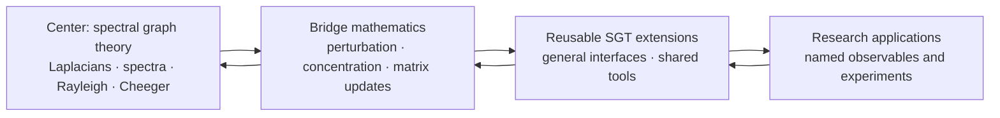

# Scaffold

Scaffold lets researchers formalize new applied mathematics today by treating
selected published results as explicit, cited assumptions. Lean checks every
downstream deduction, while those assumptions remain visible, reviewable, and
replaceable as formal proofs become available.

The project’s center is **spectral graph theory (SGT)**. Its goal is a broad,
reusable formal neighborhood around SGT: graph and Laplacian theory,
spectral and variational methods, matrix/operator tools, probability, and
bridges that future research can compose.

Scaffold is both a Lean library and a research substrate. It is **pre-release**:
the default `lake build` currently passes, but consumers should pin a [verified
revision](docs/5_QA_SCOREBOARD.md) rather than tracking `main`.

## Status

As of August 23, 2026:

| Check | Result |
| --- | --- |
| Default `lake build` | Passes; the umbrella reaches every public module |
| Explicit cited axioms | 9 |
| QA theorems/lemmas | 1546, with no `sorry` or `admit` under `Scaffold/` |

The remaining trust surface is: **Perron–Frobenius for irreducible
nonnegative matrices**
(admitted 2026-08-22 as `Scaffold.LinearAlgebra.perron_frobenius`,
Horn & Johnson Theorem 8.4.4 at the irreducible-case qualification
level — no strict-dominance clause, with the imprimitive-cycle
refutation witness `strict_dominance_refuted_QA` fencing exactly that
misstatement — opening the directed axis' second spectral toolkit,
absent from the pinned Mathlib); the scalar and matrix
concentration family (Hoeffding, Bernstein, Azuma — the subgaussian
tail bound was retired 2026-08-22 by the Markov-route repair-and-retire
of `proposals/prove-subgaussian-tail-bound.md`, whose Step 0 spike
proved the old `subgaussianNorm ≤ K`-shaped axiom materially false via
two junk mechanisms and replaced it with the moment stated integrably
at the same name and conclusion); and Hoeffding's lemma. Classical
Laplacian facts, Courant–Fischer, Cauchy interlacing, **both Cheeger
inequalities** (the easy direction since 2026-08-18; the *hard*
direction `φ²/2 ≤ λ₂` proved 2026-08-23 and retired from axiom by the
median-split route of
`proposals/discharge-perturbation-axioms.md` — the Cauchy–Schwarz core
and fused contraction, the interval-integral co-area core, and the
median/level-set/assembly layer closing through the variational
characterization; explicit axioms 10 → 9), and the **Fiedler
certified-conductance corollary** `cheeger_cut_existence` (2026-08-23:
on every connected `d`-regular graph a nonempty proper cut exists with
`conductance S ^ 2 ≤ 2 · lambda2 / d` — the cut-existence form of
Cheeger's inequality, assembled from the proved sweep lemma at the
Fiedler vector and the attained conductance minimum; Phase B of
`proposals/fiedler-partitioning.md`, pure hard crust and the
retirement's first consumer), **Weyl's perturbation
inequality**, **Davis–Kahan sin Θ** (retired
2026-08-21 by the Duhamel/exponential-integral route: the equal-rank
projector identity plus the vector-level heat-semigroup FTC assembly,
`Analysis.OperatorTheory.Perturbation.{ProjectionGap,Duhamel}`), the
**equal-rank projector identity** `‖P − Q‖ = ‖(I−Q)P‖`, the **Duhamel
bound** `‖(I−Q)P‖ ≤ ‖E‖/(b−a)`, the derived `davisKahanTwoPoint`
(now fully hard crust), Woodbury/Sherman–Morrison, the
electrical crust, Foster's theorem, the Expander Mixing Lemma, the
certificate-soundness layer (`lambda2_le_of_certificate`), the
operator-norm/resolvent bridge (`l2OpNorm_eq_max_abs_evals`, the resolvent
identity, the resolvent norm/Lipschitz bounds, and the resolvent-map
injectivity), **Tikhonov regularization in the Laplacian eigenbasis**
(the graph-signal smoothing minimizer, its eigencoefficient shrinkage
identity, the normal equation and its converse characterization,
minimality/uniqueness, and mean preservation, capped by the **Phase 2
hard-filter limit** — `tikhonovShrinkage π λ → 0` as `π → 0` at every
positive `λ`, plus the finite tail-suppression corollary: the filtered
coefficient energy of any selected positive-eigenvalue mode set
vanishes in the limit, stated as tail suppression per the external
consumer's non-overclaim instruction), and **two-sided spectral
band projectors** (the `(a, b]` band as the difference of two
`spectralProjector` calls, idempotence through the nestedness
cross-law `P_{c₁} * P_{c₂} = P_{min c₁ c₂}`, the mode-selection
action interface, the orthogonality of disjoint bands — both
composition orders, image orthogonality, and shared-mode-freeness —
and completeness under a partition: the unconditional telescoping
law, the covering-family resolution of the identity, monotone-family
orthogonality, and the vector decomposition `x = ∑ B_k x`), capped
by the **Hilbert-projection specialization** (the band projector's
output *is* Mathlib's `orthogonalProjection` onto its transported
range and the closest point of that range to the input — the
residual-orthogonality engine, the identification, and the
closest-point minimality over the band's fixed space),
are proved, not admitted. On the random-walk axis, the walk-matrix
**eigenpair transfer** through the proved similarity (both directions,
the reflected walk spectrum `walkEvals` with explicit eigenvector
witnesses, and the transferred-family expansion) and
**reversibility/detailed balance** (`deg i * P i j = deg j * P j i`
with its stationary-measure form `π i * P i j = π j * P j i` and the
symmetrizability packaging `D * P` symmetric — the property that makes
spectral methods apply to the walk at all) the **ℓ²-mixing proxy**
(`GraphTheory.Mixing`: the stationary vector `π = deg/vol`, the walk
law `(Pᵀ)ᵗ *ᵥ δₓ` with mass conservation, the density-coordinate
evolution `h_{t+1} = P *ᵥ h_t` consuming detailed balance, and the χ²
mixing distance with its vanishing characterization, `t = 0`
normalization, and plain-ℓ² corollary bridge), and the **complete
geometric-decay mixing statement** of the mixing-time program
(the conjugated-power transfer through the similarity, eigencoordinate
evolution, the Parseval-exact decay identity, the ℓ²(π) contraction
under value-based mode exclusion, and the closing χ² mixing bound
`chiSquareDistance_le_of_connected` —
`χ²(t, x) ≤ (λ*)^{2t} · ((π x)⁻¹ − 1)` on connected graphs under the
rate hypothesis, its mode hypothesis *derived* from the connectivity
kernel characterization of `L_sym` transferred through the proved
congruence, not assumed) — are likewise proved. The **matrix-level heat semigroup** (`GraphTheory.Heat`, opened 2026-08-23 as Phase B of the external-consumer program `sgt-gaps.md` authorized: `heatKernel A t := NormedSpace.exp ℝ (-(t • laplacian A))` — the diffusion operator `e^{-tL}` — with symmetry under `A.IsSymm` through the pin's `Matrix.IsSymm.exp`, the hypothesis-free time-zero identity, the general square-zero exponential collapse `exp M = 1 + M`, **the semigroup law** `heatKernel A s * heatKernel A t = heatKernel A (s + t)` (Step 2, hypothesis-free, via `Matrix.exp_add_of_commute` at the commuting negated scalar multiples — the external consumer's "identity at time zero + semigroup law" pair complete hard crust), and **mass conservation** `heatKernel A t *ᵥ onesVec = onesVec` (Step 3, hypothesis-free, through the entrywise-built exponential-series convergence `expSeries_hasSum_exp` and the kernel-vector engine `exp_mulVec_eq_of_mulVec_eq_zero` — heat neither creates nor destroys total mass, and on disconnected input it provably does not cross components; QA exhibits both the two-route conservation witness and the per-component no-leakage witness), plus **eigenmode decay and the DC limit** (Step 4, closing Phase B as pure hard crust: the eigenmode engine `exp_mulVec_eq_smul_of_mulVec_eq_smul` consuming Step 3's convergence at an eigenvector — `heatKernel A t *ᵥ vᵢ = e^{−t·λᵢ} • vᵢ` at every time — with the sorted-spectrum decay monotonicity and PSD dissipation bound, the eigenbasis expansion `heatKernel_mulVec_eq_sum`, and the payoff **`heatKernel_mulVec_tendsto_atTop`**: on connected graphs, free diffusion leaves only the DC component — the heat flow of any vector converges to its mean `((∑ j, x j)/|V|) • onesVec`; QA witnesses mode decay and the DC limit each by two independent routes, cross-validates the engine against the rank-one-idempotent collapse at a nonzero eigenvalue, and pins the K₂ Laplacian spectrum `[0, 2]` from trace/determinant) — the external consumer's four-item interface complete as hard crust), plus **the heat-flow derivative at zero** (Phase C Step 1, the second `sgt-gaps.md` request: `heatKernel_mulVec_hasDerivAt_zero`, the infinitesimal generator statement `d/dt e^{-tL} x |₀ = -L x` in `HasDerivAt` form, its entrywise engine `heatKernel_mulVec_apply_hasDerivAt_zero` being Duhamel's termwise-sum technique adapted to the eigenbasis expansion, the vector form assembled by the pin's `hasDerivAt_pi`; QA pins the numeric derivative on K₂ by two independent routes and cross-checks infinitesimal mass conservation against Step 3 in both directions), as is **the first-order remainder bound** (Phase C Step 2, completing Phase C and the proposal: `heatKernel_firstOrder_remainder_apply_le` — on the window `|t·λᵢ| ≤ 1`, every coordinate of the flow deviates from its first-order Taylor polynomial at zero by at most `t² · ∑ᵢ λᵢ² |vᵢ ⬝ᵥ x| |vᵢ a|`, the boundary-observable coordinate form, termwise through the pin's `Real.abs_exp_sub_one_sub_id_le`, no nonnegativity hypothesis; with the uniform `[0, T]` interval packaging `heatKernel_firstOrder_remainder_interval`; QA evaluates the spectral constant to exactly `4` on K₂, composes the concrete bounds `e⁻¹ ≤ 1` and `|1/2 − e^{-1/2}| ≤ 1/4` from raw closed-form values and theorem bounds at two times — pinning the `t²` scaling — and proves the window hypothesis refuted beyond `t = 1/2`). On the directed axis,
the **directed degree layer** (`GraphTheory.Directed`: the out-degree
`outDeg` (definitionally the shelf's `deg` — the undirected shelf was
carrying the out-degree walk operators symmetry-free all along), the
in-degree `inDeg`, the symmetric-cone agreements, and directed
handshaking `∑ outDeg = ∑ inDeg`, with QA certifying
`walkTransitionMatrix`'s row-stochasticity and the walk Laplacian's
mass conservation on genuinely asymmetric input and refuting symmetry
of the directed walk matrix) **and the directed normalized Laplacian**
(`directedNormalizedLaplacian := I − ½(SAS + SAᵀS)` at the out-degree
normalization — symmetric *hypothesis-free* (the two defining halves
are transposes of each other), agreeing exactly with
`normalizedLaplacian` on the symmetric cone, and conjugate by `√D` to
the square-root-free symmetrized-adjacency pair `D_out − ½(A+Aᵀ)`;
QA exhibits the calibration refutation — symmetric but **not PSD** on
directed input, the quadratic form at `!![0,4;1,0]` evaluating to
`−1/2 < 0`, so the positivity layer of the undirected toolkit does
not transfer) are proved with zero axioms. The finite-distribution **entropy layer** (`InformationTheory.Entropy`: relative entropy `klDiv` and Shannon entropy `shannonEntropy` with the visible `p i = 0 ↦ 0` junk convention, Gibbs' inequality in both directions (`0 ≤ klDiv p q`, with equality exactly at `p = q`), the uniform bridge, the entropy maximum `shannonEntropy p ≤ log |V|` with equality exactly at uniform, and nonnegativity) is proved from the term-wise information inequality `log t ≤ t − 1` — the same textbook route as the pinned Mathlib strict-concavity machinery, with zero axioms.

The generated [QA Scoreboard](docs/5_QA_SCOREBOARD.md) is the authority for
current counts, verification commands, and limitations.

## Transit map

A hub-and-spoke reading of the SGT core and the seven research axes it
feeds, colored by proof status (proved · admitted axiom · in progress ·
proposed · gated). This is a snapshot, not live data — regenerate it with
`python3 scripts/generate_scaffold_map_svg.py` after a proposal's status
changes; the same underlying data drives a clickable, hoverable version at
[`docs/scaffold_map.html`](docs/scaffold_map.html) (open it locally — it's
plain self-contained HTML/JS, no build step).

<p align="center"></p>

## Why Scaffold exists

Modern applied work often depends on results that Mathlib does not yet expose
in a directly usable form. Waiting for every prerequisite to be formalized can
block experimentation at the frontier. Hiding those gaps behind `sorry`, on the
other hand, obscures what has actually been established.

Scaffold makes the tradeoff explicit:

- published background results may enter through a narrow, cited axiom boundary;
- real definitions and stable APIs make those results composable in Lean;
- small QA proofs test the interfaces and selected consequences;
- novel results remain conditional on their axioms until those axioms are
  proved or replaced upstream.

This is stronger than informal derivation because Lean checks the downstream
reasoning. It is weaker than foundational formalization because the admitted
mathematics remains part of the trust base.

### Why spectral graph theory

The center could have been a few other applied-math domains instead; SGT
was chosen over each for a specific tradeoff, not by default.

| Alternative | Its case | Why SGT won instead |
| --- | --- | --- |
| Matrix concentration (Bernstein, Azuma) | Highest immediate utility — nearly every randomized-algorithm and high-dimensional-statistics bound depends on it directly | Needs substantial measure-theoretic setup before any concrete consequence; used here as an admitted bridge (`Probability.Concentration.Matrix.*`), not a starting point |
| Optimization and convex analysis | Interfaces directly with control theory and machine learning | Branches quickly into special cases (convex cones, non-smooth subgradients, constraint qualifications) that resist a clean formalization boundary |
| Classical (unweighted) graph theory | Already well developed in Mathlib; little extra machinery needed | Stays discrete — does not naturally bridge into the continuous linear algebra (eigenvalues, quadratic forms) that connects graphs to the rest of formalized mathematics |

SGT sits at the intersection instead: finite matrices and graphs avoid most
infinite-dimensional measure-theoretic and topological overhead, while its
spectral machinery (eigenvalues, Rayleigh quotients, quadratic forms)
immediately exercises Mathlib's bridges across linear algebra, analysis,
and probability at once. Formalizing SGT is what forces this project to
build reusable interfaces spanning linear algebra (`Spectral`),
combinatorics and expansion (`Cheeger`, `Fiedler`, `Expander`), random
walks (`RandomWalk`, `Normalized`, `Stationary`, `Mixing`), and variational analysis
(Courant–Fischer, the Cheeger bounds) — see "What's here" below — rather
than one isolated result.

### The mushy center and hard crust

Scaffold deliberately keeps two kinds of work separate:

- The **mushy center** is the smallest possible set of research-frontier results
  that we need before their full proofs exist in Lean. Each such result must be
  a named, explicit axiom with a precise statement, a source citation, and a
  clear account of its intended upstream replacement. It is never concealed
  behind `sorry`.
- The **hard crust** is everything that follows mechanically from that center:
  definitions, interfaces, derived theorems, and QA lemmas proved by Lean. This
  work must contain no `sorry` or `admit`, and should make the assumptions on
  which it depends apparent.

Ongoing work should shrink and strengthen the mushy center while expanding the
hard crust. Prefer proving or upstreaming an existing axiom, tightening an
axiom's statement, or deriving a reusable checked consequence over adding a new
assumption. An axiom may be added only when it is cited, necessary for a
concrete SGT milestone, and surrounded by enough hard-crust checks to expose
its intended use.

## The center-out research policy

Ongoing work radiates outward from SGT. We strengthen the center first, add
adjacent mathematics only when it unlocks important SGT obligations, and
advance to applications only when the intervening interfaces are credible.



The reverse arrows matter: outer work that exposes a weak definition, missing
assumption, or unusable theorem shape sends us back inward to repair the nearest
dependency. We do not expand the library merely because a topic is adjacent or
interesting.

A proposed task receives priority when it:

1. unlocks a concrete SGT theorem, experiment, or downstream consumer;
2. repairs a load-bearing definition or closes a known proof dependency;
3. reduces the trust surface, removes a placeholder, or replaces an axiom upstream;
4. creates a reusable bridge between SGT and perturbation, probability, or dynamics;
5. can be validated by a focused Lean check, numerical experiment, or citation review;
6. delivers more of the above per unit of complexity and maintenance cost than
   competing work.

Build health, real definitions, and sound theorem shapes take precedence over
adding new surface area. The complete policy lives in
[Strategy](docs/1_STRATEGY.md). Active work is listed in
[proposals](proposals/README.md).

## What's here

The near-term center is general SGT. Public modules currently cover:

| Area | Modules |
| --- | --- |
| Graphs and Laplacians | `GraphTheory.Spectral`, `GraphTheory.SimpleGraphAdapter` |
| Variational spectra | Courant–Fischer, Rayleigh, Cauchy interlacing (in `Spectral`) |
| Cuts and expansion | `GraphTheory.Cheeger`, `GraphTheory.Fiedler`, `GraphTheory.Expander` (edge weights, the centered-indicator decomposition, the Expander Mixing Lemma, and the Fiedler certified-conductance cut `cheeger_cut_existence`) |
| Decidable spectral certificates | `GraphTheory.SpectralCertificates` (the ℚ specification checker with its soundness theorem, and the kernel-verifiable ℤ cross-multiplied twin with proved bridges) |
| Electrical structure | `GraphTheory.Electrical`, `GraphTheory.ElectricalFlow`, `GraphTheory.Foster` |
| Heat semigroup | `GraphTheory.Heat` (`heatKernel A t = e^{-tL}` on `laplacian A`: symmetry under `A.IsSymm`, identity at `t = 0`, the square-zero and rank-one-idempotent exponential collapses, the semigroup law `heatKernel A s * heatKernel A t = heatKernel A (s + t)`, mass conservation `heatKernel A t *ᵥ onesVec = onesVec` with its kernel-vector engine, eigenmode decay `heatKernel A t *ᵥ vᵢ = e^{−t·λᵢ} • vᵢ` with the decay monotonicity/dissipation bounds, the eigenbasis expansion, the connected-graph DC limit `heatKernel_mulVec_tendsto_atTop`, the heat-flow derivative at zero `heatKernel_mulVec_hasDerivAt_zero` (Phase C Step 1), and the first-order remainder bound `heatKernel_firstOrder_remainder_apply_le` with its `[0, T]` interval packaging (Phase C Step 2); **the program COMPLETE — Phases A, B, and C, zero axioms throughout**) |
| Walks and mixing | `GraphTheory.RandomWalk`, `GraphTheory.Normalized` (the similarity, eigenpair transfer, conjugated powers), `GraphTheory.Stationary`, `GraphTheory.Mixing` (the ℓ²-mixing proxy: stationary vector, walk law, density evolution, χ² distance, decay engine) |
| Directed operators | `GraphTheory.Directed` (the degree layer `outDeg`/`inDeg`, directed handshaking, and the directed normalized Laplacian `I − ½(SAS + SAᵀS)` — symmetric hypothesis-free, agreeing with `normalizedLaplacian` on the symmetric cone — with the PSD-refutation calibration witness; the directed axis, program complete) |
| Nonnegative-matrix spectral theory | `LinearAlgebra.PerronFrobenius` (`Matrix.IsIrreducible` via directed reachability; the admitted Perron–Frobenius theorem for irreducible nonnegative matrices — the directed axis' second spectral toolkit) |
| Perturbation | `Analysis.OperatorTheory.Perturbation.{Weyl,DavisKahan,ProjectionGap,Duhamel}` |
| Concentration | `Probability.Concentration.Scalar.*`, `Probability.Concentration.Matrix.*` |
| Finite-distribution entropy | `InformationTheory.Entropy` (relative entropy and Shannon entropy, Gibbs' inequality, the entropy maximum — all proved) |
| Matrix updates | `Core.MatrixUpdates` (Woodbury, Sherman–Morrison) |

Outward work must improve one of those interfaces or make a concrete, broadly
reusable connection. The existing persistence modules
(`GraphTheory.Dynamics`, `Derived.EventStream`, `Derived.ProjectorDrift`) do
not set this agenda; they are a retained example whose tail and projector-drift
theorems remain conditional on Matrix Azuma alone (Davis–Kahan and Weyl
are proved since 2026-08-21/20).

See [Spectral Theory](docs/3_SPECTRAL_THEORY.md) for the status of that
example, and the [SGT Radar](docs/7_SGT_RADAR.md) for coverage scores.

### SGT coverage snapshot

Last assessed: August 22, 2026. Scores reflect usable, verified coverage on a
0–5 scale; see the [full radar and evidence](docs/7_SGT_RADAR.md).

| Area | Coverage |
| --- | ---: |
| Graph and Laplacian models | 3.5 / 5 |
| Spectral linear algebra | 4.5 / 5 |
| Variational and functional methods | 4.0 / 5 |
| Cuts, expansion, and clustering | 4.0 / 5 |
| Random walks and diffusion | 3.5 / 5 |
| Combinatorial and electrical structure | 4.5 / 5 |
| Perturbation, randomness, and algorithms | 3.5 / 5 |
| Adjacent systems interfaces | 1.0 / 5 |

Assurance quality is assessed separately in the full radar; subject coverage
and trust level are not combined into one score.

## Trust model

Citations and explicit axioms belong in the mushy center; checked Lean proofs
belong in the hard crust. Do not describe an axiom-backed result as fully
formalized, and do not use `sorry` to move a result across that boundary.

| Artifact | What it establishes | What it does not establish |
| --- | --- | --- |
| Real Lean definition | A precise, typechecked object | That it is the best model of the application |
| Explicit cited axiom | A visible assumption usable by Lean | A proof or machine-verified transcription of the source |
| QA lemma with a real proof | A checked consequence of its dependencies | The truth of any axioms it uses |
| Axiom-backed derived theorem | Correct deduction relative to the trust base | A foundationally proved theorem |
| Numerical or domain experiment | Evidence for specified behavior | A general mathematical proof |

Project documentation uses these labels distinctly. Citation review,
compilation, mathematical review, and empirical validation are separate gates.

## Repository map

```text
Scaffold/Mathlib/   public definitions and explicit axiom APIs
Scaffold/QA/        fully proved interface checks
Scaffold/Derived/   axiom-backed derived theorems (checked deductions)
Scaffold/Internal/  internal utilities
index/              source mappings and domain maps
docs/               canonical strategy, architecture, theory, partnerships, and QA
governance/         contribution, maintenance, conduct, and release process
research/papers/    reference papers and research artifacts
research/archive/   provenance and superseded reports—not current policy
scripts/            documentation and policy checks
proposals/          active priority list and delivered records
```

`Scaffold/Derived/` holds derived theorems: Lean-checked deductions whose
conclusions remain conditional on the axioms they consume. Its first two
modules are a retained persistence example: `EventStream.lean` derives an
Azuma tail bound on a random event-driven graph stream, and
`ProjectorDrift.lean` derives a high-probability endpoint projector-drift
bound. They are not a standing expansion target.

The remaining root files are repository entry points or tool configuration:
`Scaffold.lean` is the Lake library root; `lakefile.lean`,
`lake-manifest.json`, and `lean-toolchain` pin the build; and `opencode.json`
configures project-local agent tooling. Lean modules otherwise belong under
`Scaffold/`.

## Get started

Pinned toolchain: Lean 4.14.0 (see `lean-toolchain`; Mathlib is required at
the matching `v4.14.0` tag).

```sh
lake build
python3 scripts/generate_qa_scoreboard.py
python3 scripts/lint_axioms.py
python3 scripts/check_citations.py
python3 scripts/check_markdown_links.py
```

`lake build` builds the library root `Scaffold.lean`. Downstream consumers
should prefer a narrow import over that umbrella.

## Intended consumption

Once the scoreboard reports a clean build for the required modules, a Lake
project can pin Scaffold as follows:

```lean
require scaffold from git
  "https://github.com/marcospolanco/scaffold.git" @ "<verified-revision>"
```

Representative narrow imports:

```lean
import Scaffold.Mathlib.GraphTheory.Spectral
import Scaffold.Mathlib.Probability.Concentration.Matrix.Bernstein
import Scaffold.Mathlib.Analysis.OperatorTheory.Perturbation.DavisKahan
```

## Working on Scaffold

Before adding a new domain or theorem family:

1. identify the SGT obligation or downstream experiment it unlocks;
2. map the shortest dependency path back to the SGT center;
3. compare its leverage against repairing existing definitions, imports,
   citations, and axioms;
4. define the smallest composable interface;
5. record whether each dependency is proved, axiom-backed, experimental, or
   conjectural;
6. add proportionate QA and run the narrowest meaningful verification.

See [Contributing](governance/CONTRIBUTING.md) for the review workflow.

Non-interactive agent runs use `scripts/opencode-pursue`. The project agent
follows `AGENTS.md`, maintains the [execution plan](docs/EXECUTION_PLAN.md)
and [activity log](docs/AGENT_ACTIVITY.md), and is denied publishing or
destructive Git commands. See [`scripts/README.md`](scripts/README.md) for
the safety boundary and invocation.

## Canonical documentation

- [Strategy](docs/1_STRATEGY.md) — mission and center-out prioritization.
- [Architecture](docs/2_ARCHITECTURE.md) — axiom admission, QA, citations, and
  upstream replacement.
- [Spectral Theory](docs/3_SPECTRAL_THEORY.md) — retained persistence example.
- [Partnerships](docs/4_PARTNERSHIPS.md) — dated, time-sensitive research landscape.
- [QA Scoreboard](docs/5_QA_SCOREBOARD.md) — generated metrics and recorded verification.
- [SGT Backlog](docs/6_SGT_BACKLOG.md) — ranked, center-first work queue.
- [SGT Radar](docs/7_SGT_RADAR.md) — evidence-scored coverage of the SGT neighborhood.
- [Mathlib Coverage Map](docs/8_MATHLIB_COVERAGE_MAP.md) — dated survey of the
  pinned Mathlib itself, distinct from Scaffold's own coverage.
- [Proposals](proposals/README.md) — active priority list and delivered records.
- [Traction Plan](docs/traction-plan.md) — promotion plan for the future
  clean-room repository's release; applies only there, not to this repository.
- [Contributing](governance/CONTRIBUTING.md) — contribution and review workflow.

## License

Apache 2.0. See [LICENSE](LICENSE).
