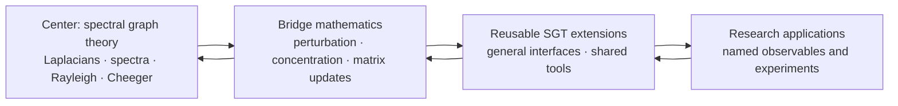

# Scaffold

Scaffold lets researchers formalize new applied mathematics today by treating
selected published results as explicit, cited assumptions. Lean checks every
downstream deduction, while those assumptions remain visible, reviewable, and
replaceable as formal proofs become available.

The project’s center is **spectral graph theory (SGT)**. Its goal is a broad,
reusable formal neighborhood around SGT: graph and Laplacian theory,
spectral and variational methods, matrix/operator tools, probability, and
bridges that future research can compose.

Scaffold is both a Lean library and a research substrate. It is **pre-release**:
the default `lake build` currently passes, but consumers should pin a [verified
revision](docs/5_QA_SCOREBOARD.md) rather than tracking `main`.

## Status

As of August 27, 2026:

| Check | Result |
| --- | --- |
| Default `lake build` | Passes; the umbrella reaches every public module |
| Explicit cited axioms | 10 |
| QA theorems/lemmas | 2549, with no `sorry` or `admit` under `Scaffold/` |

The remaining trust surface is: **Perron–Frobenius for irreducible
nonnegative matrices**
(admitted 2026-08-22 as `Scaffold.LinearAlgebra.perron_frobenius`,
Horn & Johnson Theorem 8.4.4 at the irreducible-case qualification
level — no strict-dominance clause, with the imprimitive-cycle
refutation witness `strict_dominance_refuted_QA` fencing exactly that
misstatement — opening the directed axis' second spectral toolkit,
absent from the pinned Mathlib; its first theorem consumer delivered
2026-08-24 as `GraphTheory.IrreducibleStationary` — existence,
uniqueness-up-to-positive-scale, the `∃!` packaging, and full support
of the stationary distribution on every irreducible nonnegative walk,
conditional on that axiom alone, with the eigenvalue-identification
and uniqueness clauses consumed structurally and the symmetric-cone
`K₂` agreement with the combinatorial `stationaryVec` pinned in QA;
its second delivered the same day as `GraphTheory.PageRank` — the
teleportation-regularized Google matrix whose positive floor makes
irreducibility *derived* rather than assumed, so existence, the
`∃!`, and full support of the PageRank distribution hold on
**reducible** input with no irreducibility hypothesis, likewise
conditional on that axiom alone, with the damping window `[0, 1)`
fenced at both endpoints in QA; and the axis' convergence layer opened
2026-08-24 by the second admission of the family,
`primitive_power_tendsto` (Horn & Johnson §8.5 at the row-stochastic
specialization, explicit axioms 9 → 10): powers of a primitive
row-stochastic matrix converge entrywise to the rank-one stationary
projector, with the directed 2-cycle periodicity refutation fencing
`hprim` exactly — the standing no-dominance scope of the first axiom
is precisely why this admission was needed. Its first consumer
delivered the same day as `GraphTheory.DirectedMixing`: the floor
makes the Google matrix primitive at `k = 1`, so the PageRank power
iteration converges — existence, uniqueness, and now *computability*
of the PageRank distribution, the convergence theorems conditional on
the new axiom alone with `#print axioms` verifying **zero
`perron_frobenius` contact**); the directed axis' third spectral
toolkit, the **magnetic Laplacian** (delivered 2026-08-25 as
`GraphTheory.Magnetic`, `proposals/magnetic-laplacian.md`: the
shelf's first complex Hermitian object — `M := D_sym −
½(A∘e^{iΘ} + (A∘e^{iΘ})ᴴ)` with real possibly-asymmetric weights and
arbitrary phases, Hermitian hypothesis-free by the Hermitian-part
convention; the magnetic energy identity, PSD on nonnegative weights,
the balanced-potential gauge characterization of the kernel — a
frustrated cycle forces it trivial, flux localization at form level
with no complex spectral theorem anywhere — and the zero-phase
agreement with the complexified classical Laplacian — and, since the
2026-08-26 signed-graph delivery, the gauge characterization at kernel
action level (`magneticLaplacian_mulVec_eq_zero_iff`); all proved hard
crust); the **signed-graph slice** (delivered 2026-08-26 as
`GraphTheory.Signed`, `proposals/signed-graphs-balance.md`: the signed
Laplacian `D − A_σ` at a `{±1}` signing joined to the magnetic shelf
at the π-flux — the signed Dirichlet energy identity *derived from*
the delivered `magnetic_energy`, the **Harary balance theorem in
kernel form** `IsBalanced A s ↔ ∃ x ≠ 0, L_σ *ᵥ x = 0` on connected
symmetric nonnegative input, positive definiteness under frustration,
and the switching similarity `diag(g) · L_σ · diag(g) = laplacian A`
with two-way eigenpair transfer; all proved hard crust — the
load-bearing-growth principle executed on the magnetic program); the
**Alon–Boppana program opened at its adopted gate** (2026-08-26,
`GraphTheory.AlonBoppana`, Steps 1–2 of the operator-adopted
`proposals/alon-boppana-bound.md`: the d-regularity interface — the
constant-eigenvector fact, the AM–GM row-sum domination, and the
top-eigenvalue identification `evals ⟨last⟩ = d` from both sides —
and the tree-ball interface per the Step-0 spike's verdict — the
`levE`/`levClass`/`ballE` BFS-level machinery against
`SimpleGraph.dist`, the `IsTreeBall` level-cardinality predicate, the
layer-cake cardinality bridge, and the far-apart ball-disjointness
theorem; the radial test-vector **normalization** followed 2026-08-27
as Step 3's first sub-slice — `radialVec` (Nilli's `ρ^{lev}` on the
edge ball, the d-regular-tree normalization `ρ² = (d−1)⁻¹` as a
hypothesis) with the squared-norm identity `⟨ρ^{lev}, ρ^{lev}⟩ =
2 (k+1)` exactly under `IsTreeBall`, the Rayleigh quotient's
denominator and the first theorem consumer of the Step-2 level
machinery, `1 < d` load-bearing and fenced at K₂; the energy half of
Step 3, the orthogonalization, and the diameter-dependent theorem
itself are the remaining steps per the proposal's
one-step-per-run instruction — all proved hard crust, zero new
axioms); the scalar and matrix
concentration family (Hoeffding, Bernstein, Azuma — the subgaussian
tail bound was retired 2026-08-22 by the Markov-route repair-and-retire
of `proposals/prove-subgaussian-tail-bound.md`, whose Step 0 spike
proved the old `subgaussianNorm ≤ K`-shaped axiom materially false via
two junk mechanisms and replaced it with the moment stated integrably
at the same name and conclusion); and Hoeffding's lemma. Classical
Laplacian facts, Courant–Fischer, Cauchy interlacing, **both Cheeger
inequalities** (the easy direction since 2026-08-18; the *hard*
direction `φ²/2 ≤ λ₂` proved 2026-08-23 and retired from axiom by the
median-split route of
`proposals/discharge-perturbation-axioms.md` — the Cauchy–Schwarz core
and fused contraction, the interval-integral co-area core, and the
median/level-set/assembly layer closing through the variational
characterization; explicit axioms 10 → 9), the **irregular
(volume-weighted) easy direction** `cheeger_upper_bound_normalized`
(2026-08-25, `proposals/irregular-cheeger-variational-transfer.md`:
`secondEval (normalizedLaplacian A) ≤ 2 * cheegerConstant A` on
arbitrary symmetric nonnegative positive-degree graphs — no regularity,
no connectivity — through the degree-stretched cut indicator
`√D · cutTestVector` (orthogonal to the true kernel vector `√D · 1` by
a volume identity that needs no regularity), the new general-kernel
`secondEval_le_rayleigh_of_ker`, and the `VariationalTransfer`
congruence engine's first theorem consumers; the same Rayleigh quotient
as the regular family with the closing arithmetic verbatim), and the
**irregular hard direction** `cheeger_lower_bound_normalized`
(2026-08-25/26, the same proposal's deferred half delivered:
`cheegerConstant A ^ 2 / 2 ≤ secondEval (normalizedLaplacian A)` on
exactly the easy direction's hypotheses — through the volume median
`exists_median_vol`, the degree-weighted layer-cake `coarea_core_vol`
(the regular family's Cauchy–Schwarz core and fused contraction already
degree-weighted, consumed verbatim with no regularity bridge), the
weighted norm split, and the new general-kernel sInf engine
`secondEval_variational_of_ker` at the true kernel vector `√D · 1` —
**the full Cheeger pair now holds in the volume-weighted measure on
every positive-degree weighted graph**, the family's last regular-only
caveat retired), and the **Fiedler
certified-conductance corollary** `cheeger_cut_existence` (2026-08-23:
on every connected `d`-regular graph a nonempty proper cut exists with
`conductance S ^ 2 ≤ 2 · lambda2 / d` — the cut-existence form of
Cheeger's inequality, assembled from the proved sweep lemma at the
Fiedler vector and the attained conductance minimum; Phase B of
`proposals/fiedler-partitioning.md`, pure hard crust and the
retirement's first consumer), and the **swept-level-set extraction**
(2026-08-24, `proposals/sweep-cut-extraction.md`: `fiedler_sweep_cut`
certifies an *explicit closed superlevel or sublevel set of the Fiedler
vector* — the cut the spectral-partitioning sweep actually returns, not
the non-constructive minimizer — at the same `2 λ₂ / d` constant,
through `cheeger_sweep_cut`, the median assembly of the per-part
`sweep_level_extract` whose integration is `coarea_core`'s own proof
pattern run at an attained level; pure hard crust — its irregular
port delivered 2026-08-26 as `sweep_level_extract_vol` +
`cheeger_sweep_cut_normalized`: the attainment route at the
`boundary / vol` ratio, every nonzero degree-weighted zero-sum `f`
carrying a swept nonempty proper cut at `conductance² ≤
2 · R_{L_sym}(√D f)` with no regularity, connectivity, or cardinality
hypothesis), the **higher-order (multiway) Cheeger easy direction**
`cheeger_upper_bound_multiway` (delivered 2026-08-26,
`proposals/multiway-expansion.md`, the new `GraphTheory.Multiway`:
`evals (L_sym) ⟨k−1⟩ ≤ 2 · maxᵢ boundary(Sᵢ)/vol(Sᵢ)` for *every*
disjoint nonempty k-family on every symmetric nonnegative
positive-degree graph — the every-family form, no partition-space
minimum — with the conductance corollary; through the k-general
subspace Rayleigh–Ritz engine `evals_le_of_linearIndependent`, the
order-statistics bridge `evals_le_of_card_eigvalOf_le`, and the
pointwise cross-part absorption lemma at the theorem's constant
exactly 2, and its ρ_k packaging `cheeger_upper_bound_multiway_rhoK`
(2026-08-26): the classical minimum-over-partitions form
`evals (L_sym) ⟨k−1⟩ ≤ 2 · multiwayExpansion A k` — attainment over the
finite partition space the only new content, plus the `k ≤ card V`
existence supplier), **Weyl's perturbation
inequality**, **Davis–Kahan sin Θ** (retired
2026-08-21 by the Duhamel/exponential-integral route: the equal-rank
projector identity plus the vector-level heat-semigroup FTC assembly,
`Analysis.OperatorTheory.Perturbation.{ProjectionGap,Duhamel}`), the
**equal-rank projector identity** `‖P − Q‖ = ‖(I−Q)P‖`, the **Duhamel
bound** `‖(I−Q)P‖ ≤ ‖E‖/(b−a)`, the derived `davisKahanTwoPoint`
(now fully hard crust), Woodbury/Sherman–Morrison, the
electrical crust, Foster's theorem, and the **resistance metric**
(delivered 2026-08-24: the maximum principle for unit-demand
potentials, the definiteness residual `R u v = 0 ↔ u = v`, and the
triangle inequality `R u w ≤ R u v + R v w` — with nonnegativity,
symmetry, and self-distance, `effectiveResistance` is a genuine metric
on every connected network, the classical resistance distance), the
Expander Mixing Lemma and the **Hoffman-type independence bound**
`hoffman_independence_bound` (delivered 2026-08-25,
`proposals/expander-independence-number-bound.md`: the classical ratio
bound `|S| ≤ μ·n/(d+μ)` for every independent set of a `d`-regular
nonnegative symmetric network with positive degree, at exactly the
mixing lemma's `μ` hypothesis — the proved lemma's *first theorem
consumer*, its exact hypothesis shape now load-bearing; `0 < d` proved
a genuine hypothesis by the zero-adjacency isolation fence, and QA
attains the bound with equality on both `C₄` and `K₃` at the exact
Ramanujan-pinned `μ`), the
certificate-soundness layer (`lambda2_le_of_certificate`), the
operator-norm/resolvent bridge (`l2OpNorm_eq_max_abs_evals`, the resolvent
identity, the resolvent norm/Lipschitz bounds, and the resolvent-map
injectivity), **Tikhonov regularization in the Laplacian eigenbasis**
(the graph-signal smoothing minimizer, its eigencoefficient shrinkage
identity, the normal equation and its converse characterization,
minimality/uniqueness, and mean preservation, capped by the **Phase 2
hard-filter limit** — `tikhonovShrinkage π λ → 0` as `π → 0` at every
positive `λ`, plus the finite tail-suppression corollary: the filtered
coefficient energy of any selected positive-eigenvalue mode set
vanishes in the limit, stated as tail suppression per the external
consumer's non-overclaim instruction), and **two-sided spectral
band projectors** (the `(a, b]` band as the difference of two
`spectralProjector` calls, idempotence through the nestedness
cross-law `P_{c₁} * P_{c₂} = P_{min c₁ c₂}`, the mode-selection
action interface, the orthogonality of disjoint bands — both
composition orders, image orthogonality, and shared-mode-freeness —
and completeness under a partition: the unconditional telescoping
law, the covering-family resolution of the identity, monotone-family
orthogonality, and the vector decomposition `x = ∑ B_k x`), capped
by the **Hilbert-projection specialization** (the band projector's
output *is* Mathlib's `orthogonalProjection` onto its transported
range and the closest point of that range to the input — the
residual-orthogonality engine, the identification, and the
closest-point minimality over the band's fixed space),
are proved, not admitted. On the random-walk axis, the walk-matrix
**eigenpair transfer** through the proved similarity (both directions,
the reflected walk spectrum `walkEvals` with explicit eigenvector
witnesses, and the transferred-family expansion) and
**reversibility/detailed balance** (`deg i * P i j = deg j * P j i`
with its stationary-measure form `π i * P i j = π j * P j i` and the
symmetrizability packaging `D * P` symmetric — the property that makes
spectral methods apply to the walk at all) the **ℓ²-mixing proxy**
(`GraphTheory.Mixing`: the stationary vector `π = deg/vol`, the walk
law `(Pᵀ)ᵗ *ᵥ δₓ` with mass conservation, the density-coordinate
evolution `h_{t+1} = P *ᵥ h_t` consuming detailed balance, and the χ²
mixing distance with its vanishing characterization, `t = 0`
normalization, and plain-ℓ² corollary bridge), and the **complete
geometric-decay mixing statement** of the mixing-time program
(the conjugated-power transfer through the similarity, eigencoordinate
evolution, the Parseval-exact decay identity, the ℓ²(π) contraction
under value-based mode exclusion, and the closing χ² mixing bound
`chiSquareDistance_le_of_connected` —
`χ²(t, x) ≤ (λ*)^{2t} · ((π x)⁻¹ − 1)` on connected graphs under the
rate hypothesis, its mode hypothesis *derived* from the connectivity
kernel characterization of `L_sym` transferred through the proved
congruence, not assumed) — are likewise proved. The **matrix-level heat semigroup** (`GraphTheory.Heat`, opened 2026-08-23 as Phase B of the external-consumer program `sgt-gaps.md` authorized: `heatKernel A t := NormedSpace.exp ℝ (-(t • laplacian A))` — the diffusion operator `e^{-tL}` — with symmetry under `A.IsSymm` through the pin's `Matrix.IsSymm.exp`, the hypothesis-free time-zero identity, the general square-zero exponential collapse `exp M = 1 + M`, **the semigroup law** `heatKernel A s * heatKernel A t = heatKernel A (s + t)` (Step 2, hypothesis-free, via `Matrix.exp_add_of_commute` at the commuting negated scalar multiples — the external consumer's "identity at time zero + semigroup law" pair complete hard crust), and **mass conservation** `heatKernel A t *ᵥ onesVec = onesVec` (Step 3, hypothesis-free, through the entrywise-built exponential-series convergence `expSeries_hasSum_exp` and the kernel-vector engine `exp_mulVec_eq_of_mulVec_eq_zero` — heat neither creates nor destroys total mass, and on disconnected input it provably does not cross components; QA exhibits both the two-route conservation witness and the per-component no-leakage witness), plus **eigenmode decay and the DC limit** (Step 4, closing Phase B as pure hard crust: the eigenmode engine `exp_mulVec_eq_smul_of_mulVec_eq_smul` consuming Step 3's convergence at an eigenvector — `heatKernel A t *ᵥ vᵢ = e^{−t·λᵢ} • vᵢ` at every time — with the sorted-spectrum decay monotonicity and PSD dissipation bound, the eigenbasis expansion `heatKernel_mulVec_eq_sum`, and the payoff **`heatKernel_mulVec_tendsto_atTop`**: on connected graphs, free diffusion leaves only the DC component — the heat flow of any vector converges to its mean `((∑ j, x j)/|V|) • onesVec`; QA witnesses mode decay and the DC limit each by two independent routes, cross-validates the engine against the rank-one-idempotent collapse at a nonzero eigenvalue, and pins the K₂ Laplacian spectrum `[0, 2]` from trace/determinant) — the external consumer's four-item interface complete as hard crust), plus **the heat-flow derivative at zero** (Phase C Step 1, the second `sgt-gaps.md` request: `heatKernel_mulVec_hasDerivAt_zero`, the infinitesimal generator statement `d/dt e^{-tL} x |₀ = -L x` in `HasDerivAt` form, its entrywise engine `heatKernel_mulVec_apply_hasDerivAt_zero` being Duhamel's termwise-sum technique adapted to the eigenbasis expansion, the vector form assembled by the pin's `hasDerivAt_pi`; QA pins the numeric derivative on K₂ by two independent routes and cross-checks infinitesimal mass conservation against Step 3 in both directions), as is **the first-order remainder bound** (Phase C Step 2, completing Phase C and the proposal: `heatKernel_firstOrder_remainder_apply_le` — on the window `|t·λᵢ| ≤ 1`, every coordinate of the flow deviates from its first-order Taylor polynomial at zero by at most `t² · ∑ᵢ λᵢ² |vᵢ ⬝ᵥ x| |vᵢ a|`, the boundary-observable coordinate form, termwise through the pin's `Real.abs_exp_sub_one_sub_id_le`, no nonnegativity hypothesis; with the uniform `[0, T]` interval packaging `heatKernel_firstOrder_remainder_interval`; QA evaluates the spectral constant to exactly `4` on K₂, composes the concrete bounds `e⁻¹ ≤ 1` and `|1/2 − e^{-1/2}| ≤ 1/4` from raw closed-form values and theorem bounds at two times — pinning the `t²` scaling — and proves the window hypothesis refuted beyond `t = 1/2`). On the directed axis,
the **directed degree layer** (`GraphTheory.Directed`: the out-degree
`outDeg` (definitionally the shelf's `deg` — the undirected shelf was
carrying the out-degree walk operators symmetry-free all along), the
in-degree `inDeg`, the symmetric-cone agreements, and directed
handshaking `∑ outDeg = ∑ inDeg`, with QA certifying
`walkTransitionMatrix`'s row-stochasticity and the walk Laplacian's
mass conservation on genuinely asymmetric input and refuting symmetry
of the directed walk matrix) **and the directed normalized Laplacian**
(`directedNormalizedLaplacian := I − ½(SAS + SAᵀS)` at the out-degree
normalization — symmetric *hypothesis-free* (the two defining halves
are transposes of each other), agreeing exactly with
`normalizedLaplacian` on the symmetric cone, and conjugate by `√D` to
the square-root-free symmetrized-adjacency pair `D_out − ½(A+Aᵀ)`;
QA exhibits the calibration refutation — symmetric but **not PSD** on
directed input, the quadratic form at `!![0,4;1,0]` evaluating to
`−1/2 < 0`, so the positivity layer of the undirected toolkit does
not transfer) are proved with zero axioms. The finite-distribution **entropy layer** (`InformationTheory.Entropy`: relative entropy `klDiv` and Shannon entropy `shannonEntropy` with the visible `p i = 0 ↦ 0` junk convention, Gibbs' inequality in both directions (`0 ≤ klDiv p q`, with equality exactly at `p = q`), the uniform bridge, the entropy maximum `shannonEntropy p ≤ log |V|` with equality exactly at uniform, and nonnegativity) is proved from the term-wise information inequality `log t ≤ t − 1` — the same textbook route as the pinned Mathlib strict-concavity machinery, with zero axioms. The **discrete-affine dynamics layer** (`Dynamics.DiscreteAffine`, the `sgt-gaps.md` item-2 consumer interface delivered 2026-08-23: the finite-vector geometric-decay wrapper `r ^ n • x → 0` for `|r| < 1` and the affine-iteration convergence theorem — `x_{n+1} = (1−α) • x_n + α • e` converges to `e` for `0 < α < 2`, via the closed form `x_n = (1−α)^n • (x_0 − e) + e` — both stated at a general real normed space) is likewise proved from pinned Mathlib lemmas with zero axioms, opening the discrete-affine slice of the graph-dynamics backlog item. The **Krylov/Chebyshev interface layer** (`GraphTheory.Krylov`, the approximate-spectral-projection Step 1a delivered 2026-08-23: the real `krylovSpan` definition with polynomial-image membership, the polynomial-eigenaction transfer `p(M) v = p(μ) • v` through the heat module's power lemma, the pin-gap `sum_mulVec` push, the Chebyshev band bound `|T_n(x)| ≤ 1` on `[−1, 1]` with both Step-0-priced gaps closed — `natDegree (T ℝ n) = n` and `T_m(x) ≥ 1` at `x ≥ 1`, the latter through a conjunction engine that also proves index-monotonicity — and the hypothesis-form Kaniel–Paige skeleton carrying the five named spectral-layer discharge sites) is likewise proved with zero axioms. The **Kaniel–Paige spectral discharge** (the same program's Step 1b, delivered 2026-08-23: the general-eigenvector transfer `u ⬝ᵥ (p(M) g) = (u ⬝ᵥ g) · p(μ)` at any eigenvector, the eigenbasis component form with Parseval/quadratic-form resolution for polynomial images, the affine band map with its pins and degree, the unit decomposition `b = c • u + s • g` at `c² + s² = 1`, and the composite `kanielPaigeChebyshev` — the full Kaniel–Paige bound at the Chebyshev-composed band polynomial, every spectral site discharged from the eigenbasis-level band hypothesis) is likewise proved with zero axioms. The **Kaniel–Paige final statement** (the same program's Step 1c, delivered 2026-08-24, the proposal complete: `kanielPaige` — for symmetric `M` with unit top eigenvector, unit `b` with `u ⬝ᵥ b ≠ 0`, the band hypothesis, and `k ≥ 1`, the `k`-th Krylov space contains a nonzero vector within `(Ltop − Lbot) · tan²φ / T_{k−1}(1 + 2γ)²` of the top eigenvalue at `γ = (Ltop − Ltwo)/(Ltwo − Lbot)`, the decomposition internal and the bound in the classical gap form) is likewise proved with zero axioms, QA'd end-to-end on `diag(3,1,0)` with the bound expression-equal to the composite's `16/75`, the `k = 1` degenerate case, the `b = u` tightness at bound `0` attained, and the simple-top guard refuted on a top-multiplicity fixture. The **polyfilter band-projection layer** (`GraphTheory.PolyFilter`, the Krylov Step-0 survey's recorded follow-on delivered 2026-08-24 as the Chebyshev layer's *second* consumer: the filter-agnostic transfer theorem `aeval_sub_bandProjector_l2OpNorm_le` — within `ε` of `1` at every in-band eigenvalue and of `0` at every out-of-band one, `‖p(M) − bandProjector M hM a b‖ ≤ ε`, the proof resolving the difference's action through the eigenbasis and the Resolvent C*-norm spine with *no eigenvalues of the difference computed anywhere* — plus the power-filter instantiation at the power-method rate `(t/Ltop)^d` and the Chebyshev-damped instantiation `chebyshevFilter_l2OpNorm_le` at `1/T_d(w(Ltop))` through the Krylov `bandMap`; QA with the affine exact filter driving the engine to ε = 0 two-route, both instantiations' ε constants attained at the out-mode, the power-vs-Chebyshev comparison `1/17 < 4/9`, and the out-of-band hypothesis refuted in proved form) is likewise proved with zero axioms. The **band Davis–Kahan layer** (`Perturbation.BandDavisKahan`, backlog item 9 delivered 2026-08-24 and extended the same day: the product bound `‖Q * P‖ ≤ ‖A − B‖ / δ` for the band projectors of two symmetric matrices on δ-separated windows, constant 1, by the algebraic commutator/shift route — the r-cancellation through range invariance is the theorem's content; the **difference** (sin-Θ) form `‖P_A − P_B‖ ≤ ‖A − B‖ / δ` for equal-rank band projectors under one-sided eigenvalue separation — the equal-rank gap identity's first consumer, with the public rank supplier `rank_bandProjector_eq_card` making the rank hypothesis checkable; and the **cluster form** `l2OpNorm_bandProjector_sub_bandProjector_le_of_pairwise` — the same difference bound under *pairwise* separation (B's out-of-window eigenvalues δ-away from each of A's in-window eigenvalues, the literal Yu–Wang–Samworth Theorem 1 δ), strictly weaker hypotheses: interior B-eigenvalues are handled inside the proof by a projector-free Parseval expansion at the eigenvector, boundary ones by the capture-equality window transfer `bandProjector_eq_of_forall_mem_iff` and the engine at the cluster-range center/radius; plus the vector action bound `l2OpNorm_mulVec_le` and the operator↔band-projector vector commutation as landed shelf gaps) is likewise proved with zero axioms. The **Hermitian functional-calculus bridge** (`GraphTheory.FunctionalCalculus`, delivered 2026-08-25 per `proposals/hermitian-functional-calculus-bridge.md`: the thin wrapper `spectralCalc M hM f := (isHermitian_of_isSymm hM).cfc f` consuming Mathlib's proved continuous functional calculus at the shelf's real-symmetric convention — no continuity hypothesis on the bare `ℝ → ℝ` function (finite spectrum) — with the hypothesis-free eigenvector action `f(M) *ᵥ vₖ = f (λₖ) • vₖ`, the entry/action equality with the shelf's own filter-sum expansion (`dotProduct_eigvecOf_filter` consumed verbatim as the coefficient bridge), the recovery of the hand-built `spectralProjector` as the calculus at indicator functions, and `spectralCalc_id` — a consolidation layer for the four hand-built "function of a symmetric matrix" notions, consuming no axiom and addressing none; the complex half needs no second wrapper since Mathlib's `cfc` is `RCLike`-generic, confirmed elaborating at `𝕜 = ℂ` by the QA witness `fcM2c_cfc_id`. First consumer recovered the same day: the Tikhonov minimizer *is* the calculus at the shrinkage function (`tikhonovMinimizer_eq_spectralCalc_mulVec`, hypothesis-free), with the normal equation `(L + π•1) * f(L) = π•1` re-derived through the generic CFC algebra — an eigenbasis-free route to a delivered statement. Second consumer, completing the stub later the same day: **the heat semigroup *is* the calculus at the exponential family** (`heatKernel_eq_spectralCalc_exp`, a genuine reconciliation of `Heat.lean`'s from-scratch exponential-series stack against Mathlib's `cfc` — in effect the spectral mapping theorem for `exp` at real-symmetric matrices — with the semigroup law re-derived through the calculus algebra as a second route to `heatKernel_mul_heatKernel`); and closing the family the same day, the priced follow-on **resolvent identity**: the Tikhonov filter *is* `π • (L + π•1)⁻¹` (`spectralCalc_tikhonovShrinkage_eq_smul_inv`) — by the matrix-algebra route through the shelf resolvent program's spectral-gap-free invertibility supplier (its first calculus consumer) and by the strictly more general calculus route (`cfc_inv`, merely-symmetric input under spectrum-avoidance, no determinant anywhere), with the general-symmetric normal equation as the shared parent and the consumer corollary `x* = π • ((L + π•1)⁻¹ *ᵥ y)` — the textbook shifted-inverse solve)) is likewise proved with zero axioms.

The generated [QA Scoreboard](docs/5_QA_SCOREBOARD.md) is the authority for
current counts, verification commands, and limitations.

## Transit map

A hub-and-spoke reading of the SGT core and the seven research axes it
feeds, colored by proof status (proved · admitted axiom · in progress ·
proposed · gated). This is a snapshot, not live data — regenerate it with
`python3 scripts/generate_scaffold_map_svg.py` after a proposal's status
changes; the same underlying data drives a clickable, hoverable version at
[`docs/scaffold_map.html`](docs/scaffold_map.html) (open it locally — it's
plain self-contained HTML/JS, no build step).

<p align="center"></p>

## Why Scaffold exists

Modern applied work often depends on results that Mathlib does not yet expose
in a directly usable form. Waiting for every prerequisite to be formalized can
block experimentation at the frontier. Hiding those gaps behind `sorry`, on the
other hand, obscures what has actually been established.

Scaffold makes the tradeoff explicit:

- published background results may enter through a narrow, cited axiom boundary;
- real definitions and stable APIs make those results composable in Lean;
- small QA proofs test the interfaces and selected consequences;
- novel results remain conditional on their axioms until those axioms are
  proved or replaced upstream.

This is stronger than informal derivation because Lean checks the downstream
reasoning. It is weaker than foundational formalization because the admitted
mathematics remains part of the trust base.

### Why spectral graph theory

The center could have been a few other applied-math domains instead; SGT
was chosen over each for a specific tradeoff, not by default.

| Alternative | Its case | Why SGT won instead |
| --- | --- | --- |
| Matrix concentration (Bernstein, Azuma) | Highest immediate utility — nearly every randomized-algorithm and high-dimensional-statistics bound depends on it directly | Needs substantial measure-theoretic setup before any concrete consequence; used here as an admitted bridge (`Probability.Concentration.Matrix.*`), not a starting point |
| Optimization and convex analysis | Interfaces directly with control theory and machine learning | Branches quickly into special cases (convex cones, non-smooth subgradients, constraint qualifications) that resist a clean formalization boundary |
| Classical (unweighted) graph theory | Already well developed in Mathlib; little extra machinery needed | Stays discrete — does not naturally bridge into the continuous linear algebra (eigenvalues, quadratic forms) that connects graphs to the rest of formalized mathematics |

SGT sits at the intersection instead: finite matrices and graphs avoid most
infinite-dimensional measure-theoretic and topological overhead, while its
spectral machinery (eigenvalues, Rayleigh quotients, quadratic forms)
immediately exercises Mathlib's bridges across linear algebra, analysis,
and probability at once. Formalizing SGT is what forces this project to
build reusable interfaces spanning linear algebra (`Spectral`),
combinatorics and expansion (`Cheeger`, `Fiedler`, `Expander`), random
walks (`RandomWalk`, `Normalized`, `Stationary`, `Mixing`), and variational analysis
(Courant–Fischer, the Cheeger bounds) — see "What's here" below — rather
than one isolated result.

### The mushy center and hard crust

Scaffold deliberately keeps two kinds of work separate:

- The **mushy center** is the smallest possible set of research-frontier results
  that we need before their full proofs exist in Lean. Each such result must be
  a named, explicit axiom with a precise statement, a source citation, and a
  clear account of its intended upstream replacement. It is never concealed
  behind `sorry`.
- The **hard crust** is everything that follows mechanically from that center:
  definitions, interfaces, derived theorems, and QA lemmas proved by Lean. This
  work must contain no `sorry` or `admit`, and should make the assumptions on
  which it depends apparent.

Ongoing work should shrink and strengthen the mushy center while expanding the
hard crust. Prefer proving or upstreaming an existing axiom, tightening an
axiom's statement, or deriving a reusable checked consequence over adding a new
assumption. An axiom may be added only when it is cited, necessary for a
concrete SGT milestone, and surrounded by enough hard-crust checks to expose
its intended use.

## The center-out research policy

Ongoing work radiates outward from SGT. We strengthen the center first, add
adjacent mathematics only when it unlocks important SGT obligations, and
advance to applications only when the intervening interfaces are credible.



The reverse arrows matter: outer work that exposes a weak definition, missing
assumption, or unusable theorem shape sends us back inward to repair the nearest
dependency. We do not expand the library merely because a topic is adjacent or
interesting.

A proposed task receives priority when it:

1. unlocks a concrete SGT theorem, experiment, or downstream consumer;
2. repairs a load-bearing definition or closes a known proof dependency;
3. reduces the trust surface, removes a placeholder, or replaces an axiom upstream;
4. creates a reusable bridge between SGT and perturbation, probability, or dynamics;
5. can be validated by a focused Lean check, numerical experiment, or citation review;
6. delivers more of the above per unit of complexity and maintenance cost than
   competing work.

Build health, real definitions, and sound theorem shapes take precedence over
adding new surface area. The complete policy lives in
[Strategy](docs/1_STRATEGY.md). Active work is listed in
[proposals](proposals/README.md).

## What's here

The near-term center is general SGT. Public modules currently cover:

| Area | Modules |
| --- | --- |
| Graphs and Laplacians | `GraphTheory.Spectral`, `GraphTheory.SimpleGraphAdapter` |
| Variational spectra | Courant–Fischer, Rayleigh, Cauchy interlacing (in `Spectral`) |
| Cuts and expansion | `GraphTheory.Cheeger`, `GraphTheory.Fiedler`, `GraphTheory.Expander` (edge weights, the centered-indicator decomposition, the Expander Mixing Lemma and its first theorem consumer — the Hoffman-type independence bound `hoffman_independence_bound` at the lemma's own `μ` hypothesis, with `IsIndependentSet` and the whole-graph corner fence —, the Fiedler certified-conductance cut `cheeger_cut_existence`, the swept-level-set extraction `cheeger_sweep_cut`/`fiedler_sweep_cut`, and the full irregular volume-weighted Cheeger pair `cheeger_upper_bound_normalized`/`cheeger_lower_bound_normalized` through `GraphTheory.VariationalTransfer`'s degree-stretched cut-test-vector layer, the `Cheeger.lean` volume-median/coarea machinery, and the general-kernel variational engines, plus the connectivity transfer `secondEval_normalizedLaplacian_pos_iff_connected` (`0 < λ₂(L_sym) ↔ connected`, with the kernel characterization `normalizedLaplacian_mulVec_eq_zero_iff` and the Cheeger consumer corollary `cheegerConstant_pos_of_connected`), the **volume-weighted sweep-cut extraction** — `sweep_level_extract_vol`/`cheeger_sweep_cut_normalized` (2026-08-26): the irregular pair's explicit witness level set, the regular family's attainment route at the `boundary / vol` ratio, every nonzero degree-weighted zero-sum `f` carrying a swept nonempty proper cut at `conductance² ≤ 2 · R_{L_sym}(√D f)` with no regularity, connectivity, or cardinality hypothesis — and the **irregular Fiedler instantiation** `fiedler_sweep_cut_normalized` (2026-08-26): the family's algorithm-facing capstone, composing the sweep extraction with the normalized Fiedler interface and its `D^{-1/2}` pullback so that on every connected irregular graph an explicit swept cut of the Fiedler pullback itself satisfies `conductance² ≤ 2 · λ₂ (L_sym)` — the regular family's own `2λ₂/d` constant on the cone —, and `GraphTheory.Multiway` (2026-08-26): the **higher-order Cheeger easy direction** `cheeger_upper_bound_multiway` — `evals (L_sym) ⟨k−1⟩ ≤ 2 · maxᵢ boundary(Sᵢ)/vol(Sᵢ)` for every disjoint nonempty k-family, the every-family form (no partition-space minimum), with the conductance corollary — through the k-general subspace Rayleigh–Ritz engine `evals_le_of_linearIndependent`, the order-statistics bridge `evals_le_of_card_eigvalOf_le`, and the pointwise cross-part absorption lemma at the theorem's constant exactly 2 — plus the **ρ_k partition-minimum packaging** (2026-08-26, the delivery's own follow-on): `IsMultiwayPartition`, `maxPartConductance`, `multiwayExpansion A k := sInf` over the k-way partitions, attainment over the finite partition space (`Set.Nonempty.csInf_mem` at the value set's finiteness), the existence supplier at `k ≤ card V`, and the headline `cheeger_upper_bound_multiway_rhoK` — the classical λ_k ≤ 2ρ_k statement form, consuming the every-family theorem at the attained minimizer, no new engine |
| Decidable spectral certificates | `GraphTheory.SpectralCertificates` (the ℚ specification checker with its soundness theorem, and the kernel-verifiable ℤ cross-multiplied twin with proved bridges) |
| Electrical structure | `GraphTheory.Electrical` (effective resistance by the potential equation, the one-sided Dirichlet bound, and the resistance metric — maximum principle, definiteness `R u v = 0 ↔ u = v`, triangle inequality), `GraphTheory.ElectricalFlow`, `GraphTheory.Foster` |
| Heat semigroup | `GraphTheory.Heat` (`heatKernel A t = e^{-tL}` on `laplacian A`: symmetry under `A.IsSymm`, identity at `t = 0`, the square-zero and rank-one-idempotent exponential collapses, the semigroup law `heatKernel A s * heatKernel A t = heatKernel A (s + t)`, mass conservation `heatKernel A t *ᵥ onesVec = onesVec` with its kernel-vector engine, eigenmode decay `heatKernel A t *ᵥ vᵢ = e^{−t·λᵢ} • vᵢ` with the decay monotonicity/dissipation bounds, the eigenbasis expansion, the connected-graph DC limit `heatKernel_mulVec_tendsto_atTop`, the heat-flow derivative at zero `heatKernel_mulVec_hasDerivAt_zero` (Phase C Step 1), and the first-order remainder bound `heatKernel_firstOrder_remainder_apply_le` with its `[0, T]` interval packaging (Phase C Step 2); **the program COMPLETE — Phases A, B, and C, zero axioms throughout**) |
| Walks and mixing | `GraphTheory.RandomWalk`, `GraphTheory.Normalized` (the similarity, eigenpair transfer, conjugated powers), `GraphTheory.Stationary`, `GraphTheory.Mixing` (the ℓ²-mixing proxy: stationary vector, walk law, density evolution, χ² distance, decay engine) |
| Directed operators | `GraphTheory.Directed` (the degree layer `outDeg`/`inDeg`, directed handshaking, and the directed normalized Laplacian `I − ½(SAS + SAᵀS)` — symmetric hypothesis-free, agreeing with `normalizedLaplacian` on the symmetric cone — with the PSD-refutation calibration witness; the directed axis, program complete) |
| Krylov methods and Chebyshev polynomials | `GraphTheory.Krylov` (the Lanczos/Kaniel–Paige program COMPLETE through Step 1c: the real `krylovSpan` definition, polynomial-eigenaction transfer `p(M)v = p(μ)•v`, degree-`<k` Krylov membership, `sum_mulVec`, the Chebyshev band bound `\|T_n(x)\| ≤ 1` on `[−1,1]`, `natDegree (T ℝ n) = n`, `T_m(x) ≥ 1` at `x ≥ 1`, the hypothesis-form Kaniel–Paige skeleton, the general-eigenvector transfer layer, the eigenbasis component form with Parseval/quadratic-form resolution identities, the affine band map with pins/degree/range/growth, the unit decomposition, the composite `kanielPaigeChebyshev` with every spectral site discharged, and the final statement `kanielPaige` — the classical bound in `tan²φ`/`γ` form, `u ⬝ᵥ b ≠ 0` the only starting-vector hypothesis) |
| Polynomial filters and band projection | `GraphTheory.PolyFilter` (the Chebyshev layer's second consumer, 2026-08-24: the filter-agnostic transfer theorem `\|p(M) − bandProjector M hM a b\| ≤ ε` from per-eigenvalue filter quality — no eigenvalues of the difference computed anywhere — plus the power-filter instantiation at the power-method rate `(t/Ltop)^d` and the Chebyshev-damped instantiation at `1/T_d(w(Ltop))` through the Krylov `bandMap`; the Band module's first approximation-theory consumer) |
| Nonnegative-matrix spectral theory | `LinearAlgebra.PerronFrobenius` (`Matrix.IsIrreducible` via directed reachability; the admitted Perron–Frobenius theorem for irreducible nonnegative matrices — the directed axis' second spectral toolkit), `LinearAlgebra.PrimitiveConvergence` (`Matrix.IsPrimitive` as H&J's positive-power definition; the admitted primitive power convergence `Pᵗ *ᵥ x → (π ⬝ᵥ x) • 1` — the directed axis' first *convergence* axiom, given-π form, no rate; the unconditional transfer layer: primitivity from positivity, primitivity → irreducibility by the entry-of-power walk decomposition, row-stochastic powers fixing the constant-one vector, and the entrywise/walk corollaries) |
| Irreducible stationary distributions | `GraphTheory.IrreducibleStationary` (the first Perron–Frobenius consumer, conditional on that axiom: the transposed Perron engine with the walk's root pinned to 1 through row-stochasticity, existence/`∃!`/full support of the stationary distribution on irreducible nonnegative walks, uniqueness up to positive scale; the unconditional irreducibility-transfer lemmas) |
| PageRank | `GraphTheory.PageRank` (the second Perron–Frobenius consumer, conditional on that axiom: the teleportation-regularized Google matrix `G i j = α·P i j + (1−α)·n⁻¹`, whose positive floor makes irreducibility *derived* rather than assumed — existence, the `∃!`, and full support of the PageRank distribution on **reducible** input at any damping `α ∈ [0,1)`; the unconditional structural layer: the floor, irreducibility, α-free row stochasticity, and the general row-stochasticity bridge `walkTransitionMatrix M = M`) |
| Directed mixing | `GraphTheory.DirectedMixing` (the first `primitive_power_tendsto` consumer and the directed axis' first convergence theorem: `googleMatrix_isPrimitive` — the floor makes the Google matrix primitive at `k = 1`, aperiodicity derived never assumed — and **`pageRank_powerIteration`**, the classical PageRank algorithm as a theorem, `(G ^ t) *ᵥ x → (π ⬝ᵥ x) • 1`, plus the entrywise column form and the walk-evolution form `ν ᵥ* Gᵗ → π`; all conditional on the new axiom **alone** — no `perron_frobenius` contact, the two trust costs independent; no rate, entrywise topology) |
| Magnetic Laplacian | `GraphTheory.Magnetic` (the shelf's first complex Hermitian object and the directed axis' third spectral toolkit: `magneticLaplacian A Θ = D_sym − ½(W + Wᴴ)` with `W = A∘e^{iΘ}` entrywise — Hermitian by construction **hypothesis-free** for any real possibly-asymmetric weights and any phases, the single-`W` classical form *derived* on the symmetric/antisymmetric cone; the **magnetic energy identity** `x*Mx = ½ ∑ A_uv \|x_u − e^{iΘ_uv} x_v\|²` (hypothesis-free), PSD on nonnegative weights, the **balanced-potential gauge characterization** `x*Mx = 0 ↔ x_u = e^{iΘ_uv} x_v` on every positive edge (a frustrated cycle forces the kernel trivial — spectral localization of flux at form level, no eigenvalue machinery), and the zero-phase agreement with the complexified classical Laplacian of the symmetrized weights; all proved, zero axioms) |
| Signed graphs | `GraphTheory.Signed` (the signed-graph slice of the graph-model axis, 2026-08-26: the signed Laplacian `signedLaplacian A s = D − A_σ` at a `{±1}` signing `s`, the magnetic π-flux join `magneticLaplacian A (signFlux s) = (signedLaplacian A s : ℂ)` entrywise, the signed Dirichlet energy identity derived from the delivered `magnetic_energy` (real and complex forms), the row-sum identity and the kernel↔edge-alignment characterization, the walk collapse to a `{±1}` switching, **Harary balance in kernel form** `IsBalanced A s ↔ ∃ x ≠ 0, signedLaplacian A s *ᵥ x = 0` on connected symmetric nonnegative input, positive definiteness under frustration, and the switching similarity `diag(g) · L_σ · diag(g) = laplacian A` with two-way eigenpair transfer — all proved hard crust, zero new axioms) |
| Alon–Boppana program | `GraphTheory.AlonBoppana` (the adopted program's home module, Steps 1–3a, 2026-08-26/27: the d-regularity interface in the shelf's `d : ℝ` hypothesis idiom — `IsDRegular A d`, the constant-eigenvector fact `A *ᵥ onesVec = d • onesVec` (a row-sum computation), the **AM–GM row-sum domination** `xᵀAx ≤ d · ‖x‖²` (entrywise AM–GM multiplied through nonnegative weights; the symmetric double sum's halves both `d‖x‖²` via the row- and column-sum degree identities), and the **top-eigenvalue identification** `evals ⟨last⟩ = d` proved from both sides (the `onesVec` eigenvalue witness + domination at the unit eigenvector — load-bearing on the sorted-spectrum API at its extremes); Step 2's tree-ball interface at module level — `levE`/`levClass`/`ballE` (BFS levels of an edge against `SimpleGraph.dist` on `supportGraph`), the junk-zero-honest level-0 iff with its connected amortization, the **`IsTreeBall`** full-level predicate (`#{z | levE z = j} = 2 (d−1)^j`), the ball algebra with the **layer-cake cardinality bridge `ballE_card_eq_sum`**, and the far-apart condition `distEdge` + `ballE_disjoint_of_lt_distEdge`; and Step 3's first sub-slice — `radialVec` (Nilli's radial test vector `ρ^{lev}` on the radius-`k` edge ball, the d-regular-tree normalization `ρ² = ((d−1:ℕ):ℝ)⁻¹` carried as a hypothesis) with the support/entry/nonvanishing interface, the **layer-cake sum bridge `sum_ballE_eq_sum_levels`**, and the **squared-norm identity `⟨ρ^{lev}, ρ^{lev}⟩ = 2 (k+1)`** exactly under `IsTreeBall` (the geometric growth of full levels cancelling the vector's geometric decay per level — the Rayleigh quotient's denominator, `1 < d` load-bearing at the cancellation and fenced at K₂); the energy half of Step 3, the two-vector orthogonalization, and the diameter-dependent theorem are the remaining steps per the proposal's one-step-per-run instruction; all proved hard crust, zero new axioms) |
| Hermitian functional calculus | `GraphTheory.FunctionalCalculus` (the Scaffold–Mathlib bridge, 2026-08-25: the thin wrapper `spectralCalc M hM f := (isHermitian_of_isSymm hM).cfc f` exposing Mathlib's proved continuous functional calculus at the shelf's real-symmetric convention — bare `ℝ → ℝ` functions, no continuity hypothesis; the eigenvector action `f(M) *ᵥ vₖ = f (λₖ) • vₖ` hypothesis-free; the equality with the shelf's filter-sum expansion, `dotProduct_eigvecOf_filter` consumed verbatim; the `spectralProjector` recovery at indicator functions; and `spectralCalc_id`; the complex half needs no second wrapper — Mathlib's `cfc` is `RCLike`-generic, confirmed elaborating at `𝕜 = ℂ` by QA. First consumer recovered the same day: the Tikhonov minimizer *is* the calculus at the shrinkage function (`tikhonovMinimizer_eq_spectralCalc_mulVec`, hypothesis-free), with the normal equation `(L + π•1) * f(L) = π•1` re-derived through the generic CFC algebra — an eigenbasis-free route to a delivered statement. Second consumer, later the same day: the heat semigroup *is* the calculus at the exponential family (`heatKernel_eq_spectralCalc_exp` — `Heat.lean`'s exponential-series stack against Mathlib's `cfc`, the spectral mapping theorem for `exp` at symmetric matrices in effect; `spectralCalc_exp_mul` + `heatKernel_mul_heatKernel_of_spectralCalc` re-deriving the semigroup law through the calculus algebra; the action-equality helper `matrix_eq_of_forall_mulVec_eq`; first *complex* consumer, 2026-08-25: **the magnetic heat propagator** `magneticHeat A Θ t` — the calculus of `magneticLaplacian` at `x ↦ e^{-t·x}` through the `RCLike`-generic `cfc` at 𝕜 = ℂ directly (no second wrapper), hypothesis-free by structural Hermiticity — with the general eigen-action engine `cfc_mulVec_eq_smul_of_mulVec_eq_smul` (the calculus acts at eigenvalues on EVERY eigenvector, by pure matrix algebra through unitary diagonalization; Mathlib's CFC file lacks it), the entry form, the action interfaces, time zero, and the semigroup through the complex calculus algebra; QA `MagneticCalculus_QA` on the flux pair `K₂` at antisymmetric phase π/2: closed form derived on the calculus route and verified raw, the gauge cross-check, the diffusion fence `≠ 1` at `t = 1`, and the zero-phase join to the real `heatKernel`'s complexification; closing the family, 2026-08-25: **the resolvent identity** `spectralCalc_tikhonovShrinkage_eq_smul_inv` — the Tikhonov filter IS `π • (L + π•1)⁻¹`, by the matrix-algebra route through the shelf resolvent program's spectral-gap-free invertibility supplier (its first calculus consumer) and by the strictly more general calculus route `..._of_forall_add_ne_zero` at merely-symmetric input under spectrum-avoidance (`cfc_inv`, no determinant anywhere), with the consumer corollary `x* = π • ((L + π•1)⁻¹ *ᵥ y)` the textbook shifted-inverse solve)) |
| Cluster projector | `GraphTheory.ClusterProjector` (the set-valued spectral projector `clusterProjector M hM S := ∑_{λᵢ ∈ S} vᵢvᵢᵀ` onto an arbitrary eigenvalue set — the object the interval-only shelf lacked; the intersection product law `P_S * P_T = P_{S ∩ T}`, the complement law `1 − P_S = P_{Sᶜ}` (the structural fact the window family lacks), guard-free mode selection, the band agreement `clusterProjector (Set.Ioc a b) = bandProjector a b`, and the trace/rank supplier — all proved, zero axioms) |
| Perturbation | `Analysis.OperatorTheory.Perturbation.{Weyl,DavisKahan,BandDavisKahan,ProjectionGap,Duhamel}` (the band-Davis–Kahan family, the first three forms 2026-08-24 and the **symmetric form** the same day: the bounded-window **product** bound `‖Q * P‖ ≤ ‖A − B‖ / δ` for δ-separated band projectors by the algebraic commutator/shift route; the **difference** (sin-Θ) form `‖P_A − P_B‖ ≤ ‖A − B‖ / δ` at constant 1 for equal-rank band projectors under one-sided eigenvalue separation — the equal-rank gap identity's first consumer, with the public rank supplier `rank_bandProjector_eq_card` making the rank hypothesis checkable; the **cluster form** at *pairwise* separation — the literal YWS Theorem 1 δ, strictly weaker hypotheses, interior B-eigenvalues handled in-proof; and the **symmetric form** — both out-of-window flanks δ-separated at constant 2 with **no rank hypothesis anywhere** (the YWS both-gaps dimension-freeness; 2 is exactly the triangle inequality at `P − Q = (I−Q)P − Q(I−P)`, the engine run at both argument orders, with the new public `l2OpNorm_transpose` moving the right action under the swapped bound); and the **set form** (`SetForm` sections, 2026-08-24, `proposals/cluster-projector.md`) — the same engine at `GraphTheory.ClusterProjector`'s set-valued projectors: the product bound and the equal-rank difference bound at center/radius membership separation between the clusters as **arbitrary eigenvalue sets** (no interval structure; the difference form needing no dichotomy because the complement law `1 − Q_T = Q_{Tᶜ}` replaces the window family's separate complement engine), completed the same day by the **two-sided rank-free constant-2 set form** `l2OpNorm_clusterProjector_sub_clusterProjector_le_two_of_symm` (`proposals/cluster-projector-symmetric.md`: `‖P_A(S) − P_B(T)‖ ≤ 2‖A−B‖/δ` under both-flank separation at two center/radius pairs, no multiplicity counting anywhere — a pure composition whose constant 2 is exactly the triangle inequality at the ring decomposition, the set family matching the window family's full shape) |
| Concentration | `Probability.Concentration.Scalar.*`, `Probability.Concentration.Matrix.*` |
| Finite-distribution entropy | `InformationTheory.Entropy` (relative entropy and Shannon entropy, Gibbs' inequality, the entropy maximum — all proved) |
| Discrete-affine dynamics | `Dynamics.DiscreteAffine` (the finite-vector geometric-decay wrapper `r ^ n • x → 0` for `\|r\| < 1` and the affine-iteration convergence theorem `x_{n+1} = (1−α) • x_n + α • e → e` for `0 < α < 2`, with the closed form — all proved, stated at a general real normed space; the `sgt-gaps.md` item-2 consumer interface, opening backlog item 5's discrete-affine slice) |
| Matrix updates | `Core.MatrixUpdates` (Woodbury, Sherman–Morrison) |

Outward work must improve one of those interfaces or make a concrete, broadly
reusable connection. The existing persistence modules
(`GraphTheory.Dynamics`, `Derived.EventStream`, `Derived.ProjectorDrift`) do
not set this agenda; they are a retained example whose tail and projector-drift
theorems remain conditional on Matrix Azuma alone (Davis–Kahan and Weyl
are proved since 2026-08-21/20).

See [Spectral Theory](docs/3_SPECTRAL_THEORY.md) for the status of that
example, and the [SGT Radar](docs/7_SGT_RADAR.md) for coverage scores.

### SGT coverage snapshot

Last assessed: August 26, 2026. Scores reflect usable, verified coverage on a
0–5 scale; see the [full radar and evidence](docs/7_SGT_RADAR.md).

| Area | Coverage |
| --- | ---: |
| Graph and Laplacian models | 4.0 / 5 |
| Spectral linear algebra | 4.5 / 5 |
| Variational and functional methods | 4.0 / 5 |
| Cuts, expansion, and clustering | 5.0 / 5 |
| Random walks and diffusion | 4.0 / 5 |
| Combinatorial and electrical structure | 4.5 / 5 |
| Perturbation, randomness, and algorithms | 4.0 / 5 |
| Adjacent systems interfaces | 1.0 / 5 |

Assurance quality is assessed separately in the full radar; subject coverage
and trust level are not combined into one score.

## Trust model

Citations and explicit axioms belong in the mushy center; checked Lean proofs
belong in the hard crust. Do not describe an axiom-backed result as fully
formalized, and do not use `sorry` to move a result across that boundary.

| Artifact | What it establishes | What it does not establish |
| --- | --- | --- |
| Real Lean definition | A precise, typechecked object | That it is the best model of the application |
| Explicit cited axiom | A visible assumption usable by Lean | A proof or machine-verified transcription of the source |
| QA lemma with a real proof | A checked consequence of its dependencies | The truth of any axioms it uses |
| Axiom-backed derived theorem | Correct deduction relative to the trust base | A foundationally proved theorem |
| Numerical or domain experiment | Evidence for specified behavior | A general mathematical proof |

Project documentation uses these labels distinctly. Citation review,
compilation, mathematical review, and empirical validation are separate gates.

## Repository map

```text
Scaffold/Mathlib/   public definitions and explicit axiom APIs
Scaffold/QA/        fully proved interface checks
Scaffold/Derived/   axiom-backed derived theorems (checked deductions)
Scaffold/Internal/  internal utilities
index/              source mappings and domain maps
docs/               canonical strategy, architecture, theory, partnerships, and QA
governance/         contribution, maintenance, conduct, and release process
research/papers/    reference papers and research artifacts
research/archive/   provenance and superseded reports—not current policy
scripts/            documentation and policy checks
proposals/          active priority list and delivered records
```

`Scaffold/Derived/` holds derived theorems: Lean-checked deductions whose
conclusions remain conditional on the axioms they consume. Its first two
modules are a retained persistence example: `EventStream.lean` derives an
Azuma tail bound on a random event-driven graph stream, and
`ProjectorDrift.lean` derives a high-probability endpoint projector-drift
bound. They are not a standing expansion target.

The remaining root files are repository entry points or tool configuration:
`Scaffold.lean` is the Lake library root; `lakefile.lean`,
`lake-manifest.json`, and `lean-toolchain` pin the build; and `opencode.json`
configures project-local agent tooling. Lean modules otherwise belong under
`Scaffold/`.

## Get started

Pinned toolchain: Lean 4.14.0 (see `lean-toolchain`; Mathlib is required at
the matching `v4.14.0` tag).

```sh
lake build
python3 scripts/generate_qa_scoreboard.py
python3 scripts/lint_axioms.py
python3 scripts/check_citations.py
python3 scripts/check_markdown_links.py
```

`lake build` builds the library root `Scaffold.lean`. Downstream consumers
should prefer a narrow import over that umbrella.

## Intended consumption

Once the scoreboard reports a clean build for the required modules, a Lake
project can pin Scaffold as follows:

```lean
require scaffold from git
  "https://github.com/marcospolanco/scaffold.git" @ "<verified-revision>"
```

Representative narrow imports:

```lean
import Scaffold.Mathlib.GraphTheory.Spectral
import Scaffold.Mathlib.Probability.Concentration.Matrix.Bernstein
import Scaffold.Mathlib.Analysis.OperatorTheory.Perturbation.DavisKahan
```

## Working on Scaffold

Before adding a new domain or theorem family:

1. identify the SGT obligation or downstream experiment it unlocks;
2. map the shortest dependency path back to the SGT center;
3. compare its leverage against repairing existing definitions, imports,
   citations, and axioms;
4. define the smallest composable interface;
5. record whether each dependency is proved, axiom-backed, experimental, or
   conjectural;
6. add proportionate QA and run the narrowest meaningful verification.

See [Contributing](governance/CONTRIBUTING.md) for the review workflow.

Non-interactive agent runs use `scripts/opencode-pursue`. The project agent
follows `AGENTS.md`, maintains the [execution plan](docs/EXECUTION_PLAN.md)
and [activity log](docs/AGENT_ACTIVITY.md), and is denied publishing or
destructive Git commands. See [`scripts/README.md`](scripts/README.md) for
the safety boundary and invocation.

## Canonical documentation

- [Strategy](docs/1_STRATEGY.md) — mission and center-out prioritization.
- [Architecture](docs/2_ARCHITECTURE.md) — axiom admission, QA, citations, and
  upstream replacement.
- [Spectral Theory](docs/3_SPECTRAL_THEORY.md) — retained persistence example.
- [Partnerships](docs/4_PARTNERSHIPS.md) — dated, time-sensitive research landscape.
- [QA Scoreboard](docs/5_QA_SCOREBOARD.md) — generated metrics and recorded verification.
- [SGT Backlog](docs/6_SGT_BACKLOG.md) — ranked, center-first work queue.
- [SGT Radar](docs/7_SGT_RADAR.md) — evidence-scored coverage of the SGT neighborhood.
- [Mathlib Coverage Map](docs/8_MATHLIB_COVERAGE_MAP.md) — dated survey of the
  pinned Mathlib itself, distinct from Scaffold's own coverage.
- [Proposals](proposals/README.md) — active priority list and delivered records.
- [Traction Plan](docs/traction-plan.md) — promotion plan for the future
  clean-room repository's release; applies only there, not to this repository.
- [Contributing](governance/CONTRIBUTING.md) — contribution and review workflow.

## License

Apache 2.0. See [LICENSE](LICENSE).
