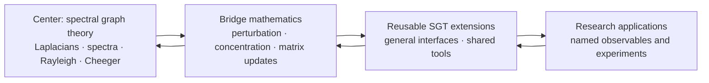

# Scaffold

Scaffold lets researchers formalize new applied mathematics today by treating selected published results as explicit, cited assumptions. Lean checks every downstream deduction, while those assumptions remain visible, reviewable, and replaceable as formal proofs become available.

The project’s center is **spectral graph theory (SGT)**. Its goal is a broad,
reusable formal neighborhood around SGT: graph and Laplacian theory,
spectral and variational methods, matrix/operator tools, probability, and
bridges that future research can compose. Spectral persistence is an existing
formalization, retained as a compatibility/example package, not the project’s
research objective.

Scaffold is both a Lean library and a research substrate. It is currently **pre-release and not yet build-clean**; see [Current maturity](#current-maturity) before trying to consume it as a dependency.

## Why Scaffold exists

Modern applied work often depends on results that Mathlib does not yet expose in a directly usable form. Waiting for every prerequisite to be formalized can block experimentation at the frontier. Hiding those gaps behind `sorry`, on the other hand, obscures what has actually been established.

Scaffold makes the tradeoff explicit:

- published background results may enter through a narrow, cited axiom boundary;
- real definitions and stable APIs make those results composable in Lean;
- small QA proofs test the interfaces and selected consequences;
- novel results remain conditional on their axioms until those axioms are proved or replaced upstream.

This is stronger than informal derivation because Lean checks the downstream reasoning. It is weaker than foundational formalization because the admitted mathematics remains part of the trust base.

### The mushy center and hard crust

Scaffold deliberately keeps two kinds of work separate:

- The **mushy center** is the smallest possible set of research-frontier results that we need before their full proofs exist in Lean. Each such result must be a named, explicit axiom with a precise statement, a source citation, and a clear account of its intended upstream replacement. It is never concealed behind `sorry`.
- The **hard crust** is everything that follows mechanically from that center: definitions, interfaces, derived theorems, and QA lemmas proved by Lean. This work must contain no `sorry` or `admit`, and should make the assumptions on which it depends apparent.

Ongoing work should shrink and strengthen the mushy center while expanding the hard crust. Prefer proving or upstreaming an existing axiom, tightening an axiom's statement, or deriving a reusable checked consequence over adding a new assumption. An axiom may be added only when it is cited, necessary for a concrete SGT milestone, and surrounded by enough hard-crust checks to expose its intended use.

## The center-out research policy

Ongoing work radiates outward from SGT. We strengthen the center first, add adjacent mathematics only when it unlocks important SGT obligations, and advance to applications only when the intervening interfaces are credible.



The reverse arrows matter: outer work that exposes a weak definition, missing assumption, or unusable theorem shape sends us back inward to repair the nearest dependency. We do not expand the library merely because a topic is adjacent or interesting.

A proposed task receives priority when it:

1. unlocks a concrete SGT theorem, experiment, or downstream consumer;
2. repairs a load-bearing definition or closes a known proof dependency;
3. reduces the trust surface, removes a placeholder, or replaces an axiom upstream;
4. creates a reusable bridge between SGT and perturbation, probability, or dynamics;
5. can be validated by a focused Lean check, numerical experiment, or citation review;
6. delivers more of the above per unit of complexity and maintenance cost than competing work.

Build health, real definitions, and sound theorem shapes take precedence over adding new surface area. The complete policy lives in [Strategy](docs/1_STRATEGY.md).

## Where the neighborhood expands

The near-term center is general SGT: weighted and normalized Laplacians,
quadratic/Rayleigh forms, spectra and projectors, cuts and expansion,
interlacing, and reusable matrix interfaces. Outward work must improve one of
those interfaces or make a concrete, broadly reusable connection.

The existing persistence modules do not set this agenda. Broader adjacent
research directions are documented separately and enter only with a named
SGT obligation and a small, Mathlib-compatible API.

See [Spectral Theory and Algorithmic Pipeline](docs/3_SPECTRAL_THEORY.md)
for the status of the retained persistence example.

### SGT coverage snapshot

Last assessed: August 18, 2026. Scores reflect usable, verified coverage on a
0–5 scale; see the [full radar and evidence](docs/7_SGT_RADAR.md).

| Area | Coverage |
| --- | ---: |
| Graph and Laplacian models | 3.5 / 5 |
| Spectral linear algebra | 3.5 / 5 |
| Variational and functional methods | 4.0 / 5 |
| Cuts, expansion, and clustering | 3.5 / 5 |
| Random walks and diffusion | 2.5 / 5 |
| Combinatorial and electrical structure | 3.0 / 5 |
| Perturbation, randomness, and algorithms | 3.0 / 5 |
| Adjacent systems interfaces | 1.0 / 5 |

Assurance quality is assessed separately in the full radar; subject coverage
and trust level are not combined into one score.

## Trust model

The trust model is therefore operational, not merely descriptive: citations and explicit axioms belong in the mushy center; checked Lean proofs belong in the hard crust. Do not describe an axiom-backed result as fully formalized, and do not use `sorry` to move a result across that boundary.

| Artifact | What it establishes | What it does not establish |
| --- | --- | --- |
| Real Lean definition | A precise, typechecked object | That it is the best model of the application |
| Explicit cited axiom | A visible assumption usable by Lean | A proof or machine-verified transcription of the source |
| QA lemma with a real proof | A checked consequence of its dependencies | The truth of any axioms it uses |
| Axiom-backed derived theorem | Correct deduction relative to the trust base | A foundationally proved theorem |
| Numerical or domain experiment | Evidence for specified behavior | A general mathematical proof |

Project documentation uses these labels distinctly. Citation review, compilation, mathematical review, and empirical validation are separate gates.

## Repository map

```text
Scaffold/Mathlib/   public definitions and explicit axiom APIs
Scaffold/QA/        fully proved interface checks
Scaffold/Derived/   axiom-backed derived theorems (checked deductions)
Scaffold/Internal/  internal utilities
index/              source mappings and domain maps
docs/               canonical strategy, architecture, theory, partnerships, and QA
governance/         contribution, maintenance, conduct, and release process
research/papers/    reference papers and research artifacts
research/archive/   provenance and superseded reports—not current policy
scripts/            documentation and policy checks
```

`Scaffold/Derived/` holds derived theorems: Lean-checked deductions whose
conclusions remain conditional on the axioms they consume. Its first two
modules are a retained persistence example: `EventStream.lean` derives an
Azuma tail bound on a random event-driven graph stream, and
`ProjectorDrift.lean` derives a high-probability endpoint projector-drift
bound. They are not a standing expansion target.

The remaining root files are repository entry points or tool configuration: `Scaffold.lean` is the Lake library root; `lakefile.lean`, `lake-manifest.json`, and `lean-toolchain` pin the build; and `opencode.json` configures project-local agent tooling. Lean modules otherwise belong under `Scaffold/`.

## Current maturity

As of August 18, 2026:

- the default `lake build` passes: its umbrella certifies the SGT center (`GraphTheory.Spectral`), the `SimpleGraph` interop adapter (`GraphTheory.SimpleGraphAdapter`, both `SimpleGraph → WAdj` and the `WAdj → SimpleGraph` `supportGraph` direction, with the proved kernel-equality bridge to Mathlib's `lapMatrix` kernel), the electrical crust (`GraphTheory.Electrical`: effective resistance by the potential equation, with existence, uniqueness, the energy identity, and a total function whose junk fallback is QA-witnessed), the Cheeger bridge, the random-walk interfaces (`GraphTheory.RandomWalk`), the general normalized Laplacian (`GraphTheory.Normalized`), the event-driven frontier, the Weyl/Davis–Kahan perturbation modules, the probability concentration bridge (`Probability.Concentration.Scalar.*`, `Probability.Concentration.Matrix.*`), the derived layer (`Derived.EventStream`, `Derived.ProjectorDrift`), and the Core utilities;
- all QA modules compile directly with 484 QA theorem/lemma declarations and no `sorry` or `admit` anywhere under `Scaffold/`;
- the public axiom boundary is 13 explicit, cited axioms; the remaining classical Laplacian facts (symmetry, kernel, Dirichlet form, PSD, symmetry preservation under events) are proved, not admitted, the λ₂ variational characterization (`lambda2_variational`, Courant–Fischer for the algebraic connectivity over vectors orthogonal to `onesVec`, for symmetric nonnegative weights, with its general-operator form `secondEval_variational`) is a proved theorem — retired on 2026-08-18 from an axiom whose symmetry-only shape was materially false and is refuted in QA — as is the **general Courant–Fischer min–max at every index** (`evals_min_max` with its two witness directions, symmetry-only, never admitted), delivered later the same day, the Cheeger *upper* bound (easy direction, `λ₂(L_sym) ≤ 2φ` for `d`-regular graphs) is proved the same day from that engine through the volume-centered cut indicator (`cheeger_upper_bound` retired from axiom; the remaining Cheeger axiom is the hard direction only), the Woodbury matrix-update identity is likewise a proved theorem — retired on 2026-08-18 from an axiom whose missing `C`-invertibility hypothesis made it materially false (refuted in QA at the scalar counterexample) and proved from Mathlib's `Matrix.invOf_add_mul_mul` at the standard middle factor `C⁻¹ + V A⁻¹ U` — and its rank-one special case `sherman_morrison` is proved too, retired from axiom the same day as the `k = Fin 1` specialization of that theorem at unchanged name and hypotheses (a pure proof task: its statement was verified correct against the repaired Woodbury shape before the proof, so the matrix-update bridge is now axiom-free), and Cauchy interlacing for principal submatrices (`eigen_interlacing_principal_submatrix`) is proved as the min–max engine's first named consumer — retired 2026-08-18 from axiom through the extend-by-zero padding bridge and the subspace-intersection dimension count, with the interlacing window now pinned numerically in QA (`0 ≤ 1 ≤ 2` on `K₂` with a singleton submatrix, both collapsed one-sided bounds refuted); the scalar `hoeffding_iid`/`bernstein_iid` specializations are proved derived theorems, `spectral_gap_stability` is proved from the admitted Weyl inequality, the spectral-projector algebra (eigenbasis orthonormality and completeness, projector idempotence, extreme thresholds) is proved from the Mathlib spectral-theorem API, and the electrical-structure crust is proved so far at no axiom cost (the connected-kernel characterization `ker L = span {ones}`, weighted component structure, potential solvability: every zero-sum demand on a connected graph admits a potential, and effective resistance as a well-determined quantity by the potential equation, with the energy identity and a QA-witnessed honest fallback);
- the subgaussian norm is a real definition (`subgaussianNorm`), not an axiom; matrix concentration is stated over the spectral norm (`Matrix.L2OpNorm`), the semidefinite order (`Matrix.PosSemidef`), and Mathlib's `ProbabilityTheory.IndepFun`;
- the derived layer retains an end-to-end persistence example: `eventStreamTail` bounds the tail of the cumulative Laplacian perturbation `‖L_m − L_0‖`, and `eventStreamProjectorDrift` bounds endpoint rotation of the invariant spectral subspace by `s/(γ−s)` with failure probability at most `2 d exp(−s²/(8 m R²))`. Both are checked deductions from admitted Matrix Azuma, Weyl, and Davis–Kahan axioms; neither drives the roadmap.

The generated [QA Scoreboard](docs/5_QA_SCOREBOARD.md) is the authority for current counts and verification results.

## Intended consumption

Once the scoreboard reports a clean build for the required modules, a Lake project will be able to pin Scaffold as follows:

```lean
require scaffold from git
  "https://github.com/marcospolanco/scaffold.git" @ "<verified-revision>"
```

Representative narrow imports are intended to look like:

```lean
import Scaffold.Mathlib.GraphTheory.Spectral
import Scaffold.Mathlib.Probability.Concentration.Matrix.Bernstein
import Scaffold.Mathlib.Analysis.OperatorTheory.Perturbation.DavisKahan
```

These examples describe the intended API and are not a claim that the current revision builds cleanly. Consumers should use a verified commit rather than `main`.

## Working on Scaffold

Before adding a new domain or theorem family:

1. identify the SGT obligation or downstream experiment it unlocks;
2. map the shortest dependency path back to the SGT center;
3. compare its leverage against repairing existing definitions, imports, citations, and axioms;
4. define the smallest composable interface;
5. record whether each dependency is proved, axiom-backed, experimental, or conjectural;
6. add proportionate QA and run the narrowest meaningful verification.

Useful checks include:

```sh
python3 scripts/generate_qa_scoreboard.py
python3 scripts/lint_axioms.py
python3 scripts/check_citations.py
python3 scripts/check_markdown_links.py
```

`lake build` builds the library root `Scaffold.lean`. Its umbrella covers all public modules, including the concentration subtree (see the [QA Scoreboard](docs/5_QA_SCOREBOARD.md) for scope and limitations).

### Autonomous OpenCode pursuit

The repository includes a non-interactive OpenCode workflow using `zhipuai-coding-plan/glm-5.3` with the `high` reasoning variant:

```sh
scripts/opencode-pursue --runs 1
```

Use `--runs N` for a bounded sequence of resumptions, or pass an optional
direction as a quoted trailing argument:

```sh
scripts/opencode-pursue -- "advance proposals/<name>.md, step 1 only"
```

A direction pins the invocation to a single run; continue it with
`scripts/opencode-pursue --runs N --resume`, which keeps the direction in the
session history rather than restating it every run. The project agent follows `AGENTS.md`, maintains the
current [execution plan](docs/EXECUTION_PLAN.md) and append-only
[activity log](docs/AGENT_ACTIVITY.md), selects a bounded high-leverage
milestone, implements and verifies it, and is denied external-directory access
and publishing or destructive Git commands. See
[`scripts/README.md`](scripts/README.md) for the exact safety boundary.

## Canonical documentation

- [Strategy](docs/1_STRATEGY.md) — mission and center-out prioritization.
- [Architecture](docs/2_ARCHITECTURE.md) — axiom admission, QA, citations, and upstream replacement.
- [Spectral Theory](docs/3_SPECTRAL_THEORY.md) — retained persistence example.
- [Partnerships](docs/4_PARTNERSHIPS.md) — dated, time-sensitive research landscape.
- [QA Scoreboard](docs/5_QA_SCOREBOARD.md) — generated metrics and recorded verification.
- [SGT Backlog](docs/6_SGT_BACKLOG.md) — ranked, center-first work queue for the broad SGT program.
- [SGT Radar](docs/7_SGT_RADAR.md) — evidence-scored coverage of the SGT neighborhood and assurance quality.
- [Mathlib Coverage Map](docs/8_MATHLIB_COVERAGE_MAP.md) — dated survey of what the pinned Mathlib itself provides per SGT-adjacent discipline, distinct from the radar's scoring of Scaffold's own coverage.
- [Traction Plan](docs/traction-plan.md) — promotion plan for the future clean-room repository's release; applies only there, not to this repository.
- [Contributing](governance/CONTRIBUTING.md) — contribution and review workflow.

## License

Apache 2.0. See [LICENSE](LICENSE).
