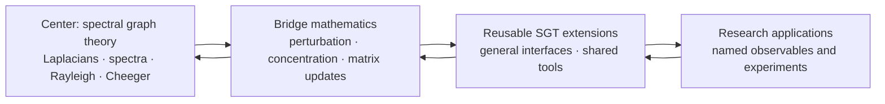

# Scaffold

Scaffold is a growing, machine-checked formalization of spectral graph theory
in Lean 4. Every claim is exactly what it says: a proved theorem is proved by
the kernel, and every remaining assumption is a small, explicit, cited
placeholder for one specific unproven research result, never hidden behind
`sorry`. The library's job is to keep proving those placeholders away: the
explicit axiom count has already fallen from 10 to 5 as the hard crust has
grown, and the trend is toward zero, not toward accumulation.

The project’s center is **spectral graph theory (SGT)**. Its goal is a broad,
reusable formal neighborhood around SGT: graph and Laplacian theory,
spectral and variational methods, matrix/operator tools, probability, and
bridges that future research can compose.

Scaffold is both a Lean library and a research substrate. It is **pre-release**:
the default `lake build` currently passes, but consumers should pin a [verified
revision](docs/5_QA_SCOREBOARD.md) rather than tracking `main`.

## Status

As of August 31, 2026:

| Check | Result |
| --- | --- |
| Default `lake build` | Passes; the umbrella reaches every public module |
| Explicit cited axioms | 5 |
| QA theorems/lemmas | 3544, with no `sorry` or `admit` under `Scaffold/` |

Recent highlights (full per-run history in
[`docs/AGENT_ACTIVITY.md`](docs/AGENT_ACTIVITY.md); per-result detail in each
linked proposal):

- **Alon–Boppana bound** delivered complete end-to-end (Nilli's variational
  route), with the **Ramanujan Expansion Ceiling** as its first theorem
  consumer ([proposal](proposals/alon-boppana-bound.md)).
- **Certified stability for Laplacian positional encodings**: the
  general-rank Davis–Kahan pair (`spectralEncodingSubspace_stability`/
  `spectralEncoding_stability`) — the first machine-checked instance of the
  LapPE/SAN subspace-stability class, with the `k = 1` Fiedler pair as
  corollaries and a `k = 2` QA where the bound is exactly attained
  ([proposal](proposals/spectral-positional-encoding-stability.md)) —
  with its **random-graph companion**, the rank-`k` drift pipeline
  (`edgePerturbation_spectralEncoding_drift'`): under Bernoulli edge
  resampling the encoding subspace stays within `s/(γ−s)` of the base's
  with high probability, the separation discharged inline from the base
  gap by proved Weyl — automatic `δ` certification, the delivery's own
  priced follow-on
  ([proposal](proposals/spectral-encoding-drift-pipeline.md)).
- **Certified oversmoothing ceiling from mixing**: depth-form consumers of
  the χ² mixing bound — past a computable depth, every node's propagated
  view is provably within `ε` of stationarity, and any two starts'
  views within `2ε`; QA pins the same graph at two rate certificates
  (depth 3 vs 9 at the same `ε`)
  ([proposal](proposals/message-passing-depth-mixing-bound.md)), with
  its **per-pair resistance refinement** — the four-point contrast of
  the walk law bounded by the mode-rate times
  `√R(x₁,x₂)·√R(y,y')` (the entrywise eigenbasis expansion joined to
  Foster's spectral resistance formula; exact attainment proved on K₃,
  the mode-coverage hypothesis fenced on C₄) — the first bridge
  between the electrical and mixing axes
  ([proposal](proposals/message-passing-depth-mixing-bound.md),
  follow-on record).
- **Spectral sparsification via leverage-score sampling**, complete —
  `matrix_bernstein`'s first real theorem consumer — with the
  **closed-form GNN sampling budget** (`sparsificationBudget`: the
  minimal certified `q` from `(n, ε, δ)`, axiom-free) as its
  practitioner-facing packaging
  ([proposal](proposals/spectral-sparsification-via-leverage-scores.md),
  [usage note](docs/gnn-sparsification-budget.md)).
- **Both Cheeger inequalities** on arbitrary weighted graphs, including the
  volume-weighted (irregular) pair and the higher-order (multiway) easy
  direction (`GraphTheory.Cheeger`, `GraphTheory.Multiway`).
- **The directed / Perron–Frobenius axis**: PageRank, irreducible stationary
  distributions, directed mixing, the magnetic Laplacian, and signed-graph
  balance theory.
- **Heat semigroup** and **Krylov / Kaniel–Paige**, both programs complete
  end-to-end with zero admitted axioms.
- **Hermitian functional-calculus bridge**, unifying Tikhonov filtering, the
  heat semigroup, and the magnetic propagator as one construction.
- **Fiedler-subspace stability** and **empirical stationary-distribution
  concentration** — first graph-theoretic consumers of `davis_kahan_sin_theta`
  and `hoeffding_empirical`, respectively.
- **Vertex-degree concentration under edge resampling** —
  `hoeffding_inequality`'s first theorem consumer, the scalar sibling of
  the edge-perturbation tails, with its **Bernstein twin** (the
  variance-adaptive degree tails — `bernstein_inequality`'s and
  `bernstein_bounded_variance`'s first consumers, strictly sharper at
  interior sampling probabilities: `2 exp(−3/5) < 2 exp(−1/4)` proved on
    the fixture) and the **admissibility dissolution** (the window
    family's first unconditional measured event — the admissibility
    conjunct derived from the pair design condition plus the degree
    tails — completed across the family: the floor and swept-cut
    capstone unconditional too). **The scalar concentration stack is now
    axiom-free end to end** — the tail theorems (Hoeffding
    2026-08-30, `hoeffding_lemma_mgf` + the Chernoff assembly; Bernstein
    2026-08-30, the Bennett MGF engine, Errata §8) and the ψ₂-form
    `hoeffding_lemma` itself (2026-08-30, the pointwise-collapse route:
    the defining set sees only the bound and the mass, the sharp
    bound `a/√(log 2)` attained) — every remaining admitted axiom now
    has a theorem consumer.
    ([proposal](proposals/hoeffding-inequality-degree-concentration.md),
    [retirement](proposals/retire-hoeffding-lemma-pointwise-collapse.md)).
- **The matrix master bound** — the first proved slice of the matrix
  concentration retirement route: Tropp's Proposition 3.1 (the
  Laplace-transform step every matrix concentration proof consumes) in
  its two-sided spectral-norm form, with its deterministic engine the
  trace-exponential spectral identity `tr (exp (θ•M)) =
  ∑ exp (θ·λᵢ(M))` (the identity the pinned Mathlib lists as an open
  TODO), the degenerate `V = ∅` corner guarded at birth and fenced in
  QA ([proposal](proposals/matrix-master-bound-first-slice.md)).

The generated [QA Scoreboard](docs/5_QA_SCOREBOARD.md) is the authority for
current counts, verification commands, and limitations.

## Transit map

A hub-and-spoke reading of the SGT core and the seven research axes it
feeds, colored by proof status (proved · admitted axiom · in progress ·
proposed · gated). This is a snapshot, not live data — regenerate it with
`python3 scripts/generate_scaffold_map_svg.py` after a proposal's status
changes; the same underlying data drives a clickable, hoverable version at
[`docs/scaffold_map.html`](docs/scaffold_map.html) (open it locally — it's
plain self-contained HTML/JS, no build step).

<p align="center"></p>

## Why Scaffold exists

Most of what makes spectral graph theory useful, both Cheeger directions, the
Alon-Boppana bound, the Krylov/Kaniel-Paige program, the heat semigroup, the
full scalar concentration stack, and the Hermitian functional-calculus bridge
among them, is already proved end to end in Lean, with zero admitted axioms.
That is the actual asset: a comprehensive, kernel-checked spectral graph
theory library where you can trust every claim by construction, not by
reputation.

A handful of research-frontier results (5 today, down from 10) are not yet
proved anywhere in Lean, and Mathlib does not expose them either. Rather than
block on every prerequisite or hide the gap behind `sorry`, Scaffold makes
the boundary explicit and disciplined:

- a not-yet-proved published result may enter through a narrow, cited axiom,
  never silently, always named and sourced;
- real definitions and stable APIs make it composable in Lean immediately;
- small QA proofs test the interfaces and selected consequences;
- anything downstream stays honestly conditional on that axiom until it is
  proved locally or replaced upstream, with every retirement recorded in
  [`docs/AGENT_ACTIVITY.md`](docs/AGENT_ACTIVITY.md) and every defect a stress
  test ever found in an admitted axiom logged in
  [`docs/9_ERRATA.md`](docs/9_ERRATA.md), not quietly dropped.

The axiom boundary is the mechanism, not the pitch. The pitch is what it
protects: you always know exactly which claims are proved and which are
assumptions, and the assumption count only ever moves toward zero.

This is stronger than informal derivation because Lean checks the downstream
reasoning. It is weaker than foundational formalization because the admitted
mathematics remains part of the trust base.

### Why spectral graph theory

The center could have been a few other applied-math domains instead; SGT
was chosen over each for a specific tradeoff, not by default.

| Alternative | Its case | Why SGT won instead |
| --- | --- | --- |
| Matrix concentration (Bernstein, Azuma) | Highest immediate utility — nearly every randomized-algorithm and high-dimensional-statistics bound depends on it directly | Needs substantial measure-theoretic setup before any concrete consequence; used here as an admitted bridge (`Probability.Concentration.Matrix.*`), not a starting point |
| Optimization and convex analysis | Interfaces directly with control theory and machine learning | Branches quickly into special cases (convex cones, non-smooth subgradients, constraint qualifications) that resist a clean formalization boundary |
| Classical (unweighted) graph theory | Already well developed in Mathlib; little extra machinery needed | Stays discrete — does not naturally bridge into the continuous linear algebra (eigenvalues, quadratic forms) that connects graphs to the rest of formalized mathematics |

SGT sits at the intersection instead: finite matrices and graphs avoid most
infinite-dimensional measure-theoretic and topological overhead, while its
spectral machinery (eigenvalues, Rayleigh quotients, quadratic forms)
immediately exercises Mathlib's bridges across linear algebra, analysis,
and probability at once. Formalizing SGT is what forces this project to
build reusable interfaces spanning linear algebra (`Spectral`),
combinatorics and expansion (`Cheeger`, `Fiedler`, `Expander`), random
walks (`RandomWalk`, `Normalized`, `Stationary`, `Mixing`), and variational analysis
(Courant–Fischer, the Cheeger bounds) — see "What's here" below — rather
than one isolated result.

### The mushy center and hard crust

Scaffold deliberately keeps two kinds of work separate:

- The **mushy center** is the smallest possible set of research-frontier results
  that we need before their full proofs exist in Lean. Each such result must be
  a named, explicit axiom with a precise statement, a source citation, and a
  clear account of its intended upstream replacement. It is never concealed
  behind `sorry`.
- The **hard crust** is everything that follows mechanically from that center:
  definitions, interfaces, derived theorems, and QA lemmas proved by Lean. This
  work must contain no `sorry` or `admit`, and should make the assumptions on
  which it depends apparent.

Ongoing work should shrink and strengthen the mushy center while expanding the
hard crust. Prefer proving or upstreaming an existing axiom, tightening an
axiom's statement, or deriving a reusable checked consequence over adding a new
assumption. An axiom may be added only when it is cited, necessary for a
concrete SGT milestone, and surrounded by enough hard-crust checks to expose
its intended use.

## The center-out research policy

Ongoing work radiates outward from SGT. We strengthen the center first, add
adjacent mathematics only when it unlocks important SGT obligations, and
advance to applications only when the intervening interfaces are credible.



The reverse arrows matter: outer work that exposes a weak definition, missing
assumption, or unusable theorem shape sends us back inward to repair the nearest
dependency. We do not expand the library merely because a topic is adjacent or
interesting.

A proposed task receives priority when it:

1. unlocks a concrete SGT theorem, experiment, or downstream consumer;
2. repairs a load-bearing definition or closes a known proof dependency;
3. reduces the trust surface, removes a placeholder, or replaces an axiom upstream;
4. creates a reusable bridge between SGT and perturbation, probability, or dynamics;
5. can be validated by a focused Lean check, numerical experiment, or citation review;
6. delivers more of the above per unit of complexity and maintenance cost than
   competing work.

Build health, real definitions, and sound theorem shapes take precedence over
adding new surface area. The complete policy lives in
[Strategy](docs/1_STRATEGY.md). Active work is listed in
[proposals](proposals/README.md).

## What's here

The near-term center is general SGT. Public modules currently cover:

| Area | Modules |
| --- | --- |
| Graphs and Laplacians | `GraphTheory.Spectral`, `GraphTheory.SimpleGraphAdapter` |
| Variational spectra | Courant–Fischer, Rayleigh, Cauchy interlacing, the identity-spectrum pin `evals_one` (in `Spectral`), and the **Poincaré inequality family** (`GraphTheory.Poincare`: variance ≤ energy/gap in both the combinatorial and degree-weighted π forms, plus the linear-in-gap edge-expansion bound `λ₂·\|S\|·(\|V\|−\|S\|)/\|V\| ≤ boundary`) |
| Cuts and expansion | `GraphTheory.Cheeger`, `GraphTheory.Fiedler`, `GraphTheory.Expander`, `GraphTheory.Multiway`, `GraphTheory.VariationalTransfer` — both Cheeger directions (regular and volume-weighted), the Expander Mixing Lemma and Hoffman bound, certified-conductance and swept-cut extraction, the higher-order (multiway) easy direction, and the degree eigenvalue sandwich `λₖ(L)/dmax ≤ λₖ(L_sym) ≤ λₖ(L)/dmin` |
| Decidable spectral certificates | `GraphTheory.SpectralCertificates` (ℚ and kernel-verifiable ℤ specification checkers, both soundness-proved) |
| Electrical structure | `GraphTheory.Electrical`, `GraphTheory.ElectricalFlow`, `GraphTheory.Foster` — effective resistance as a genuine metric, Foster's theorem, leverage scores |
| Heat semigroup | `GraphTheory.Heat` — the diffusion operator `e^{-tL}`: semigroup law, mass conservation, eigenmode decay, the connected-graph DC limit, the derivative/remainder bounds at `t = 0`, and heat-variance decay (`Var(e^{-tL}f) ≤ e^{−2tλ₂}Var(f)`, the Poincaré family's consumer, hypothesis-minimal — exact at `λ₂ = 0`); plus the walk/normalized twin pair `e^{-tL_walk}`/`e^{-tL_sym}` with the `√D`-conjugation between them and the π-weighted variance decay at rate `λ₂(L_sym)` (the continuous-time mixing engine); program complete |
| Walks and mixing | `GraphTheory.RandomWalk`, `GraphTheory.Normalized`, `GraphTheory.Stationary`, `GraphTheory.Mixing` — the ℓ²-mixing proxy and the geometric-decay mixing bound — plus `GraphTheory.Oversmoothing`, the certified depth past which propagated views are provably ε-close to stationarity, the per-pair resistance contrast bound (the walk law's four-point contrast against `√R·√R` of the two pairs), and the **total-variation mixing conversion** (`tvDistance` with `TV ≤ (1/2)·√χ²` at the sharp classical constant, and the depth-form TV ceiling — the field-standard `t_mix(ε)` statement form, with its two-start `2ε` twin) , and the continuous-time χ² mixing bound (intrinsic rate, no caller certificate, connectivity-free) with the **continuous-time mixing time** `contMixingTimeFrom` — the per-start `t_mix(ε)` at LPW ch. 20's `∀ s ≥ t` reading, its spectral ceiling `t_mix(ε) ≤ max 0 (ln(√((πx)⁻¹−1)/(2ε))/λ₂(L_sym))`, the continuous walk law and its TV conversion twins, and ε-antitonicity — and the **Poisson bridge**: the Poissonization identity `ν^cont_t = ∑'ₖ e^{−t}tᵏ/k!·ν_k`, the `Pᵀ` TV-contraction toolkit with discrete TV monotonicity, and the continuous↔discrete comparability `TV_cont(t) ≤ ∑_{k<m} e^{−t}tᵏ/k! + TV_disc(m)` with its discrete-certificate transfer corollary — and the **discrete mixing time** `walkMixingTimeFrom` (the `t_mix(ε)` object at LPW ch. 20's per-start reading, the twin of the continuous object), whose attainment specification (a *minimum*, by well-ordering) discharges that corollary's certificate clause, with its own spectral ceiling `t_mix(ε) ≤ ⌈log(√C/(2ε))/log(1/r)⌉`  — and the **spectral mixing floor** (the program's first lower-bound family, the over-squashing floor delivered on its own named route): the exact law-level test-function evolution at arbitrary `L_sym` eigenpairs, the TV and χ² floors `(1/2)|1−μ|^t·|v x|/(√D x·c) ≤ TV` and `(1−μ)^{2t}(v x)²/(π x·‖v‖²) ≤ χ²` (periodic modes never decay — the chains no ceiling reaches), the `t_mix` floor gate, and the log-form floor `⌈log(|v x|/(√D x·2εc))/log(1/|1−μ|)⌉ ≤ t_mix` — the classical eigenvalue lower bound on mixing time, completing the two-sided depth bracket — and the **uniform mixing time** `walkMixingTime` (LPW's field-standard worst-case-start `t_mix(ε)`) with the **submultiplicativity class** it unlocks: LPW's two distances `d(t)`/`d̄(t)`, the sharp Dobrushin contraction `TV(μ(Pᵀ)ᵗ, ν(Pᵀ)ᵗ) ≤ TV(μ,ν)·d(t)` at equal masses, the classical `d(s+t) ≤ d(s)d(t)` and `d̄(s+t) ≤ d̄(s)d(t)`, and the ε-escalation corollary — one certified evaluation time yields every ε-level mixing time (LPW's `t_mix := t_mix(1/4)` convention's engine) |

| Directed operators | `GraphTheory.Directed` — out/in-degree, directed handshaking, the directed normalized Laplacian |
| Krylov methods and Chebyshev polynomials | `GraphTheory.Krylov` — the Lanczos/Kaniel–Paige program, complete end-to-end |
| Polynomial filters and band projection | `GraphTheory.PolyFilter` — filter-agnostic band-projector approximation, with power-method and Chebyshev instantiations |
| Nonnegative-matrix spectral theory | `LinearAlgebra.PerronFrobenius`, `LinearAlgebra.PrimitiveConvergence` — the admitted Perron–Frobenius and primitive-power-convergence axioms |
| Irreducible stationary distributions | `GraphTheory.IrreducibleStationary` — Perron–Frobenius's first theorem consumer |
| PageRank | `GraphTheory.PageRank` — the teleportation-regularized Google matrix, existence and uniqueness on reducible input |
| Directed mixing | `GraphTheory.DirectedMixing` — `primitive_power_tendsto`'s first consumer, the PageRank power-iteration theorem |
| Magnetic Laplacian | `GraphTheory.Magnetic` — the shelf's first complex Hermitian object; flux/gauge characterization |
| Signed graphs | `GraphTheory.Signed` — the signed Laplacian; Harary's balance theorem in kernel form |
| Alon–Boppana program | `GraphTheory.AlonBoppana` — complete end-to-end via Nilli's variational route; its first theorem consumer is the Ramanujan Expansion Ceiling |
| Hermitian functional calculus | `GraphTheory.FunctionalCalculus` — the Scaffold–Mathlib bridge; recovers Tikhonov filtering, the heat semigroup, and the magnetic propagator as one calculus |
| Cluster projector | `GraphTheory.ClusterProjector` — the spectral projector onto an arbitrary eigenvalue set |
| Perturbation | `Analysis.OperatorTheory.Perturbation.{Weyl,DavisKahan,BandDavisKahan,ProjectionGap,Duhamel}` — Weyl's inequality, Davis–Kahan sin Θ, and the band/cluster projector-stability family |
| Concentration | `Probability.Concentration.Scalar.*`, `Probability.Concentration.Matrix.*` |
| Spectral sparsification | `GraphTheory.Sparsification`, `Derived.SparsificationTail`, `Probability.BernoulliProduct` — leverage-score sampling; `matrix_bernstein`'s first real theorem consumer; the `(1±ε)` sparsifier tail, its `q ~ log n/ε²` budget, and the graph-vector form on the sampled Laplacian |
| Edge-perturbation concentration | `GraphTheory.EdgePerturbation`, `Derived.EdgePerturbationTail`, `Derived.EdgePerturbationDrift` — centered Bernoulli edge-Laplacian perturbations; `matrix_hoeffding`'s first theorem consumer; the norm/quadratic-form tails, the eigenvalue-level (spectral-gap) tail via proved Weyl, the high-probability Fiedler-drift pipeline (with its matched-threshold `s/(γ−s)` sharpening), the Cheeger-driven connectivity window, its irregular (normalized) sibling via the degree sandwich, and the swept-Fiedler-cut capstone (connected + certified cut of the resampled graph), the C₄ dropped-guard refutation of its floor-positivity hypothesis, and the per-vertex degree-deviation tail (`hoeffding_inequality`'s first theorem consumer, with the all-vertices union bound) plus its variance-adaptive Bernstein twin (`bernstein_inequality`'s and `bernstein_bounded_variance`'s first consumers, at the true variance statistic `∑ₑ w² p (1−p)`) and the admissibility dissolution (the unconditional connectivity window: `perturbAdmissible` derived from the pair design condition `p e + p eᵀ ≤ 1` plus the degree tails — completed across the family, the floor and swept-cut capstone unconditional too, with the strict-containment witness proving the measured event genuinely enlarged) |
| Concentration → subspace-stability pipeline | `Derived.EdgePerturbationDrift` — high-probability Fiedler-subspace and Fiedler-line rotation under random edge resampling (`edgePerturbation_fiedlerLine_drift`), composing `fiedlerLine_stability` with `edgePerturbation_norm_tail` through the packaging identity `laplacian (perturbWeight A p ω) = ∑ₑ perturbSummand` and the Laplacian linearity package (`laplacian_smul`/`laplacian_sum`); since 2026-08-31 the **rank-`k` spectral-encoding drift pipeline** (`edgePerturbation_spectralEncodingSubspace_drift{'}`, `edgePerturbation_spectralEncoding_drift{'}`) — the same pipeline at arbitrary encoding rank, the separation discharged inline from the base graph's rank-`k` gap by proved Weyl at index `k+1` (automatic `δ` certification) |
| Empirical stationary distribution | `Probability.IIDProduct`, `Derived.EmpiricalStationary` — the fixed-time empirical tail (`hoeffding_empirical`'s first theorem consumer, hard crust since that axiom's retirement) and the stationarity-limit form: past the oversmoothing depth, `n` sampled trajectories estimate `π` to `ε` at `2 exp(−nε²/2)` — the depth certificate as a sampling guarantee |
| Finite-distribution entropy | `InformationTheory.Entropy` (relative entropy and Shannon entropy, Gibbs' inequality, the entropy maximum — all proved) |
| Discrete-affine dynamics | `Dynamics.DiscreteAffine` (finite-vector geometric decay and affine-iteration convergence, all proved) |
| Matrix updates | `Core.MatrixUpdates` (Woodbury, Sherman–Morrison) |

Outward work must improve one of those interfaces or make a concrete, broadly
reusable connection. The existing persistence modules
(`GraphTheory.Dynamics`, `Derived.EventStream`, `Derived.ProjectorDrift`) do
not set this agenda; they are a retained example whose tail and projector-drift
theorems remain conditional on Matrix Azuma alone (Davis–Kahan and Weyl
are proved since 2026-08-21/20).

See [Spectral Theory](docs/3_SPECTRAL_THEORY.md) for the status of that
example, and the [SGT Radar](docs/7_SGT_RADAR.md) for coverage scores.

### SGT coverage snapshot

Last assessed: August 31, 2026. Scores reflect usable, verified coverage on a
0–5 scale; see the [full radar and evidence](docs/7_SGT_RADAR.md).

| Area | Coverage |
| --- | ---: |
| Graph and Laplacian models | 4.0 / 5 |
| Spectral linear algebra | 4.5 / 5 |
| Variational and functional methods | 4.0 / 5 |
| Cuts, expansion, and clustering | 5.0 / 5 |
| Random walks and diffusion | 4.5 / 5 |
| Combinatorial and electrical structure | 4.5 / 5 |
| Perturbation, randomness, and algorithms | 4.5 / 5 |
| Adjacent systems interfaces | 1.0 / 5 |

Assurance quality is assessed separately in the full radar; subject coverage
and trust level are not combined into one score.

## Trust model

Citations and explicit axioms belong in the mushy center; checked Lean proofs
belong in the hard crust. Do not describe an axiom-backed result as fully
formalized, and do not use `sorry` to move a result across that boundary.

| Artifact | What it establishes | What it does not establish |
| --- | --- | --- |
| Real Lean definition | A precise, typechecked object | That it is the best model of the application |
| Explicit cited axiom | A visible assumption usable by Lean | A proof or machine-verified transcription of the source |
| QA lemma with a real proof | A checked consequence of its dependencies | The truth of any axioms it uses |
| Axiom-backed derived theorem | Correct deduction relative to the trust base | A foundationally proved theorem |
| Numerical or domain experiment | Evidence for specified behavior | A general mathematical proof |

Project documentation uses these labels distinctly. Citation review,
compilation, mathematical review, and empirical validation are separate gates.

## Repository map

```text
Scaffold/Mathlib/   public definitions and explicit axiom APIs
Scaffold/QA/        fully proved interface checks
Scaffold/Derived/   axiom-backed derived theorems (checked deductions)
Scaffold/Internal/  internal utilities
index/              source mappings and domain maps
docs/               canonical strategy, architecture, theory, partnerships, and QA
governance/         contribution, maintenance, conduct, and release process
research/papers/    reference papers and research artifacts
research/archive/   provenance and superseded reports—not current policy
scripts/            documentation and policy checks
proposals/          active priority list and delivered records
```

`Scaffold/Derived/` holds derived theorems: Lean-checked deductions whose
conclusions remain conditional on the axioms they consume. Its first two
modules are a retained persistence example: `EventStream.lean` derives an
Azuma tail bound on a random event-driven graph stream, and
`ProjectorDrift.lean` derives a high-probability endpoint projector-drift
bound. They are not a standing expansion target.

The remaining root files are repository entry points or tool configuration:
`Scaffold.lean` is the Lake library root; `lakefile.lean`,
`lake-manifest.json`, and `lean-toolchain` pin the build; and `opencode.json`
configures project-local agent tooling. Lean modules otherwise belong under
`Scaffold/`.

## Get started

Pinned toolchain: Lean 4.14.0 (see `lean-toolchain`; Mathlib is required at
the matching `v4.14.0` tag).

```sh
lake build
python3 scripts/generate_qa_scoreboard.py
python3 scripts/lint_axioms.py
python3 scripts/check_citations.py
python3 scripts/check_markdown_links.py
```

`lake build` builds the library root `Scaffold.lean`. Downstream consumers
should prefer a narrow import over that umbrella.

## Intended consumption

Once the scoreboard reports a clean build for the required modules, a Lake
project can pin Scaffold as follows:

```lean
require scaffold from git
  "https://github.com/marcospolanco/scaffold.git" @ "<verified-revision>"
```

Representative narrow imports:

```lean
import Scaffold.Mathlib.GraphTheory.Spectral
import Scaffold.Mathlib.Probability.Concentration.Matrix.Bernstein
import Scaffold.Mathlib.Analysis.OperatorTheory.Perturbation.DavisKahan
```

## Working on Scaffold

Before adding a new domain or theorem family:

1. identify the SGT obligation or downstream experiment it unlocks;
2. map the shortest dependency path back to the SGT center;
3. compare its leverage against repairing existing definitions, imports,
   citations, and axioms;
4. define the smallest composable interface;
5. record whether each dependency is proved, axiom-backed, experimental, or
   conjectural;
6. add proportionate QA and run the narrowest meaningful verification.

See [Contributing](governance/CONTRIBUTING.md) for the review workflow.

Non-interactive agent runs use `scripts/opencode-pursue`. The project agent
follows `AGENTS.md`, maintains the [execution plan](docs/EXECUTION_PLAN.md)
and [activity log](docs/AGENT_ACTIVITY.md), and is denied publishing or
destructive Git commands. See [`scripts/README.md`](scripts/README.md) for
the safety boundary and invocation.

## Canonical documentation

- [Strategy](docs/1_STRATEGY.md) — mission and center-out prioritization.
- [Architecture](docs/2_ARCHITECTURE.md) — axiom admission, QA, citations, and
  upstream replacement.
- [Spectral Theory](docs/3_SPECTRAL_THEORY.md) — retained persistence example.
- [Partnerships](docs/4_PARTNERSHIPS.md) — dated, time-sensitive research landscape.
- [QA Scoreboard](docs/5_QA_SCOREBOARD.md) — generated metrics and recorded verification.
- [SGT Backlog](docs/6_SGT_BACKLOG.md) — ranked, center-first work queue.
- [SGT Radar](docs/7_SGT_RADAR.md) — evidence-scored coverage of the SGT neighborhood.
- [Mathlib Coverage Map](docs/8_MATHLIB_COVERAGE_MAP.md) — dated survey of the
  pinned Mathlib itself, distinct from Scaffold's own coverage.
- [Errata](docs/9_ERRATA.md) — every admitted axiom or theorem statement
  found materially false or inconsistent after landing, and how it was
  repaired; the evidence trail behind the trust model above.
- [Proposals](proposals/README.md) — active priority list and delivered records.
- [Traction Plan](docs/traction-plan.md) — promotion plan for the future
  clean-room repository's release; applies only there, not to this repository.
- [GNN Sparsification Budget](docs/gnn-sparsification-budget.md) —
  practitioner-facing usage note for the certified edge-sampling budget,
  with the `matrix_bernstein` trust caveat stated first.
- [Agentic Architecture Review](docs/arch/scaffold-agentic-architecture-review.md) — control-plane audit; live unattended `--commit` is B because Sequence 0 is unimplemented (verify/commit mismatch, mutable verifier, incomplete ladder, no host time budget). Planning contract A−; A+ not earned.
- [Commit Steward Protocol](docs/arch/commit-steward-protocol.md) — the
  verify-and-commit procedure that sits between the autonomous agent
  (which has no git authority) and `main`. The steward may veto; git
  stays in the host and is never authorized by a model verdict.
- [Contributing](governance/CONTRIBUTING.md) — contribution and review workflow.

## License

Apache 2.0. See [LICENSE](LICENSE).
