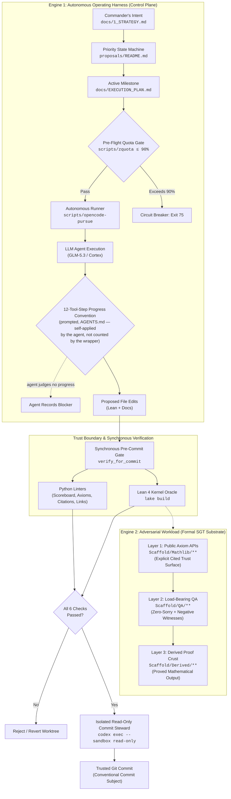
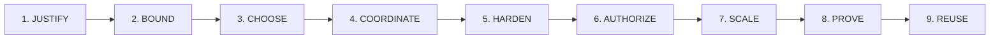
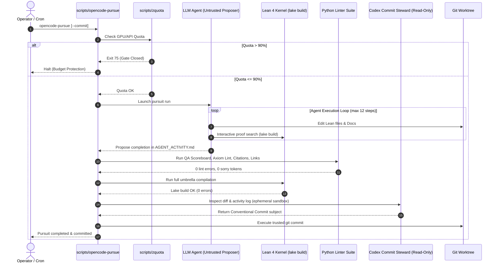
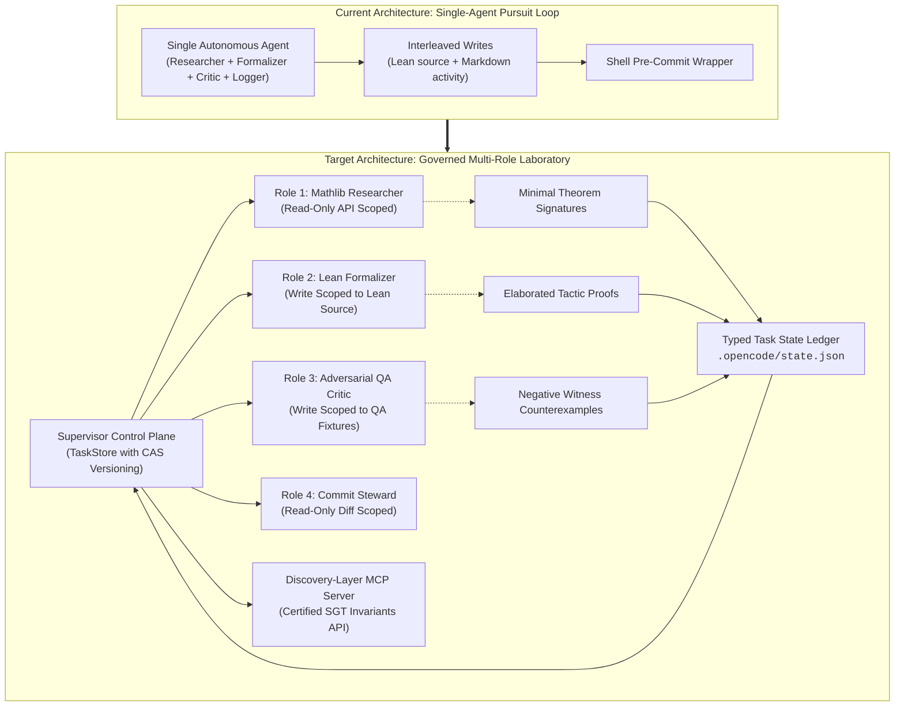

# Scaffold: An Agentic Architecture for Autonomous Formal Mathematics
## Comprehensive System Review, Epistemological Audit, and Operational Evaluation

**Status:** Technical Architecture Review & Evaluation — self-assessed against the cited `@fde/media` rubric; not externally certified  
**Date:** August 2026 · figures current as of `docs/5_QA_SCOREBOARD.md`, 2026-08-21 (see Revision History, §10)  
**Target Repository:** `scaffold` (`Scaffold/`, `docs/`, `scripts/`, `proposals/`, `governance/`)  
**Evaluation Framework:** `@fde/media` (*Agentic Architecture Guide*, *The Agentic Design Palace*, *ELOS: The Lighthouse*, *Applied AI Evaluation & Safety*, and `fde_agentic_flow.py`)

---

## 1. Architectural Framing: The Dual Identity of Scaffold

To understand Scaffold only as a formal mathematics repository is to mistake the payload for the engine. 

Scaffold is commonly described as a Lean 4 library for Spectral Graph Theory (SGT). However, its deeper architectural significance is as an **autonomous, self-steering, self-falsifying agentic operating system**. Spectral Graph Theory is the *domain workload*; the repository itself is an *executable harness for high-assurance autonomous agent engineering*.



### Solving the Ground Truth & Authority Dilemma

Most autonomous agent architectures in production fail because their operating environment is non-deterministic, subjective, or fuzzy (e.g., chat workflows, web automation, unstructured API integrations). In those environments, systems often fall into the trap of **"LLM-as-judge" echo chambers**, where ungrounded generative models evaluate their own outputs, leading to silent drift, cascading hallucinations, and unmitigated blast radii.

Scaffold solves this fundamental dilemma through two architectural breakthroughs:
1. **The Kernel as the Definitive Adversary:** The agent operates against an unforgiving, deterministic truth oracle—the **Lean 4 typechecker**. A proposed theorem step either typechecks against its exact mathematical type or it does not. The evaluation is absolute and mathematically bounded.
2. **Absolute Separation of Generation and Authority:** The autonomous agent possesses zero authority to execute git commits, push code, or declare axioms valid on its own self-report. The control plane relies exclusively on synchronous deterministic linters and an isolated, read-only commit steward.

---

## 2. Station-by-Station Audit: The 9-Station Agentic Design Palace

Evaluating Scaffold against the 9 universal stations of the Agentic Design Palace:



### Station 1: JUSTIFY (Product Gate & Metric Trees)
*Mnemonic Anchor: Five-key gate, outcome tree, and counter-metric balance.*

#### 1.1 The AI Justification Gate
In `@fde/media`, the primary rule is: *Never use an LLM where deterministic code, search, or rules suffice.* Scaffold adheres to this with extreme discipline:
- **Deterministic Work:** Typechecking, proof verification, syntax parsing, citation validation, axiom counting, and markdown link verification are strictly delegated to deterministic software (`lake build`, Lean kernel, and Python linters in `scripts/`).
- **Bounded AI Work:** High-dimensional conjecture pathfinding, Mathlib theorem discovery, Lean syntax generation, tactic sequence search, and draft refactoring are delegated to the autonomous agent (`glm-5.3` / `Codex`).

#### 1.2 Metric Tree Formulation
Scaffold's operational governance mirrors the $L0 \rightarrow L1 \rightarrow L2$ metric tree structure:

```text
L0 (North Star): Verified, Axiom-Transparent SGT Theorem Crust Expansion Rate
├── L1.1: Build & Elaboration Reachability (% clean compilation of Scaffold umbrella)
├── L1.2: Axiom Elimination Rate (Admitted axioms successfully retired to proved theorems)
├── L1.3: Load-Bearing QA Density (Ratio of non-vacuous QA lemmas to public declarations)
└── L1.4: Mathlib API Alignment (% reuse of standard Mathlib predicates & types)
    ├── L2 Levers: `scripts/generate_qa_scoreboard.py`, `scripts/lint_axioms.py`
    ├── L2 Levers: `scripts/check_citations.py`, `scripts/check_markdown_links.py`
    └── L2 Levers: Active priority selection in `proposals/README.md`
```

#### 1.3 Counter-Metrics & Anti-Goodharting Defense
In `@fde/media`, an $L0$ metric without counter-metrics invites system corruption. Scaffold enforces hard quality and safety floors:
- **`sorry`/`admit` Counter-Metric:** Hard invariant of **0 placeholder tokens** in `Scaffold/QA/**` and `Scaffold/Mathlib/**` (`docs/5_QA_SCOREBOARD.md`). An agent cannot falsely inflate theorem velocity by inserting `sorry`.
- **Axiom Surface Counter-Metric:** Total public axioms are tracked continuously (11; `docs/5_QA_SCOREBOARD.md` is the live authority). Any new axiom requires explicit justification under `docs/2_ARCHITECTURE.md` §5.
- **Citation Precision Counter-Metric:** Every public axiom must have verified locator metadata in `index/sources/**`.

---

### Station 2: BOUND (The Four Inviolable Boundaries & NFRs)
*Mnemonic Anchor: V1 blueprint inside four stone walls.*

`@fde/media` mandates four inviolable boundaries before autonomous agency is granted. Scaffold enforces all four at the system level:

| Boundary | `@fde/media` Requirement | Scaffold Implementation | Operational Enforcement |
| :--- | :--- | :--- | :--- |
| **01. Cost / Spend** | Hard circuit breakers before runaway inference loops | `scripts/zquota` + `--quota-threshold 90` | Exits with status `75` if provider quota exceeds 90% before run starts. |
| **02. Authority** | No autonomous writes to un-sandboxed or irreversible targets | `AGENTS.md` working rules + `--commit` wrapper | Agent cannot `git push`, publish, or commit; commits are handled by an isolated, read-only Codex steward. |
| **03. Data / Provenance** | PII tokenization, clean-room boundary, copyright safety | `docs/2_ARCHITECTURE.md` §8 & `governance/CONTRIBUTING.md` | Prohibits bulk copyrighted textbook extracts; mandates structural citations and topic indices. |
| **04. Confidence / Trust** | Uncertainty floors, explicit refusal, no disguised hallucination | Explicit `axiom` keyword vs disguised `theorem := by sorry` | Trust boundary is rendered 100% transparent to the Lean compiler and human review. |

---

### Station 3: CHOOSE (Architectural Selection & Complexity Ladder)
*Mnemonic Anchor: Locked complexity staircase.*

#### 3.1 The Complexity Decision Ladder
`@fde/media` defines the progression:
$$\text{Rules} \rightarrow \text{Heuristics} \rightarrow \text{Classical ML} \rightarrow \text{LLM/RAG} \rightarrow \text{Bounded Agent} \rightarrow \text{Multi-Agent}$$

Scaffold operates at the **Bounded Autonomous Agent** tier:
- A single autonomous runner (`scripts/opencode-pursue`) executes bounded turns.
- Multi-agent complexity is not adopted prematurely; rather, the agent uses tool calls (`lake build`, `view_file`, `replace_file_content`) to interact with the repository environment.

#### 3.2 When Multi-Agent Is Earned
`@fde/media` states that multi-agent systems are earned only when single-agent systems suffer from context window poisoning, role overloading, or conflicting write scopes.

In Scaffold, multi-agent specialization is now **earned** at specific junctures:
1. **Mathlib API Exploration vs Formalization:** Surveying Mathlib's deep category/order hierarchies clutters context with large imported types, reducing the agent's attention budget for tactic synthesis.
2. **Adversarial QA Synthesis:** The agent that writes the theorem statement should not be the sole author of the QA witness; a specialized *Critic/Adversary* agent should attempt to refute the statement shape with counter-fixtures (e.g., disconnected graphs, negative spectra).

---

### Station 4: COORDINATE (State, Roles, Contracts & Termination)
*Mnemonic Anchor: Supervisor clock over a governed ledger.*

#### 4.1 State Management & Write Scopes
In Scaffold, task state is maintained across three complementary artifacts:
1. **`docs/EXECUTION_PLAN.md`**: Tracks the active milestone, SGT leverage rationale, and immediate next action.
2. **`docs/AGENT_ACTIVITY.md`**: An append-only journal recording UTC timestamps, session ID, run ID, status (`in-progress`, `completed`, `blocked`), changes, verification, and remaining risk.
3. **`proposals/README.md`**: The backlog state machine (Active High/Medium/Low, Delivered, Retired).

#### 4.2 Deterministic Termination Controls
`@fde/media` warns that *"loop until done"* is a critical anti-pattern. Scaffold enforces strict termination bounds:
- **12-Tool-Step Progress Convention:** `AGENTS.md:77` instructs that if no meaningful progress occurs within 12 tool steps, the agent should record evidence as a blocker, pivot, or cleanly terminate. This is a behavioral instruction inside the agent's prompt; `scripts/opencode-pursue` has no tool-step counter of its own, so compliance is self-applied by the agent rather than enforced by the wrapper. R-05 in §6 records an observed instance where it did not fire.
- **Run Quota (`--runs N`):** Limits continuous execution steps per pursuit invocation.
- **Clean Exit Traps:** Interrupted runs trap `SIGINT`/`SIGTERM` and direct the operator to `docs/AGENT_ACTIVITY.md`.

---

### Station 5: HARDEN (Resilience, Failure Envelopes & Crash Recovery)
*Mnemonic Anchor: Queued engine with bulkheads and relief valves.*

#### 5.1 Durable Execution & Crash Recovery
- **Session Continuity:** `scripts/opencode-pursue` persists session identifiers to `.opencode/pursue-session`. The `--resume` flag enables exact state resumption without restarting research from scratch.
- **Worktree Integrity:** The `--commit` wrapper strictly verifies `git status --porcelain`. If an uncommitted pursuit left the worktree dirty, subsequent runs refuse to proceed until the operator reconciles the state.
- **Defensive Unit Testing:** `scripts/test_opencode_pursue.sh` provides automated regression suites for the autonomous pursuit wrapper itself, testing argument parsing, session handling, and commit safety.

#### 5.2 Context Pruning & Anti-Poisoning
When an agent fails a proof in Lean, error messages can flood the context window. Scaffold counters context poisoning by:
- Enforcing fresh sessions for new directed pursuits.
- Directing the agent to externalize findings into `docs/EXECUTION_PLAN.md` before the context degrades.

---

### Station 6: AUTHORIZE (Control Plane Separation & Policy Gates)
*Mnemonic Anchor: Iron customs gate and scoped capability key.*

This is one of Scaffold's strongest architectural alignments with `@fde/media`.



#### 6.1 Untrusted Model vs. Trusted Authorizer
`@fde/media` Chapter 9 & 10 establish that **the model is an untrusted parser and proposer; trusted code alone authorizes and executes**.
- The LLM can propose any Lean syntax, tactic, or documentation edit.
- No model output is trusted on self-report. The `verify_for_commit` routine in `scripts/opencode-pursue` executes six independent deterministic validators in sequence.
- If a single check fails, the git commit is completely blocked.

#### 6.2 The Read-Only Commit Steward
Rather than letting the generating agent write its own commit history, Scaffold passes the staged diff and `AGENT_ACTIVITY.md` to an isolated, read-only Codex instance (`codex exec --ephemeral --sandbox read-only`). The steward generates a standardized Conventional Commit subject, which is validated by a strict regex before the host shell executes `git commit`.

---

### Station 7: SCALE (Load Mathematics & Bottleneck Analysis)
*Mnemonic Anchor: Calculation telescope.*

#### 7.1 Mathematical Agent Load Dynamics
In typical RAG/Chat architectures, latency is dominated by vector retrieval and token generation. In Scaffold, the load equation is fundamentally different:

$$T_{\text{task}} = N_{\text{steps}} \times \left( T_{\text{infer}} + T_{\text{lean\_elaborate}} + T_{\text{mathlib\_lookup}} \right)$$

- **$T_{\text{lean\_elaborate}}$ (Lean Kernel Latency):** Elaborating large Mathlib matrix files can take 5–45 seconds per build.
- **$T_{\text{mathlib\_lookup}}$ (Search Space):** Mathlib comprises hundreds of thousands of theorems. Naive grep searches pollute context and waste tokens.

#### 7.2 The Bottleneck Rule
`@fde/media` Chapter 11 notes: *Coordination and state synchronization break before compute.* In Scaffold:
- The primary constraint is **formal theorem alignment**. A single incorrect binder, implicit typeclass coercion, or missing matrix symmetry assumption invalidates an entire downstream proof branch.
- Scaffold mitigates this by maintaining `docs/8_MATHLIB_COVERAGE_MAP.md`, providing a curated, dated index of Mathlib's capabilities to prevent agents from repeatedly re-surveying the mathlib repository.

---

### Station 8 & 9: PROVE & REUSE (Falsification & The Platform Loop)
*Mnemonic Anchor: Evidence court and productization workshop.*

```mermaid
stateDiagram-v2
    [*] --> LiteratureAxiom: Identify SGT literature gap
    LiteratureAxiom --> CitationIndex: Record exact bibliographic locators (index/sources)
    CitationIndex --> NegativeWitnessQA: Construct falsification test on boundary cases (e.g. K2, singular matrices)
    
    state NegativeWitnessQA {
        [*] --> ProveNegativeInstance
        ProveNegativeInstance --> RefuteFalseStatement: Falsify if statement shape is broken
        RefuteFalseStatement --> RepairAxiomShape: Correct hypotheses / dimensions
        RepairAxiomShape --> PassQA: QA compiles with 0 sorry
    }

    NegativeWitnessQA --> PublicAxiomLayer: Admitted to Scaffold/Mathlib/**
    PublicAxiomLayer --> ProofCrustDevelopment: Prove downstream theorems (Scaffold/Derived/**)
    ProofCrustDevelopment --> UpstreamProvedReplacement: General proof engine built (e.g. Courant-Fischer Min-Max)
    
    state AxiomRetirementLifecycle {
        [*] --> CompareConventions: Compare Mathlib vs Scaffold shapes
        CompareConventions --> ProveAdapterLemmas: Bridge interface differences
        ProveAdapterLemmas --> DeprecateAxiom: Add compatibility deprecation note
        DeprecateAxiom --> RetireAxiom: Remove axiom, update QA Scoreboard (-1 Axiom)
    }

    UpstreamProvedReplacement --> AxiomRetirementLifecycle
    AxiomRetirementLifecycle --> UpstreamMathlibPR: Export verified theorem to Mathlib
    UpstreamMathlibPR --> [*]
```



#### 8.1 "Height Is Not Evidence": Popperian Falsification
Scaffold's strategy document (`docs/1_STRATEGY.md` § *Load-bearing growth*) directly implements the core epistemological doctrine of `@fde/media`:
> *"A declaration that compiles and sits beside existing work, without depending on the precise correctness of any specific earlier definition, adds surface area but tests nothing... Prefer work whose success is contingent on an earlier definition or proof being exactly right."*

#### 8.2 Negative-Witness QA Fixtures
Just as `@fde/media` requires adversarial test suites, Scaffold mandates **negative witnesses**:
- `old_cheeger_lower_bound_refuted_QA`: Refuted the pre-repair Cheeger lower bound on $K_2$ ($1/2 \le 0$).
- `Connectivity_QA.lean`: Disconnected graph witnesses that fail if connectedness hypotheses are omitted.
- `MatrixUpdates_QA.lean`: Refuted the false Woodbury scalar shape on singular matrices.

#### 8.3 The Upstream Replacement Lifecycle
Scaffold's contribution contract (`docs/2_ARCHITECTURE.md` §9) governs how admitted axioms are systematically eliminated as the proof crust solidifies. This lifecycle has successfully retired:
- `eigen_interlacing_principal_submatrix` (Cauchy interlacing)
- `sherman_morrison` (Rank-1 matrix updates)
- `woodbury_identity` (General matrix updates)
- `cheeger_upper_bound` (Cheeger easy direction)
- `lambda2_variational` (Variational algebraic connectivity)

---

## 3. Philosophical & Operational Alignment: ELOS (The Lighthouse)

The foundational operating principles of `fde/media/ELOS-the-lighthouse.md` and `fde/media/README.md` map directly onto Scaffold's architectural design:

| ELOS Lighthouse Principle | `@fde/media` Doctrine | Scaffold Manifestation |
| :--- | :--- | :--- |
| **0. Bedrock (Trust)** | *Conviction accountable to evidence; safe to report bad numbers.* | Axioms are never hidden behind `sorry`. When an axiom is found false on $K_2$, it is publicly recorded, refuted in QA, and repaired. |
| **1. Chart Room (Clarity)** | *Commander's Intent: clarity of outcome over rigid plans.* | `docs/1_STRATEGY.md` sets the center-out rule: when fog arises in outer applications, immediately retreat inward to fix the nearest load-bearing defect. |
| **2. Engine Room (Leverage)** | *Output = Activity $\times$ Leverage; single-threaded DRI.* | `proposals/README.md` ranks work strictly by downstream SGT proof enablement per unit of complexity. |
| **5. Instrument Deck (Signal)** | *Paired indicators & counter-metrics.* | Scoreboard pairs theorem count with strict `sorry`-token counts and explicit axiom counters. |
| **6. Storm Deck (Hard Things)** | *Pre-mortem confidence voting & post-mortems.* | Proposals require calibration steps and hypothesis verification before formal Lean authoring begins. |

---

## 4. Formal Architectural Evaluation & Scorecard

Evaluating Scaffold across the core engineering dimensions and production readiness criteria of `@fde/media`:

```
+---------------------------------------------------------------------------------------+
| DIMENSION           | STATUS    | SCORE  | ARCHITECTURAL FINDINGS & CONTROLS         |
+---------------------+-----------+--------+-------------------------------------------+
| 1. GATE (Justify)   | PASS      | 9.5/10 | Strict AI vs deterministic separation.    |
| 2. BOUND (NFRs)     | PASS      | 9.0/10 | 3 boundaries code-enforced; 1 (progress   |
|                     |           |        | brake) is prompted, not code-level.       |
| 3. CHOOSE (Topology)| PASS      | 9.0/10 | Simplest viable single-agent baseline.    |
| 4. COORDINATE(State)| WEAK+     | 7.0/10 | Markdown state sync; lack of typed schema;|
|                     |           |        | step-progress control not code-enforced.  |
| 5. AUTHORIZE(Safety)| PASS      | 10/10  | Model proposes; trusted code authorizes.  |
| 6. PROVE (Evals)    | PASS      | 10/10  | Negative witnesses; zero-sorry floor.     |
+---------------------+-----------+--------+-------------------------------------------+
| COMPOSITE           | PASS      | 90.8%  | Overall Grade: A- (unweighted mean of the |
|                     |           |        | six scores above; self-assessed, not      |
|                     |           |        | externally reviewed)                      |
+---------------------------------------------------------------------------------------+
```

### Detailed Evaluation by Dimension

#### Dimension 1: GATE (Product-Sense & AI Justification) — **PASS [9.5 / 10]**
- **Criteria:** Deterministic algorithms vs. AI; clean L0 outcome definition; balanced counter-metrics.
- **Strengths:** Lean 4 typechecking, syntax parsing, citation validation, and link checking are 100% deterministic (`scripts/`). LLM is restricted to fuzzy conjecture pathfinding and tactic search. L0 crust growth is paired with hard counter-metrics (zero `sorry`/`admit` tokens, tracked public axiom count).
- **Identified Gap (-0.5):** Token spend per formal theorem milestone is not yet benchmarked against baseline human formalization cost.

#### Dimension 2: BOUND (Constraints & Four Inviolable Walls) — **PASS [9.0 / 10]**
- **Criteria:** Explicit numeric bounds on cost, authority, data provenance, and confidence.
- **Strengths:** 
  - **Cost:** `scripts/zquota` enforces a hard 90% pre-flight threshold (exit code 75), and `--runs N` bounds total run count.
  - **Authority:** Agent is strictly barred from `git commit`, `git push`, and history rewriting.
  - **Data:** Prohibits raw copyrighted mathematical text; mandates concise structural citations.
  - **Confidence:** Explicit `axiom` keyword prevents disguise of unproved theorems; Lean kernel acts as the ultimate truth oracle.
- **Identified Gaps (-1.0):** Dynamic cost reservation per tool step (as in `TaskStore.reserve_cost`) is managed at the session level rather than per-step. Cost is bounded by quota and run-count, but *within* a single run there is no code-level step budget — the 12-tool-step figure describes a prompted convention the agent applies to itself, not a wrapper-enforced reservation (see R-05).

#### Dimension 3: CHOOSE (Simplest Viable Architecture) — **PASS [9.0 / 10]**
- **Criteria:** Avoid premature multi-agent complexity; adopt multi-agent only when earned by fan-out or write isolation.
- **Strengths:** Avoided premature multi-agent complexity; operates as a robust, single-agent supervisor loop with external verification. Explicitly documents architectural choices, alternatives rejected, and technical debt in `docs/2_ARCHITECTURE.md` §12.
- **Identified Gap (-1.0):** Multi-agent specialization (separating Mathlib retrieval from Lean formalization) is now earned by the complexity of recent SGT theorems, but has not yet been formalized.

#### Dimension 4: COORDINATE (State, Roles & Write Scopes) — **WEAK+ [7.0 / 10]**
- **Criteria:** Typed contracts; one writer per state; shared state not chat memory; bounded termination.
- **Strengths:** Run count limits and clear failure traps (`SIGINT`/`SIGTERM` handling) are code-enforced. Clear separation of commit (agent drafts, shell lints, Codex commits).
- **Identified Gaps (-3.0):**
  - **Unstructured Markdown State:** State is synchronized via free-form markdown (`EXECUTION_PLAN.md` and `AGENT_ACTIVITY.md`) rather than typed JSON schemas.
  - **Interleaved Write Scopes:** The same agent edits Lean source code, updates execution plans, and appends to activity logs in a single turn, risking state inconsistency.
  - **Fine-grained termination is prompted, not enforced (R-05):** deterministic termination in this architecture reduces to the quota gate and `--runs N`; the finer-grained "notice you're stuck and pivot" control (the 12-tool-step convention) is a prompted instruction the agent applies to itself, with no wrapper-level enforcement. See R-05 in §6 for a directly observed case where a run ran for hours past that convention on a single stuck proof before stopping via an unrelated harness limit.

#### Dimension 5: AUTHORIZE (Control Plane Separation) — **PASS [10 / 10]**
- **Criteria:** Model proposes, trusted code authorizes; credentials never in context; forensic audit trail.
- **Strengths (Flawless):** Zero trust placed in model self-reports. `verify_for_commit` executes 6 synchronous deterministic validators (`git diff --check`, `generate_qa_scoreboard.py`, `lint_axioms.py`, `check_citations.py`, `check_markdown_links.py`, `lake build`). Sandboxed read-only Codex inspection ensures commit subjects conform to Conventional Commit standards without granting write authority to the generating model.

#### Dimension 6: PROVE (Evals & Falsification) — **PASS [10 / 10]**
- **Criteria:** Catastrophic slice gating; refusal of aggregate averages; negative testing; upstream platform reuse.
- **Strengths (Flawless):** Uncompromising Popperian falsification: "Height is not evidence" (`docs/1_STRATEGY.md`). Rejects aggregate scores in favor of exact invariant satisfaction. Hard invariant of zero `sorry`/`admit` tokens across 998 QA declarations. Mandates negative witnesses that actively prove false axiom statements are refuted before admission. Systematic 6-step lifecycle for retiring admitted axioms to proved theorems.

---

### Production Agent Readiness Scorecard

Evaluation against the 4 core dimensions of `AGENTIC_ARCHITECTURE_GUIDE.md` § *Agent Readiness Testing*:

```text
+-------------------------------------------------------------------------------+
| READINESS CATEGORY | WEIGHT   | STATUS | PASS CRITERIA & EVIDENCE             |
+--------------------+----------+--------+--------------------------------------+
| 1. SAFETY          | BLOCKER  | PASS   | 100% - Pre-commit gate; read-only    |
|                    |          |        | commit steward; sandbox enforcement. |
|                    |          |        |                                      |
| 2. RELIABILITY     | HIGH     | PASS   | 88% - Session resume; dirty tree     |
|                    |          |        | lock; test suites. The 12-step brake |
|                    |          |        | is prompted, not code-enforced (R-05).|
|                    |          |        |                                      |
| 3. COST & FINOPS   | MEDIUM   | PASS   | 90% - 90% zquota pre-flight gate;    |
|                    |          |        | bounded run loops.                   |
|                    |          |        |                                      |
| 4. OBSERVABILITY   | MEDIUM   | PASS   | 95% - UTC append-only journal;       |
|                    |          |        | session ID tracking; raw run logs.   |
+-------------------------------------------------------------------------------+
```

---

## 5. Architectural Contrast: High-Assurance Design vs. Naive Prototype Patterns

| Architectural Dimension | Naive Prototype Pattern | High-Assurance Production Design (Scaffold Reality) |
| :--- | :--- | :--- |
| **Opening Move** | Sketches multi-agent mesh / picks framework | Bounds problem & defines mathematical constraints (`1_STRATEGY.md` center-out rule). |
| **Multi-Agent** | Assumes more agents equal smarter system | Single-agent pursuit with strict external verification; multi-agent deferred until earned. |
| **Safety & Writes** | Human confirmation as only gate | Synchronous policy gate before any write (`verify_for_commit` executes 6 deterministic tools). |
| **Scale Bottleneck**| Adds more compute / expands context window | Identifies Lean elaboration and Mathlib graph traversal as binding bottleneck (`8_MATHLIB_COVERAGE_MAP.md`). |
| **State Sync** | Chat memory or unstructured text blobs | Append-only audit journal with strict timestamps (`AGENT_ACTIVITY.md`); roadmap to typed JSON state. |
| **Evaluation** | Average aggregate benchmark accuracy | Catastrophic slice gating & falsification (0-`sorry` invariant; negative-witness refutations). |

---

## 6. Comprehensive Gap Analysis & Risk Register

While Scaffold demonstrates world-class rigor in formal mathematics and verification gating, evaluating it against the production agentic standards of `@fde/media` reveals five structural improvement areas:

```text
+---------------------------------------------------------------------------------------------------+
|                                   SCAFFOLD RISK REGISTER                                          |
+---------------------------------------------------------------------------------------------------+
| Risk ID | Category         | Description                               | Severity | Mitigation     |
+---------+------------------+-------------------------------------------+----------+----------------+
| R-01    | State Machine    | Unstructured Markdown State Interleaving  | Medium   | Structured JSON|
| R-02    | Architecture     | Single-Agent Cognitive Overload           | Medium   | Multi-Agent    |
| R-03    | Performance      | Lean 4 Elaboration Bottleneck             | Medium   | Module Slicing |
| R-04    | Governance       | Manual Proposal Table Promotion           | Low      | CI Gate Script |
| R-05    | Termination      | Progress Brake Is Prompted, Not Enforced  | Medium   | Wrapper-Level  |
|         |                  |                                            |          | Step Counter   |
+---------------------------------------------------------------------------------------------------+
```

### Gap 1: Unstructured Markdown State Interleaving
- **Observed State:** State is synchronized via free-form text in `docs/EXECUTION_PLAN.md` and `docs/AGENT_ACTIVITY.md`.
- **`@fde/media` Standard:** `fde_agentic_flow.py` utilizes a typed `SharedTaskState` with explicit field-level ACLs, JSON schema validation, and optimistic CAS version checks.
- **Risk:** Agents occasionally format activity entries inconsistently, requiring regex scraping in bash wrappers.

### Gap 2: Single-Agent Cognitive Overload During Deep Proofs
- **Observed State:** A single agent session performs literature retrieval, Mathlib API exploration, Lean formalization, QA authoring, and documentation logging.
- **`@fde/media` Standard:** Separation of concerns into **Planner**, **Researcher**, **Formalizer/Executor**, and **Critic**.
- **Risk:** Context exhaustion during long proof search attempts causes the agent to lose track of broader architectural invariants.

### Gap 3: Lean 4 Elaboration Latency on Large Dependency Graphs
- **Observed State:** Running `lake build` after every minor tactic change introduces multi-second delays, consuming agent execution timeouts.
- **`@fde/media` Standard:** Latency budgeting and critical-path optimization.
- **Risk:** Slow builds can starve a run's productive time; there is no code-level step budget to bound how long any one proof attempt is allowed to run before something intervenes (see R-05).

### Gap 4: Manual Proposal Priority Gatekeeping
- **Observed State:** Proposal promotion and status changes in `proposals/README.md` are maintained by manual text edits.
- **`@fde/media` Standard:** Automated gate transitions based on verifiable CI outcomes.
- **Risk:** Proposals marked delivered or blocked can diverge from actual git branch realities.

### Gap 5 / Risk R-05: Progress Brake Is Prompted, Not Code-Enforced
- **Observed State:** `AGENTS.md:77` instructs the agent to record a blocker and pivot if no meaningful progress occurs within 12 tool steps. `scripts/opencode-pursue` contains no tool-step counter; nothing in the wrapper measures or enforces this. It is a behavioral convention the agent is asked to self-apply, not a control-plane mechanism.
- **Directly observed failure instance:** A live pursuit run spent roughly 4–6 hours (far more than 12 tool-equivalent steps) attempting the Davis–Kahan equal-rank projector identity in a new module (`ProjectionGap.lean`), repeatedly hitting Lean elaborator heartbeat timeouts and patching the same proof, before stopping — not via a 12-step pivot, but via an unrelated, much larger harness-level step limit ("Maximum steps for this agent have been reached"). The 12-step convention did not fire at any point during that window.
- **`@fde/media` Standard:** Deterministic termination controls should be enforced by the control plane, not left to the untrusted model's self-report (Station 4.2, Station 6.1 — "the model is an untrusted parser and proposer; trusted code alone authorizes and executes"). This applies to *pacing* decisions (when to stop and hand back), not only to *write* decisions (what to commit) — the current architecture only enforces the latter.
- **Risk:** Quota exhaustion or wall-clock cost from a single agent grinding on one intractable proof step, undetected until the harness's own much coarser limit trips. Medium severity: `scripts/zquota`'s 90% threshold and `--runs N` still bound total exposure across runs, so this is a within-run inefficiency, not an unbounded-cost failure.
- **Mitigation:** Add an actual tool-call (or wall-clock) counter to `scripts/opencode-pursue`'s per-run loop, comparable to the existing quota gate, that terminates or interrupts a stalled run at a configurable threshold rather than relying on the agent to notice its own lack of progress.

---

## 7. Architectural Recommendations & Evolution Roadmap

To evolve Scaffold into a reference-grade autonomous mathematical laboratory, we propose a four-phase upgrade roadmap directly derived from `@fde/media`:



### Phase 1: Implement Structured Task State Governance
Create a typed task store (mirroring `TaskStore` in `fde_agentic_flow.py`) that serializes active pursuit state to `.opencode/state.json`:

```json
{
  "task_id": "sgt-electrical-flow-step-4",
  "version": 4,
  "milestone": {
    "proposal": "proposals/electrical-flow-routing.md",
    "step": 4,
    "objective": "Prove Rayleigh monotonicity in conductance form"
  },
  "budget": {
    "allocated_tool_steps": 12,
    "consumed_tool_steps": 3,
    "quota_threshold": 90
  },
  "write_scopes": {
    "agent": ["Scaffold/SpectralGraph/ElectricalFlow.lean", "Scaffold/QA/SpectralGraph/ElectricalFlow_QA.lean"],
    "steward": ["git_commit"]
  },
  "status": "in_progress"
}
```

### Phase 2: Introduce Multi-Role Supervisor Subagents
Leverage the subagent harness (`invoke_subagent`) to instantiate specialized agent roles:
1. **`mathlib-researcher` (Read-Only):** Explores `Mathlib` and returns only minimal theorem signatures and module paths.
2. **`lean-formalizer` (Write-Scoped):** Receives the focused signatures and authors the Lean proof in `Scaffold/Mathlib/**` or `Scaffold/Derived/**`.
3. **`adversarial-qa-critic` (QA-Scoped):** Instantiates edge cases, negative witnesses, and boundary graphs in `Scaffold/QA/**` to stress-test the formalizer's definitions.

### Phase 3: Build a Formal Mathematical Trajectory Evaluation Suite
Incorporate `fde-evaluations-guide.md` principles into a new evaluation harness (`scripts/eval_agent_trajectories.py`):
- Maintain a **Golden Set of SGT Formalization Tasks** (e.g., 20 historical proof steps ranging from elementary algebraic identities to deep Courant-Fischer variational characterizations).
- Evaluate candidate models not merely on final proof completion, but on **trajectory efficiency**:
  - Number of tactic regressions before successful QED.
  - Frequency of invalid syntax submissions.
  - Recovery speed after Lean elaboration errors.
  - Adherence to Mathlib naming conventions.

### Phase 4: Discovery-Layer MCP Server Integration
Fulfill the vision of `proposals/discovery-mcp-server.md` by exposing Scaffold's SGT definitions, QA witnesses, and citation indices through a standardized Model Context Protocol (MCP) interface. This allows external agentic workflows to query verified spectral graph invariants seamlessly.

---

## 8. Broader Architectural Takeaways: A Generalizable Blueprint for Autonomous AI

The architectural lessons distilled from Scaffold extend far beyond spectral graph theory. Scaffold provides a **canonical, generalizable blueprint for deploying autonomous agents into zero-tolerance, mission-critical environments**:

```text
+---------------------------------------------------------------------------------------------------+
|                        GENERALIZABLE BLUEPRINT: HIGH-ASSURANCE AGENTIC SYSTEMS                   |
+---------------------------------------------------------------------------------------------------+
| 1. Deterministic Truth Oracles   | Bind agents to formal verifiers (compilers, typecheckers,      |
|                                  | SAT/SMT solvers) rather than statistical LLM-as-judge loops.   |
|                                  |                                                                |
| 2. Explicit Trust Boundaries     | Demarcate admitted assumptions (`axiom`) from proved claims    |
|                                  | (`theorem`). Never permit disguised placeholders (`sorry`).   |
|                                  |                                                                |
| 3. Negative-Witness Testing      | Force agents to construct adversarial fixtures that actively   |
|                                  | prove invalid claims fail before granting production autonomy. |
|                                  |                                                                |
| 4. Out-of-Band Write Authority   | Strip write/commit authority from generating models; execute   |
|                                  | side-effects exclusively through verified, read-only stewards. |
|                                  |                                                                |
| 5. Commander's Intent (ELOS)     | Encode strategic priorities as inward-retreat heuristics       |
|                                  | (center-out) so agents self-steer during execution fog.        |
+---------------------------------------------------------------------------------------------------+
```

### Direct Domain Adaptations
- **Distributed Protocols & Concurrency:** Replace Lean 4 with **TLA+ / TLC Model Checker** to build an autonomous formal verification agent for distributed consensus algorithms.
- **Systems & Kernel Refactoring:** Replace SGT with the **Rust Compiler & Miri** to build an autonomous memory-safety and undefined-behavior elimination engine.
- **Scientific Discovery & Chemistry:** Replace Lean with **SMT Constraint Solvers & Thermodynamic Simulators** to build an autonomous molecular kinetic design loop.

---

## 9. Architectural Verdict & Final Summary

```text
================================================================================
FINAL VERDICT: SHIP, WITH ONE OPEN TERMINATION-CONTROL GAP (R-05)
COMPOSITE SCORE: 90.8 / 100  |  GRADE: A- (self-assessed; not externally reviewed)
================================================================================

KEY TAKEAWAY:
Scaffold demonstrates that autonomous agency does not require sacrificing formal
rigor or operational safety. By combining Lean 4's uncompromising kernel with
disciplined, out-of-band verification and expenditure controls, Scaffold establishes
a reference substrate for the future of verifiable, autonomous scientific AI. Every
claim in this scorecard describes a control confirmed to be genuinely enforced in
code (`scripts/opencode-pursue`, `scripts/zquota`, `verify_for_commit`) except one:
the 12-tool-step progress convention (`AGENTS.md:77`) is prompted guidance the agent
applies to itself, not a wrapper-level mechanism — R-05 (§6) records a directly
observed run where it did not fire, and is the one open item standing between this
architecture and a full AUTHORIZE-grade termination guarantee.
================================================================================
```

---

## 10. Revision History

| Version | Date | Change |
| :--- | :--- | :--- |
| v1 | August 2026 | Original draft, written against an earlier commit. |
| v2 | 2026-08-21 | Public axiom count and QA declaration count updated to the live `docs/5_QA_SCOREBOARD.md` figures (11 axioms, 998 QA declarations). The 12-tool-step control was re-characterized throughout — including the Station 1 diagram, Stations 2 and 4, the composite scorecard, the risk register (added R-05), and the verdict — from a code-enforced circuit breaker to what it actually is: a prompted convention in `AGENTS.md:77` with no counter in `scripts/opencode-pursue`, evidenced by a directly observed live run that exceeded it by hours before stopping via an unrelated harness limit. Dependent scores (BOUND, COORDINATE, RELIABILITY, composite) were recalculated accordingly. |
