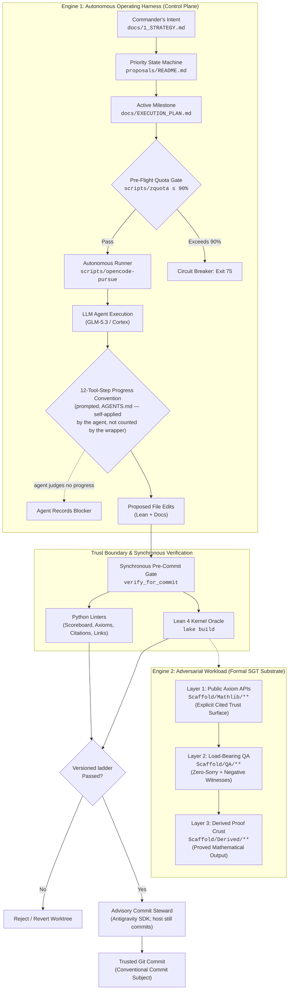
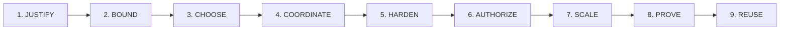
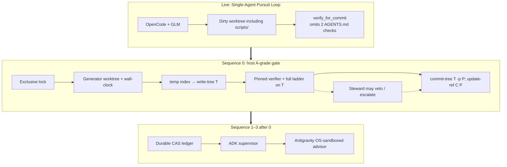

# Scaffold: An Agentic Architecture for Autonomous Formal Mathematics
## Comprehensive System Review, Epistemological Audit, and Operational Evaluation

**Status:** Technical Architecture Review & Evaluation — self-assessed against the cited `@fde/media` rubric; not externally certified  
**Date:** August 2026 · live axiom/QA counts: `docs/5_QA_SCOREBOARD.md` (do not freeze them here; see §7.0)  
**Target Repository:** `scaffold` (`Scaffold/`, `docs/`, `scripts/`, `proposals/`, `governance/`)  
**Evaluation Framework:** `@fde/media` (*Agentic Architecture Guide*, *The Agentic Design Palace*, *ELOS: The Lighthouse*, *Applied AI Evaluation & Safety*, and `fde_agentic_flow.py`)

---

## 1. Architectural Framing: The Dual Identity of Scaffold

To understand Scaffold only as a formal mathematics repository is to mistake the payload for the engine. 

Scaffold is commonly described as a Lean 4 library for Spectral Graph Theory (SGT). However, its deeper architectural significance is as an **autonomous, self-steering, self-falsifying agentic operating system**. Spectral Graph Theory is the *domain workload*; the repository itself is an *executable harness for high-assurance autonomous agent engineering*.



### Solving the Ground Truth & Authority Dilemma

Most autonomous agent architectures in production fail because their operating environment is non-deterministic, subjective, or fuzzy (e.g., chat workflows, web automation, unstructured API integrations). In those environments, systems often fall into the trap of **"LLM-as-judge" echo chambers**, where ungrounded generative models evaluate their own outputs, leading to silent drift, cascading hallucinations, and unmitigated blast radii.

Scaffold solves this fundamental dilemma through two architectural breakthroughs:
1. **The Kernel as the Definitive Adversary:** The agent operates against an unforgiving, deterministic truth oracle—the **Lean 4 typechecker**. A proposed theorem step either typechecks against its exact mathematical type or it does not. The evaluation is absolute and mathematically bounded.
2. **Absolute Separation of Generation and Authority:** The autonomous agent possesses zero authority to execute git commits, push code, or declare axioms valid on its own self-report. The control plane relies exclusively on synchronous deterministic linters and an isolated, read-only commit steward.

The commit steward's own procedure — what it actually checks, in what order, and where it escalates to a human rather than deciding alone — is formalized in [`commit-steward-protocol.md`](commit-steward-protocol.md), written after the role had run manually across several sessions and stabilized in practice.

The **live** control plane is still `launchd` plus `scripts/opencode-pursue` (bash, markdown state, prompted 12-step brake, incomplete `verify_for_commit`). The **adopted** contract — Sequence 0 host harden, then durable ledger, then ADK, Antigravity **advisory** — is §7.0. That is planning, not a wrapper rewrite. Unattended `--commit` is not Sequence-0-complete.

---

## 2. Station-by-Station Audit: The 9-Station Agentic Design Palace

Evaluating Scaffold against the 9 universal stations of the Agentic Design Palace:



### Station 1: JUSTIFY (Product Gate & Metric Trees)
*Mnemonic Anchor: Five-key gate, outcome tree, and counter-metric balance.*

#### 1.1 The AI Justification Gate
In `@fde/media`, the primary rule is: *Never use an LLM where deterministic code, search, or rules suffice.* Scaffold adheres to this with extreme discipline:
- **Deterministic Work:** Typechecking, proof verification, syntax parsing, citation validation, axiom counting, and markdown link verification are strictly delegated to deterministic software (`lake build`, Lean kernel, and Python linters in `scripts/`).
- **Bounded AI Work:** High-dimensional conjecture pathfinding, Mathlib theorem discovery, Lean syntax generation, tactic sequence search, and draft refactoring are delegated to the autonomous agent (`glm-5.3` via OpenCode). Commit-subject and record-vs-diff judgment sit in a separate Antigravity 2.0 steward, not in that generating agent.

#### 1.2 Metric Tree Formulation
Scaffold's operational governance mirrors the $L0 \rightarrow L1 \rightarrow L2$ metric tree structure:

```text
L0 (North Star): Verified, Axiom-Transparent SGT Theorem Crust Expansion Rate
├── L1.1: Build & Elaboration Reachability (% clean compilation of Scaffold umbrella)
├── L1.2: Axiom Elimination Rate (Admitted axioms successfully retired to proved theorems)
├── L1.3: Load-Bearing QA Density (Ratio of non-vacuous QA lemmas to public declarations)
└── L1.4: Mathlib API Alignment (% reuse of standard Mathlib predicates & types)
    ├── L2 Levers: `scripts/generate_qa_scoreboard.py`, `scripts/lint_axioms.py`
    ├── L2 Levers: `scripts/check_citations.py`, `scripts/check_markdown_links.py`
    └── L2 Levers: Active priority selection in `proposals/README.md`
```

#### 1.3 Counter-Metrics & Anti-Goodharting Defense
In `@fde/media`, an $L0$ metric without counter-metrics invites system corruption. Scaffold enforces hard quality and safety floors:
- **`sorry`/`admit` Counter-Metric:** Hard invariant of **0 placeholder tokens** in `Scaffold/QA/**` and `Scaffold/Mathlib/**` (`docs/5_QA_SCOREBOARD.md`). An agent cannot falsely inflate theorem velocity by inserting `sorry`.
- **Axiom Surface Counter-Metric:** Total public axioms are tracked continuously in `docs/5_QA_SCOREBOARD.md` (the live authority; this review does not freeze a count). Any new axiom requires explicit justification under `docs/2_ARCHITECTURE.md` §5.
- **Citation Precision Counter-Metric:** Every public axiom must have verified locator metadata in `index/sources/**`.

---

### Station 2: BOUND (The Four Inviolable Boundaries & NFRs)
*Mnemonic Anchor: V1 blueprint inside four stone walls.*

`@fde/media` mandates four inviolable boundaries before autonomous agency is granted. Scaffold enforces all four at the system level:

| Boundary | `@fde/media` Requirement | Scaffold Implementation | Operational Enforcement |
| :--- | :--- | :--- | :--- |
| **01. Cost / Spend** | Hard circuit breakers before runaway inference loops | `scripts/zquota` + `--quota-threshold 90` | Exits with status `75` if provider quota exceeds 90% before run starts. |
| **02. Authority** | No autonomous writes to un-sandboxed or irreversible targets | `AGENTS.md` working rules + `--commit` wrapper | Agent cannot `git push` or commit. Unattended commit is **not** Sequence-0-complete: verifier is worktree-mutable (R-06), ladder is a subset (R-09). Adopted: pinned verifier, host-only git, Antigravity advisory. |
| **03. Data / Provenance** | PII tokenization, clean-room boundary, copyright safety | `docs/2_ARCHITECTURE.md` §8 & `governance/CONTRIBUTING.md` | Prohibits bulk copyrighted textbook extracts; mandates structural citations and topic indices. |
| **04. Confidence / Trust** | Uncertainty floors, explicit refusal, no disguised hallucination | Explicit `axiom` keyword vs disguised `theorem := by sorry` | Trust boundary is rendered 100% transparent to the Lean compiler and human review. |

---

### Station 3: CHOOSE (Architectural Selection & Complexity Ladder)
*Mnemonic Anchor: Locked complexity staircase.*

#### 3.1 The Complexity Decision Ladder
`@fde/media` defines the progression:
$$\text{Rules} \rightarrow \text{Heuristics} \rightarrow \text{Classical ML} \rightarrow \text{LLM/RAG} \rightarrow \text{Bounded Agent} \rightarrow \text{Multi-Agent}$$

Scaffold operates at the **Bounded Autonomous Agent** tier:
- **Live:** a single autonomous runner (`scripts/opencode-pursue`) executes bounded turns; the agent uses tool calls (`lake build`, `view_file`, `replace_file_content`) to interact with the repository.
- **Adopted (§7.0):** Sequence 0 hardens the live shell gate first. ADK 2.0 is a later supervisor (quota, ledger consumers, role nodes), not a second LLM and not the next patch. Picking ADK does not move the system up the ladder into a multi-agent mesh. Multi-agent specialization remains earned (Station 3.2) and lands as ADK nodes only after Sequences 0–1.

#### 3.2 When Multi-Agent Is Earned
`@fde/media` states that multi-agent systems are earned only when single-agent systems suffer from context window poisoning, role overloading, or conflicting write scopes.

In Scaffold, multi-agent specialization is now **earned** at specific junctures:
1. **Mathlib API Exploration vs Formalization:** Surveying Mathlib's deep category/order hierarchies clutters context with large imported types, reducing the agent's attention budget for tactic synthesis.
2. **Adversarial QA Synthesis:** The agent that writes the theorem statement should not be the sole author of the QA witness; a specialized *Critic/Adversary* agent should attempt to refute the statement shape with counter-fixtures (e.g., disconnected graphs, negative spectra).

---

### Station 4: COORDINATE (State, Roles, Contracts & Termination)
*Mnemonic Anchor: Supervisor clock over a governed ledger.*

#### 4.1 State Management & Write Scopes
In Scaffold, task state is maintained across three complementary artifacts:
1. **`docs/EXECUTION_PLAN.md`**: Tracks the active milestone, SGT leverage rationale, and immediate next action.
2. **`docs/AGENT_ACTIVITY.md`**: An append-only journal recording UTC timestamps, session ID, run ID, status (`in-progress`, `completed`, `blocked`), changes, verification, and remaining risk.
3. **`proposals/README.md`**: The backlog state machine (Active High/Medium/Low, Delivered, Retired).

#### 4.2 Deterministic Termination Controls
`@fde/media` warns that *"loop until done"* is a critical anti-pattern. Scaffold enforces strict termination bounds:
- **12-Tool-Step Progress Convention:** `AGENTS.md:77` instructs that if no meaningful progress occurs within 12 tool steps, the agent should record evidence as a blocker, pivot, or cleanly terminate. This is a behavioral instruction inside the agent's prompt; `scripts/opencode-pursue` has no tool-step counter of its own, so compliance is self-applied by the agent rather than enforced by the wrapper. R-05 in §6 records an observed instance where it did not fire.
- **Run Quota (`--runs N`):** Limits continuous execution steps per pursuit invocation.
- **Clean Exit Traps:** Interrupted runs trap `SIGINT`/`SIGTERM` and direct the operator to `docs/AGENT_ACTIVITY.md`.

---

### Station 5: HARDEN (Resilience, Failure Envelopes & Crash Recovery)
*Mnemonic Anchor: Queued engine with bulkheads and relief valves.*

#### 5.1 Durable Execution & Crash Recovery
- **Session Continuity:** `scripts/opencode-pursue` persists session identifiers to `.opencode/pursue-session`. The `--resume` flag enables exact state resumption without restarting research from scratch.
- **Worktree Integrity:** The `--commit` wrapper strictly verifies `git status --porcelain`. If an uncommitted pursuit left the worktree dirty, subsequent runs refuse to proceed until the operator reconciles the state.
- **Defensive Unit Testing:** `scripts/test_opencode_pursue.sh` provides automated regression suites for the autonomous pursuit wrapper itself, testing argument parsing, session handling, and commit safety.

#### 5.2 Context Pruning & Anti-Poisoning
When an agent fails a proof in Lean, error messages can flood the context window. Scaffold counters context poisoning by:
- Enforcing fresh sessions for new directed pursuits.
- Directing the agent to externalize findings into `docs/EXECUTION_PLAN.md` before the context degrades.

---

### Station 6: AUTHORIZE (Control Plane Separation & Policy Gates)
*Mnemonic Anchor: Iron customs gate and scoped capability key.*

This is one of Scaffold's strongest architectural alignments with `@fde/media`.

```mermaid
sequenceDiagram
    autonumber
    actor Operator as Operator / Cron
    participant Wrapper as scripts/opencode-pursue
    participant Quota as scripts/zquota
    participant Agent as LLM Agent (Untrusted Proposer)
    participant Kernel as Lean 4 Kernel (lake build)
    participant Linters as Python Linter Suite
    participant Steward as Antigravity Commit Steward (Read-Only SDK)
    participant Git as Git Worktree

    Operator->>Wrapper: opencode-pursue [--commit]
    Wrapper->>Quota: Check GPU/API Quota
    alt Quota > 90%
        Quota-->>Wrapper: Exit 75 (Gate Closed)
        Wrapper-->>Operator: Halt (Budget Protection)
    else Quota <= 90%
        Quota-->>Wrapper: Quota OK
        Wrapper->>Agent: Launch pursuit run
        loop Agent Execution Loop (max 12 steps)
            Agent->>Git: Edit Lean files & Docs
            Agent->>Kernel: Interactive proof search (lake build)
        end
        Agent-->>Wrapper: Propose completion in AGENT_ACTIVITY.md
        Wrapper->>Linters: Run QA Scoreboard, Axiom Lint, Citations, Links
        Linters-->>Wrapper: 0 lint errors, 0 sorry tokens
        Wrapper->>Kernel: Run full umbrella compilation
        Kernel-->>Wrapper: Lake build OK (0 errors)
        Wrapper->>Steward: Inspect diff & activity log (deny-by-default SDK process)
        Steward-->>Wrapper: Structured verdict (subject, gap flags, commit/wait/escalate)
        Wrapper->>Git: Execute trusted git commit (host only; never the steward)
        Wrapper-->>Operator: Pursuit completed & committed
    end
```

#### 6.1 Untrusted Model vs. Trusted Authorizer
`@fde/media` Chapter 9 & 10 establish that **the model is an untrusted parser and proposer; trusted code alone authorizes and executes**.
- The LLM can propose any Lean syntax, tactic, or documentation edit.
- No model output is trusted on self-report. The `verify_for_commit` routine in `scripts/opencode-pursue` runs a **subset** of the `AGENTS.md` ladder (R-09: it omits `check_refutation_independence.py` and `check_public_reachability.py`). Sequence 0 replaces that subset with a versioned fail-closed manifest.
- If a single required check fails, the git commit is completely blocked.

#### 6.2 The Read-Only Commit Steward (veto only, never a go-signal)
The adopted steward is an isolated Antigravity 2.0 Python SDK process (`google.antigravity`). Deny-by-default tool policy is necessary and **not sufficient** (R-10). A steward verdict may **veto or escalate**. After the deterministic ladder has passed on tree OID *T*, a passing steward verdict is **not** a positive authorization condition — the host commits *T* because the ladder passed, or it does not commit. `agy -p` is not this role. The steward is never a child `invoke_subagent` of the generator.

The live `--commit` path still calls `codex exec` for a subject line. That stand-in is also not a go-signal in the adopted contract (today the wrapper treats a valid subject as required before `git commit` — Sequence 0 removes that as an authorization condition). Neither Codex nor Antigravity closes R-06–R-09 or R-13. Procedure: [`commit-steward-protocol.md`](commit-steward-protocol.md).

---

### Station 7: SCALE (Load Mathematics & Bottleneck Analysis)
*Mnemonic Anchor: Calculation telescope.*

#### 7.1 Mathematical Agent Load Dynamics
In typical RAG/Chat architectures, latency is dominated by vector retrieval and token generation. In Scaffold, the load equation is fundamentally different:

$$T_{\text{task}} = N_{\text{steps}} \times \left( T_{\text{infer}} + T_{\text{lean\_elaborate}} + T_{\text{mathlib\_lookup}} \right)$$

- **$T_{\text{lean\_elaborate}}$ (Lean Kernel Latency):** Elaborating large Mathlib matrix files can take 5–45 seconds per build.
- **$T_{\text{mathlib\_lookup}}$ (Search Space):** Mathlib comprises hundreds of thousands of theorems. Naive grep searches pollute context and waste tokens.

#### 7.2 The Bottleneck Rule
`@fde/media` Chapter 11 notes: *Coordination and state synchronization break before compute.* In Scaffold:
- The primary constraint is **formal theorem alignment**. A single incorrect binder, implicit typeclass coercion, or missing matrix symmetry assumption invalidates an entire downstream proof branch.
- Scaffold mitigates this by maintaining `docs/8_MATHLIB_COVERAGE_MAP.md`, providing a curated, dated index of Mathlib's capabilities to prevent agents from repeatedly re-surveying the mathlib repository.

---

### Station 8 & 9: PROVE & REUSE (Falsification & The Platform Loop)
*Mnemonic Anchor: Evidence court and productization workshop.*

```mermaid
stateDiagram-v2
    [*] --> LiteratureAxiom: Identify SGT literature gap
    LiteratureAxiom --> CitationIndex: Record exact bibliographic locators (index/sources)
    CitationIndex --> NegativeWitnessQA: Construct falsification test on boundary cases (e.g. K2, singular matrices)
    
    state NegativeWitnessQA {
        [*] --> ProveNegativeInstance
        ProveNegativeInstance --> RefuteFalseStatement: Falsify if statement shape is broken
        RefuteFalseStatement --> RepairAxiomShape: Correct hypotheses / dimensions
        RepairAxiomShape --> PassQA: QA compiles with 0 sorry
    }

    NegativeWitnessQA --> PublicAxiomLayer: Admitted to Scaffold/Mathlib/**
    PublicAxiomLayer --> ProofCrustDevelopment: Prove downstream theorems (Scaffold/Derived/**)
    ProofCrustDevelopment --> UpstreamProvedReplacement: General proof engine built (e.g. Courant-Fischer Min-Max)
    
    state AxiomRetirementLifecycle {
        [*] --> CompareConventions: Compare Mathlib vs Scaffold shapes
        CompareConventions --> ProveAdapterLemmas: Bridge interface differences
        ProveAdapterLemmas --> DeprecateAxiom: Add compatibility deprecation note
        DeprecateAxiom --> RetireAxiom: Remove axiom, update QA Scoreboard (-1 Axiom)
    }

    UpstreamProvedReplacement --> AxiomRetirementLifecycle
    AxiomRetirementLifecycle --> UpstreamMathlibPR: Export verified theorem to Mathlib
    UpstreamMathlibPR --> [*]
```



#### 8.1 "Height Is Not Evidence": Popperian Falsification
Scaffold's strategy document (`docs/1_STRATEGY.md` § *Load-bearing growth*) directly implements the core epistemological doctrine of `@fde/media`:
> *"A declaration that compiles and sits beside existing work, without depending on the precise correctness of any specific earlier definition, adds surface area but tests nothing... Prefer work whose success is contingent on an earlier definition or proof being exactly right."*

#### 8.2 Negative-Witness QA Fixtures
Just as `@fde/media` requires adversarial test suites, Scaffold mandates **negative witnesses**:
- `old_cheeger_lower_bound_refuted_QA`: Refuted the pre-repair Cheeger lower bound on $K_2$ ($1/2 \le 0$).
- `Connectivity_QA.lean`: Disconnected graph witnesses that fail if connectedness hypotheses are omitted.
- `MatrixUpdates_QA.lean`: Refuted the false Woodbury scalar shape on singular matrices.

#### 8.3 The Upstream Replacement Lifecycle
Scaffold's contribution contract (`docs/2_ARCHITECTURE.md` §9) governs how admitted axioms are systematically eliminated as the proof crust solidifies. This lifecycle has successfully retired:
- `eigen_interlacing_principal_submatrix` (Cauchy interlacing)
- `sherman_morrison` (Rank-1 matrix updates)
- `woodbury_identity` (General matrix updates)
- `cheeger_upper_bound` (Cheeger easy direction)
- `lambda2_variational` (Variational algebraic connectivity)

---

## 3. Philosophical & Operational Alignment: ELOS (The Lighthouse)

The foundational operating principles of `fde/media/ELOS-the-lighthouse.md` and `fde/media/README.md` map directly onto Scaffold's architectural design:

| ELOS Lighthouse Principle | `@fde/media` Doctrine | Scaffold Manifestation |
| :--- | :--- | :--- |
| **0. Bedrock (Trust)** | *Conviction accountable to evidence; safe to report bad numbers.* | Axioms are never hidden behind `sorry`. When an axiom is found false on $K_2$, it is publicly recorded, refuted in QA, and repaired. |
| **1. Chart Room (Clarity)** | *Commander's Intent: clarity of outcome over rigid plans.* | `docs/1_STRATEGY.md` sets the center-out rule: when fog arises in outer applications, immediately retreat inward to fix the nearest load-bearing defect. |
| **2. Engine Room (Leverage)** | *Output = Activity $\times$ Leverage; single-threaded DRI.* | `proposals/README.md` ranks work strictly by downstream SGT proof enablement per unit of complexity. |
| **5. Instrument Deck (Signal)** | *Paired indicators & counter-metrics.* | Scoreboard pairs theorem count with strict `sorry`-token counts and explicit axiom counters. |
| **6. Storm Deck (Hard Things)** | *Pre-mortem confidence voting & post-mortems.* | Proposals require calibration steps and hypothesis verification before formal Lean authoring begins. |

---

## 4. Formal Architectural Evaluation & Scorecard

Evaluating Scaffold across the core engineering dimensions and production readiness criteria of `@fde/media`:

```
+---------------------------------------------------------------------------------------+
| DIMENSION           | STATUS    | SCORE  | ARCHITECTURAL FINDINGS & CONTROLS         |
+---------------------+-----------+--------+-------------------------------------------+
| 1. GATE (Justify)   | PASS      | 9.5/10 | Strict AI vs deterministic separation.    |
| 2. BOUND (NFRs)     | PASS      | 9.0/10 | 3 boundaries code-enforced; 1 (progress   |
|                     |           |        | brake) is prompted, not code-level.       |
| 3. CHOOSE (Topology)| PASS      | 9.0/10 | Simplest viable single-agent baseline.    |
| 4. COORDINATE(State)| WEAK+     | 7.0/10 | Markdown state sync; lack of typed schema;|
|                     |           |        | step-progress control not code-enforced.  |
| 5. AUTHORIZE(Safety)| WEAK+     | 7.0/10  | Host git is right; verifier is mutable; |
|                     |           |        | ladder incomplete; 1s TOCTOU (R-06–09). |
| 6. PROVE (Evals)    | PASS      | 10/10  | Negative witnesses; zero-sorry floor.     |
+---------------------+-----------+--------+-------------------------------------------+
| COMPOSITE           | WEAK+     | 85.8%  | Unweighted mean. Unattended-commit slice  |
|                     |           |        | graded B externally until Sequence 0.    |
+---------------------------------------------------------------------------------------+
```

### Detailed Evaluation by Dimension

#### Dimension 1: GATE (Product-Sense & AI Justification) — **PASS [9.5 / 10]**
- **Criteria:** Deterministic algorithms vs. AI; clean L0 outcome definition; balanced counter-metrics.
- **Strengths:** Lean 4 typechecking, syntax parsing, citation validation, and link checking are 100% deterministic (`scripts/`). LLM is restricted to fuzzy conjecture pathfinding and tactic search. L0 crust growth is paired with hard counter-metrics (zero `sorry`/`admit` tokens, tracked public axiom count).
- **Identified Gap (-0.5):** Token spend per formal theorem milestone is not yet benchmarked against baseline human formalization cost.

#### Dimension 2: BOUND (Constraints & Four Inviolable Walls) — **PASS [9.0 / 10]**
- **Criteria:** Explicit numeric bounds on cost, authority, data provenance, and confidence.
- **Strengths:** 
  - **Cost:** `scripts/zquota` enforces a hard 90% pre-flight threshold (exit code 75), and `--runs N` bounds total run count.
  - **Authority:** Agent is strictly barred from `git commit`, `git push`, and history rewriting.
  - **Data:** Prohibits raw copyrighted mathematical text; mandates concise structural citations.
  - **Confidence:** Explicit `axiom` keyword prevents disguise of unproved theorems; Lean kernel acts as the ultimate truth oracle.
- **Identified Gaps (-1.0):** Dynamic cost reservation per tool step (as in `TaskStore.reserve_cost`) is managed at the session level rather than per-step. Cost is bounded by quota and run-count, but *within* a single run there is no code-level step budget — the 12-tool-step figure describes a prompted convention the agent applies to itself, not a wrapper-enforced reservation (see R-05).

#### Dimension 3: CHOOSE (Simplest Viable Architecture) — **PASS [9.0 / 10]**
- **Criteria:** Avoid premature multi-agent complexity; adopt multi-agent only when earned by fan-out or write isolation.
- **Strengths:** Avoided premature multi-agent complexity; operates as a robust, single-agent supervisor loop with external verification. Explicitly documents architectural choices, alternatives rejected, and technical debt in `docs/2_ARCHITECTURE.md` §12.
- **Identified Gap (-1.0):** Multi-agent specialization (separating Mathlib retrieval from Lean formalization) is earned by recent SGT theorem complexity. The adopted shape is ADK nodes plus an Antigravity steward sibling (§7.0 / Phase 2); it is not yet implemented.

#### Dimension 4: COORDINATE (State, Roles & Write Scopes) — **WEAK+ [7.0 / 10]**
- **Criteria:** Typed contracts; one writer per state; shared state not chat memory; bounded termination.
- **Strengths:** Run count limits and clear failure traps (`SIGINT`/`SIGTERM` handling) are code-enforced. Clear separation of commit (agent drafts, shell lints, isolated steward judges, host commits).
- **Identified Gaps (-3.0):**
  - **Unstructured Markdown State:** State is synchronized via free-form markdown (`EXECUTION_PLAN.md` and `AGENT_ACTIVITY.md`) rather than typed JSON schemas.
  - **Interleaved Write Scopes:** The same agent edits Lean source code, updates execution plans, and appends to activity logs in a single turn, risking state inconsistency.
  - **Fine-grained termination is prompted, not enforced (R-05):** deterministic termination in this architecture reduces to the quota gate and `--runs N`; the finer-grained "notice you're stuck and pivot" control (the 12-tool-step convention) is a prompted instruction the agent applies to itself, with no wrapper-level enforcement. See R-05 in §6 for a directly observed case where a run ran for hours past that convention on a single stuck proof before stopping via an unrelated harness limit.

#### Dimension 5: AUTHORIZE (Control Plane Separation) — **WEAK+ [7.0 / 10]**
- **Criteria:** Model proposes, trusted code authorizes; credentials never in context; forensic audit trail.
- **Strengths:** The generator is barred from `git commit` / `git push`. Lean and the Python linters are the evidence plane. The *intent* of an isolated steward plus host-only Git is correct.
- **Identified Gaps (-3.0):** Four live Sequence 0 failures (verify/commit mismatch; verifier in the candidate tree; incomplete `verify_for_commit`; prompt-only 12-step). Also R-10 (SDK policy ≠ OS isolation). A steward *subject line* does not repair those. Sequence 0 is the AUTHORIZE recovery; the steward may veto, never authorize.

#### Dimension 6: PROVE (Evals & Falsification) — **PASS [10 / 10]**
- **Criteria:** Catastrophic slice gating; refusal of aggregate averages; negative testing; upstream platform reuse.
- **Strengths:** Uncompromising Popperian falsification: "Height is not evidence" (`docs/1_STRATEGY.md`). Rejects aggregate scores in favor of exact invariant satisfaction. Hard invariant of zero `sorry`/`admit` tokens in QA and `Scaffold/Mathlib` (counts: `docs/5_QA_SCOREBOARD.md`, not a frozen figure in this file). Mandates negative witnesses. Systematic lifecycle for retiring admitted axioms to proved theorems.

---

### Production Agent Readiness Scorecard

Evaluation against the 4 core dimensions of `AGENTIC_ARCHITECTURE_GUIDE.md` § *Agent Readiness Testing*:

```text
+-------------------------------------------------------------------------------+
| READINESS CATEGORY | WEIGHT   | STATUS | PASS CRITERIA & EVIDENCE             |
+--------------------+----------+--------+--------------------------------------+
| 1. SAFETY          | BLOCKER  | FAIL   | Mutable verifier (R-06); incomplete   |
|                    |          |        | ladder (R-09); 1s TOCTOU (R-07).      |
|                    |          |        | Sequence 0 is the recovery.           |
|                    |          |        |                                      |
| 2. RELIABILITY     | HIGH     | PASS   | 88% - Session resume; dirty tree     |
|                    |          |        | lock; test suites. The 12-step brake |
|                    |          |        | is prompted, not code-enforced (R-05).|
|                    |          |        |                                      |
| 3. COST & FINOPS   | MEDIUM   | PASS   | 90% - 90% zquota pre-flight gate;    |
|                    |          |        | bounded run loops.                   |
|                    |          |        |                                      |
| 4. OBSERVABILITY   | MEDIUM   | PASS   | 95% - UTC append-only journal;       |
|                    |          |        | session ID tracking; raw run logs.   |
+-------------------------------------------------------------------------------+
```

---

## 5. Architectural Contrast: High-Assurance Design vs. Naive Prototype Patterns

| Architectural Dimension | Naive Prototype Pattern | High-Assurance Production Design (Scaffold Reality) |
| :--- | :--- | :--- |
| **Opening Move** | Sketches multi-agent mesh / picks framework | Bounds problem & defines mathematical constraints (`1_STRATEGY.md` center-out rule). |
| **Multi-Agent** | Assumes more agents equal smarter system | Single-agent pursuit with strict external verification; multi-agent deferred until earned. |
| **Safety & Writes** | Human confirmation as only gate | Synchronous policy gate is the *intent*; live `verify_for_commit` is an incomplete subset of `AGENTS.md` and runs worktree scripts (R-06, R-09). |
| **Scale Bottleneck**| Adds more compute / expands context window | Identifies Lean elaboration and Mathlib graph traversal as binding bottleneck (`8_MATHLIB_COVERAGE_MAP.md`). |
| **State Sync** | Chat memory or unstructured text blobs | Append-only audit journal with strict timestamps (`AGENT_ACTIVITY.md`); roadmap to typed JSON state. |
| **Evaluation** | Average aggregate benchmark accuracy | Catastrophic slice gating & falsification (0-`sorry` invariant; negative-witness refutations). |

---

## 6. Comprehensive Gap Analysis & Risk Register

While Scaffold demonstrates world-class rigor in formal mathematics and verification gating, evaluating it against the production agentic standards of `@fde/media` — and against the 2026-08-30 agent-stack review of the ADK/Antigravity mix — reveals these structural gaps:

```text
+---------------------------------------------------------------------------------------------------+
|                                   SCAFFOLD RISK REGISTER                                          |
+---------------------------------------------------------------------------------------------------+
| Risk ID | Category         | Description                               | Severity | Mitigation     |
+---------+------------------+-------------------------------------------+----------+----------------+
| R-01    | State Machine    | Unstructured Markdown State Interleaving  | Medium   | Seq 1 ledger   |
| R-02    | Architecture     | Single-Agent Cognitive Overload           | Medium   | Seq 2 ADK roles|
| R-03    | Performance      | Lean 4 Elaboration Bottleneck             | Medium   | Module Slicing |
| R-04    | Governance       | Manual Proposal Table Promotion           | Low      | CI Gate Script |
| R-05    | Termination      | Progress Brake Is Prompted, Not Enforced  | Medium   | Seq 0 host cap |
| R-06    | Authority        | Generator can edit the verifier scripts   | Critical | Pinned verifier|
|         |                  | that then approve its own diff            |          | + CP human gate|
| R-07    | Authority        | Liveness + 1s status diff is not a lock   | High     | Lock+snapshot  |
| R-08    | Termination      | ADK cannot count OpenCode-internal tools  | High     | Host CPU/clock |
| R-09    | Authority        | verify_for_commit omits two AGENTS.md     | High     | Versioned      |
|         |                  | ladder steps                              |          | fail-closed    |
|         |                  |                                           |          | manifest       |
| R-10    | Isolation        | SDK deny-policies ≠ OS sandbox / creds /  | High     | OS containment;|
|         |                  | egress                                    |          | steward=advice |
| R-11    | State            | ADK session ≠ durable CAS ledger          | Medium   | Seq 1 spec     |
| R-12    | Observability    | Review froze axiom/QA counts              | Medium   | Scoreboard is  |
|         |                  |                                           |          | sole authority |
| R-13    | Authority        | Lock without binding commit to tree OID   | High     | temp index; T; |
|         |                  | leaves an outside-writer race; write-tree |          | commit-tree;   |
|         |                  | serializes the index, not the worktree   |          | update-ref C P |
| R-14    | Authority        | Trust root listed only scripts/lakefile   | High     | toolchain,     |
|         |                  |                                           |          | lake-manifest, |
|         |                  |                                           |          | hooks, manifest|
+---------------------------------------------------------------------------------------------------+
```

### Gap 1: Unstructured Markdown State Interleaving
- **Observed State:** State is synchronized via free-form text in `docs/EXECUTION_PLAN.md` and `docs/AGENT_ACTIVITY.md`.
- **`@fde/media` Standard:** `fde_agentic_flow.py` utilizes a typed `SharedTaskState` with explicit field-level ACLs, JSON schema validation, and optimistic CAS version checks.
- **Risk:** Agents occasionally format activity entries inconsistently, requiring regex scraping in bash wrappers.
- **Adopted path:** Sequence 1 durable CAS ledger (§7.0), then optionally an ADK session as a consumer of that ledger. Markdown journals remain the operator-facing audit trail, not the machine state. An ADK session object is not by itself durable or CAS-safe (R-11).

### Gap 2: Single-Agent Cognitive Overload During Deep Proofs
- **Observed State:** A single agent session performs literature retrieval, Mathlib API exploration, Lean formalization, QA authoring, and documentation logging.
- **`@fde/media` Standard:** Separation of concerns into **Planner**, **Researcher**, **Formalizer/Executor**, and **Critic**.
- **Risk:** Context exhaustion during long proof search attempts causes the agent to lose track of broader architectural invariants.
- **Adopted path:** After Sequences 0–1, ADK `SequentialAgent` / workflow nodes for researcher, formalizer (GLM), and critic; Antigravity remains an **advisory** steward (§7.0 Sequence 3).

### Gap 3: Lean 4 Elaboration Latency on Large Dependency Graphs
- **Observed State:** Running `lake build` after every minor tactic change introduces multi-second delays, consuming agent execution timeouts.
- **`@fde/media` Standard:** Latency budgeting and critical-path optimization.
- **Risk:** Slow builds can starve a run's productive time; there is no code-level step budget to bound how long any one proof attempt is allowed to run before something intervenes (see R-05).

### Gap 4: Manual Proposal Priority Gatekeeping
- **Observed State:** Proposal promotion and status changes in `proposals/README.md` are maintained by manual text edits.
- **`@fde/media` Standard:** Automated gate transitions based on verifiable CI outcomes.
- **Risk:** Proposals marked delivered or blocked can diverge from actual git branch realities.

### Gap 5 / Risk R-05: Progress Brake Is Prompted, Not Code-Enforced
- **Observed State:** `AGENTS.md:77` instructs the agent to record a blocker and pivot if no meaningful progress occurs within 12 tool steps. `scripts/opencode-pursue` contains no tool-step counter; nothing in the wrapper measures or enforces this. It is a behavioral convention the agent is asked to self-apply, not a control-plane mechanism.
- **Directly observed failure instance:** A live pursuit run spent roughly 4–6 hours (far more than 12 tool-equivalent steps) attempting the Davis–Kahan equal-rank projector identity in a new module (`ProjectionGap.lean`), repeatedly hitting Lean elaborator heartbeat timeouts and patching the same proof, before stopping — not via a 12-step pivot, but via an unrelated, much larger harness-level step limit ("Maximum steps for this agent have been reached"). The 12-step convention did not fire at any point during that window.
- **`@fde/media` Standard:** Deterministic termination controls should be enforced by the control plane, not left to the untrusted model's self-report (Station 4.2, Station 6.1 — "the model is an untrusted parser and proposer; trusted code alone authorizes and executes"). This applies to *pacing* decisions (when to stop and hand back), not only to *write* decisions (what to commit) — the current architecture only enforces the latter.
- **Risk:** Quota exhaustion or wall-clock cost from a single agent grinding on one intractable proof step, undetected until the harness's own much coarser limit trips. Medium severity: `scripts/zquota`'s 90% threshold and `--runs N` still bound total exposure across runs, so this is a within-run inefficiency, not an unbounded-cost failure.
- **Mitigation:** Sequence 0 binds the generator with a **host** wall-clock/CPU limit (ADK cannot count OpenCode-internal tool calls if OpenCode is one subprocess — R-08). Sequence 2 may add ADK `before_tool_callback` only for tools the supervisor owns, or by proxying every counted operation through the host. A prompted 12-step instruction is not a control.

---

## 7. Architectural Recommendations & Evolution Roadmap

To evolve Scaffold into a reference-grade autonomous mathematical laboratory, we propose a four-phase upgrade roadmap directly derived from `@fde/media`. **§7.0 is the adopted control-plane contract.** Lean work and ordinary verification are strong. Unattended `--commit` is **B** because the live wrapper still fails the four Sequence 0 acceptance criteria below. The Git recipe, pinned verifier, and wall-clock cap exist to close those four — not as extra architecture. A+ stays a later closure target (Sequences 1–3 plus that implementation).

### 7.0 Adopted mix: harden the host first, then ADK, Antigravity advisory

**Status:** Planning contract, 2026-08-30. Not implemented. Live still fails all four Sequence 0 criteria. The path remains `launchd` → `scripts/opencode-pursue` → GLM via OpenCode → host `verify_for_commit` (worktree scripts; incomplete relative to `AGENTS.md`) → `git add -A` / `git commit`. Unattended `--commit` is **not** authorized against this contract until Sequence 0 lands.

**Sequence 0 acceptance — four live failures (all still open).**

The transactional guarantee Sequence 0 must add:

> **The exact Git tree that passed the complete trusted verification ladder is the exact tree committed.**

None of this implies the agent is malicious. It protects against races, accidental edits, stale checks, and runaway runs.

| # | Live failure | Why it breaks the guarantee | Sequence 0 close | Risk |
| :--- | :--- | :--- | :--- | :--- |
| **1** | It verifies one state and commits another. Checks run against the live worktree; afterward `git add -A` stages whatever exists then. There is no immutable verified snapshot. | A race or a later generator rewrite can commit a tree the ladder never saw. | Temporary index → tree OID *T*; verify a checkout of *T*; `C=$(git commit-tree T -p P)`; `git update-ref <ref> C P`. Generators run before *T*, or regeneration must leave *T* unchanged. | R-07, R-13 |
| **2** | The verifier is inside the candidate change. The agent can accidentally edit `scripts/lint_axioms.py`, build configuration, or another trust-root file, and the wrapper then uses that edited version for approval. | Approval is not from a trusted verifier. | Run the ladder from a pinned checkout/image of the last trusted verifier. Refuse unattended `--commit` (human review) if the **trust root** changed: `scripts/` (including the verification manifest), `lakefile.lean`, `lake-manifest.json`, `lean-toolchain`, tracked hooks, and other Lake/toolchain pins. | R-06, R-14 |
| **3** | The unattended ladder is incomplete. It omits `check_refutation_independence.py` and `check_public_reachability.py`. | A “pass” is not the complete `AGENTS.md` ladder. | Versioned fail-closed manifest matching `AGENTS.md`; record every exit. | R-09 |
| **4** | A run has no enforced internal time budget. The 12-step brake is prompt guidance. A stuck proof attempt can run for hours. | The host cannot bound a runaway generator. | Host wall-clock/CPU limit on the generator process. Prompted 12-step is not a control. | R-05 |

External review (2026-08-30: **Grade B — adopt conditionally, not yet ship for unattended commits**) accepted Lean + deterministic QA as the evidence plane and host-only Git as the right shape. Sequence 0 is those four closures. Additional Sequence 0 rules (steward veto-only, never a go-signal; cooperative flock is not a substitute for `update-ref`) do not replace them.

**Sequence 0 Git mechanics (how item 1 is implemented; specify before coding).**
`git write-tree` serializes the **index**, not the working tree. A naive `write-tree` on the default index can therefore commit something other than the files the generator just wrote. Sequence 0 must:

```text
GIT_INDEX_FILE=<temp> git read-tree HEAD          # or empty, then
GIT_INDEX_FILE=<temp> git add -A                  # populate temp index from the intended tree
T=$(GIT_INDEX_FILE=<temp> git write-tree)         # tree OID
# verify a checkout of T with the pinned ladder (not the live worktree)
C=$(git commit-tree T -p P -m ...)                # P = current branch tip
git update-ref <ref> C P                          # atomic: succeeds only if <ref> still names P
```

Any **content generator** (including `generate_qa_scoreboard.py` rewriting `docs/5_QA_SCOREBOARD.md`) runs **before** *T* is taken, or verification must prove that regeneration leaves *T* unchanged. Do not `git add -A` / `git commit` on the live worktree after the ladder. `update-ref C P` is the compare-and-swap; a cooperative flock is not a substitute for it.

**Safe shape (every unattended commit):**

```text
1. Generator     dedicated writable worktree; no Git credential; host wall-clock/CPU bound
2. Snapshot      exclusive lock held; **temporary index** → `git write-tree` → tree OID T
                 (`write-tree` reads the index, not the working tree)
3. Verification  pinned verifier runs the full manifest against a checkout of T
4. Advice        steward may veto or escalate; never the positive authorize condition
5. Commit        C = `git commit-tree T -p P`; `git update-ref <ref> C P`
                 (atomic advance; fails if <ref> is no longer P)
```

**Build order — do not skip ahead:**

| Seq | What | Closes | Not this |
| :--- | :--- | :--- | :--- |
| **0** | Close the four live failures: (1) temp index → *T* → verify checkout of *T* → `commit-tree` / `update-ref C P` (not `git add -A` after a live-worktree ladder); (2) pinned verifier + fail closed if trust root changed; (3) versioned ladder including `check_refutation_independence.py` and `check_public_reachability.py`; (4) host wall-clock/CPU on the generator. Steward may veto, never authorize. | R-05, R-06, R-07, R-09, R-13, R-14 | ADK; steward as go-signal |
| **1** | Typed durable ledger: persistence backend, schema + migrations, monotonic transitions, recovery, concurrency tests. Not "an ADK session object" by itself | R-01, R-11 | ADK orchestration |
| **2** | ADK 2.0 workflow as supervisor *on top of* 0+1. LiteLLM for GLM. `before_tool_callback` counts only supervisor-owned tools; if OpenCode remains one subprocess, ADK must not claim to count its internal calls — the Sequence 0 host budget still binds | R-02 (roles), R-08 (only if tools are proxied through ADK) | Replacing lake/git with LLM nodes |
| **3** | Antigravity 2.0 SDK as **advisory** read-only steward: deny-by-default *plus* OS sandbox, read-only mount of tree *T*, no Git/network credentials, explicit egress, pinned SDK/runtime. A steward verdict may **veto or escalate**. It must **never** be the positive condition that authorizes commit after the deterministic ladder on *T* has passed. Host commits *T*. `agy -p` is not this role | R-10 | Steward as go-signal; deny-policies-as-sandbox |

Google's split still holds for Sequence 2–3: ADK is the workflow runtime; Antigravity is a coding-agent harness with useful tool policies that are **not** OS isolation. Antigravity cannot plug GLM; the generator stays OpenCode/LiteLLM.

```text
launchd / Cloud Scheduler          ← keep the clock
        │
        ▼
exclusive lock                     ← Sequence 0; entire generate→snapshot→verify→commit
        │
        ├─ GLM / OpenCode            writable worktree, no git creds, wall-clock/CPU cap
        ├─ temp index → git write-tree → OID T
        ├─ pinned verifier + full ladder on checkout of T
        ├─ Antigravity may veto (never a go-signal)
        └─ C=commit-tree T -p P; update-ref <ref> C P
```

Sequence 2 may wrap that spine in ADK. It may not reorder it.

| Layer | Live | Adopted | Must not become |
| :--- | :--- | :--- | :--- |
| Clock | `launchd` hourly plist | Keep | An agent that "decides when to run" |
| Mutual exclusion | `isrunning` + 1s `git status` diff (TOCTOU) | Exclusive lock **and** commit of the verified tree OID *T*; lock alone cannot stop an outside writer | Sleep-and-hope; lock without OID bind |
| Verifier | Worktree `scripts/` | Pinned checkout/image of the last trusted verifier | Trusting dirty-tree linters |
| Trust root | not a single list | `scripts/` (incl. verification manifest), `lakefile.lean`, `lake-manifest.json`, `lean-toolchain`, tracked hooks / Lake pins; diffs → human | Protecting only `scripts/` + `lakefile.lean` |
| Ladder | `verify_for_commit` omits two `AGENTS.md` steps | Versioned fail-closed manifest; record every exit | A second incomplete list in bash |
| Step budget | Prompted 12-step; ADK cannot see OpenCode-internal tools | Host wall-clock/CPU on the generator; ADK counts only tools it owns, or every counted op is proxied | Claiming ADK `maximum_remote_calls` covers OpenCode-as-one-process |
| Ledger | Markdown journals | Sequence 1 durable CAS ledger | Equating "ADK session" with durability |
| Steward | Codex subject line | **Veto/escalate only**; never the positive authorize condition after deterministic checks on *T* | Steward as go-signal; deny-policies-as-sandbox |
| Git | Host after regex on subject | Temp index → *T* → verify *T* → `commit-tree T -p P` → `update-ref C P` | `git add -A` / `git commit` on a live worktree after verify; `write-tree` of the default index |

**What this mix is not.** It is not "replace bash with ADK and call it done." Station 3 still forbids picking a framework as the opening move. It is not BYOK GLM inside Antigravity. It is not moving git into ADK's `LlmAgent` or the steward.

Numeric claims in this review (axiom count, QA declaration count) are not restated here. The live authority is [`docs/5_QA_SCOREBOARD.md`](../5_QA_SCOREBOARD.md) (generated table).

The steward *procedure* remains [`commit-steward-protocol.md`](commit-steward-protocol.md). Sequence 0 replaces that document's Step 0, Step 6, and Step 7's `git add -A` with the temporary-index / *T* / `commit-tree` / `update-ref` recipe above; it does not implement them in this revision.



### Phase 1: Typed durable ledger (Sequence 1 — after Sequence 0)
Specify, then implement, a durable CAS ledger — **not** "an ADK session." Required before any ADK work: persistence backend, schema and migrations, monotonic state transitions, recovery, and concurrency tests. Operator dump may still be `.opencode/state.json`. Field contract, mirroring `TaskStore` in `fde_agentic_flow.py`:

```json
{
  "task_id": "sgt-electrical-flow-step-4",
  "version": 4,
  "milestone": {
    "proposal": "proposals/electrical-flow-routing.md",
    "step": 4,
    "objective": "Prove Rayleigh monotonicity in conductance form"
  },
  "budget": {
    "allocated_tool_steps": 12,
    "consumed_tool_steps": 3,
    "quota_threshold": 90
  },
  "write_scopes": {
    "agent": ["Scaffold/SpectralGraph/ElectricalFlow.lean", "Scaffold/QA/SpectralGraph/ElectricalFlow_QA.lean"],
    "steward": [],
    "host": ["git_commit"]
  },
  "status": "in_progress"
}
```

### Phase 2: ADK role nodes (Sequence 2) + Antigravity advisor (Sequence 3)
Only after Sequences 0–1. Roles 1–3 are ADK `SequentialAgent` / workflow nodes. Role 4 is an Antigravity **advisor** (OS-sandboxed), never an authorizer, never `invoke_subagent` from GLM:
1. **`mathlib-researcher` (Read-Only ADK node):** Explores `Mathlib` and returns only minimal theorem signatures and module paths.
2. **`lean-formalizer` (Write-Scoped, GLM):** Receives the focused signatures and authors the Lean proof in `Scaffold/Mathlib/**` or `Scaffold/Derived/**`, via LiteLLM or by invoking OpenCode as a tool.
3. **`adversarial-qa-critic` (QA-Scoped ADK node):** Instantiates edge cases, negative witnesses, and boundary graphs in `Scaffold/QA/**` to stress-test the formalizer's definitions.
4. **`commit-steward` (advisory Antigravity SDK):** May veto or escalate. Must not be the positive condition that authorizes `commit-tree T`. SDK deny-lists do not replace OS isolation (R-10).

### Phase 3: Build a Formal Mathematical Trajectory Evaluation Suite
Incorporate `fde-evaluations-guide.md` principles into a new evaluation harness (`scripts/eval_agent_trajectories.py`):
- Maintain a **Golden Set of SGT Formalization Tasks** (e.g., 20 historical proof steps ranging from elementary algebraic identities to deep Courant-Fischer variational characterizations).
- Evaluate candidate models not merely on final proof completion, but on **trajectory efficiency**:
  - Number of tactic regressions before successful QED.
  - Frequency of invalid syntax submissions.
  - Recovery speed after Lean elaboration errors.
  - Adherence to Mathlib naming conventions.

### Phase 4: Discovery-Layer MCP Server Integration
Fulfill the vision of `proposals/discovery-mcp-server.md` by exposing Scaffold's SGT definitions, QA witnesses, and citation indices through a standardized Model Context Protocol (MCP) interface. This allows external agentic workflows to query verified spectral graph invariants seamlessly.

---

## 8. Broader Architectural Takeaways: A Generalizable Blueprint for Autonomous AI

The architectural lessons distilled from Scaffold extend far beyond spectral graph theory. Scaffold provides a **canonical, generalizable blueprint for deploying autonomous agents into zero-tolerance, mission-critical environments**:

```text
+---------------------------------------------------------------------------------------------------+
|                        GENERALIZABLE BLUEPRINT: HIGH-ASSURANCE AGENTIC SYSTEMS                   |
+---------------------------------------------------------------------------------------------------+
| 1. Deterministic Truth Oracles   | Bind agents to formal verifiers (compilers, typecheckers,      |
|                                  | SAT/SMT solvers) rather than statistical LLM-as-judge loops.   |
|                                  |                                                                |
| 2. Explicit Trust Boundaries     | Demarcate admitted assumptions (`axiom`) from proved claims    |
|                                  | (`theorem`). Never permit disguised placeholders (`sorry`).   |
|                                  |                                                                |
| 3. Negative-Witness Testing      | Force agents to construct adversarial fixtures that actively   |
|                                  | prove invalid claims fail before granting production autonomy. |
|                                  |                                                                |
| 4. Out-of-Band Write Authority   | Strip write/commit authority from generating models; execute   |
|                                  | side-effects exclusively through verified, read-only stewards. |
|                                  |                                                                |
| 5. Commander's Intent (ELOS)     | Encode strategic priorities as inward-retreat heuristics       |
|                                  | (center-out) so agents self-steer during execution fog.        |
+---------------------------------------------------------------------------------------------------+
```

### Direct Domain Adaptations
- **Distributed Protocols & Concurrency:** Replace Lean 4 with **TLA+ / TLC Model Checker** to build an autonomous formal verification agent for distributed consensus algorithms.
- **Systems & Kernel Refactoring:** Replace SGT with the **Rust Compiler & Miri** to build an autonomous memory-safety and undefined-behavior elimination engine.
- **Scientific Discovery & Chemistry:** Replace Lean with **SMT Constraint Solvers & Thermodynamic Simulators** to build an autonomous molecular kinetic design loop.

---

## 9. Architectural Verdict & Final Summary

```text
================================================================================
FINAL VERDICT: DO NOT SHIP UNATTENDED COMMITS UNTIL SEQUENCE 0 IS IMPLEMENTED
LIVE UNATTENDED-COMMIT SLICE: B
PLANNING CONTRACT: A− (four live failures named as Seq 0; not yet executed)
A+: CONDITIONAL CLOSURE TARGET — NOT EARNED
COMPOSITE (six @fde/media dimensions): 85.8 / 100  |  GRADE: B+ (self-assessed)
================================================================================

KEY TAKEAWAY:
Lean work and ordinary verification are strong. Live unattended commit is B
because it still fails four Sequence 0 criteria: (1) verify worktree then
git add -A another state; (2) verifier lives in the candidate tree;
(3) ladder omits two AGENTS.md checks; (4) 12-step brake is prompt-only.
The guarantee Sequence 0 must add: the exact Git tree that passed the
complete trusted verification ladder is the exact tree committed. That
protects against races, accidental edits, stale checks, and runaway runs
— not against a malicious agent. A+ remains unearned until Sequence 0
(and then 1–3) exist in code.
================================================================================
```

---

## 10. Revision History

| Version | Date | Change |
| :--- | :--- | :--- |
| v1 | August 2026 | Original draft, written against an earlier commit. |
| v2 | 2026-08-21 | Public axiom count and QA declaration count updated to the live `docs/5_QA_SCOREBOARD.md` figures (11 axioms, 998 QA declarations). The 12-tool-step control was re-characterized throughout — including the Station 1 diagram, Stations 2 and 4, the composite scorecard, the risk register (added R-05), and the verdict — from a code-enforced circuit breaker to what it actually is: a prompted convention in `AGENTS.md:77` with no counter in `scripts/opencode-pursue`, evidenced by a directly observed live run that exceeded it by hours before stopping via an unrelated harness limit. Dependent scores (BOUND, COORDINATE, RELIABILITY, composite) were recalculated accordingly. |
| v3 | 2026-08-30 | Commit steward plane retargeted from Codex (`codex exec --sandbox read-only`) to an isolated Antigravity 2.0 Python SDK process (`google.antigravity`, deny-by-default, structured verdict, host-only `git commit`). Diagrams, Station 6, Dimension 4/5 prose, Phase 1 write-scopes, and Phase 2 roles updated. The live `--commit` wrapper is still the thinner Codex subject-line stand-in; this version names the Google-stack steward as architecture, not as a claim that `scripts/opencode-pursue` has been retargeted. |
| v4 | 2026-08-30 | Adopted control-plane mix recorded as §7.0: ADK 2.0 workflow as supervisor (quota, session state, R-05 step budget, function nodes for `verify_for_commit` and git), GLM kept on the generator via LiteLLM or OpenCode-as-tool, Antigravity reserved for the isolated steward. Station 3 and R-05 mitigation updated. Phases 1–2 retargeted onto that mix. Live path is still `launchd` + `opencode-pursue`; this is architecture, not a wrapper rewrite. |
| v5 | 2026-08-30 | External agent-stack review (B, not yet ship unattended commits) absorbed as R-06–R-12. §7.0 reordered: Sequence 0 host harden (pinned verifier, full ladder, lock/snapshot, wall-clock) → Sequence 1 durable CAS ledger → Sequence 2 ADK → Sequence 3 Antigravity as **advisory** steward with OS isolation. AUTHORIZE 10→7, composite 90.8%→85.8%. Frozen 11/998 axiom/QA figures removed (scoreboard is sole authority). Planning only; no wrapper change. |
| v6 | 2026-08-30 | Regrade absorbed: live unattended-commit **B**, planning contract **A−**, **A+ not earned**. Sequence 0 now requires `write-tree` / verify / `commit-tree` of the same OID *T* (R-13); expanded trust root (`lean-toolchain`, `lake-manifest.json`, hooks, verification manifest — R-14); steward is veto/escalate only, never the positive authorize condition. §7.0 scoreboard counts are a link only. Planning only. |
| v7 | 2026-08-30 | Sequence 0 Git mechanics made implementation-explicit: `write-tree` serializes the index, not the worktree; temporary index; `C=$(git commit-tree T -p P)`; `git update-ref <ref> C P`; content generators run before *T* or must leave *T* unchanged. Planning only. |
| v8 | 2026-08-30 | Sequence 0 acceptance restated as the four live failures a critic must not have to reconstruct: (1) verify one state / commit another; (2) verifier inside the candidate change; (3) incomplete unattended ladder; (4) no host time budget. Transactional guarantee is the one-sentence test. Planning only. |
